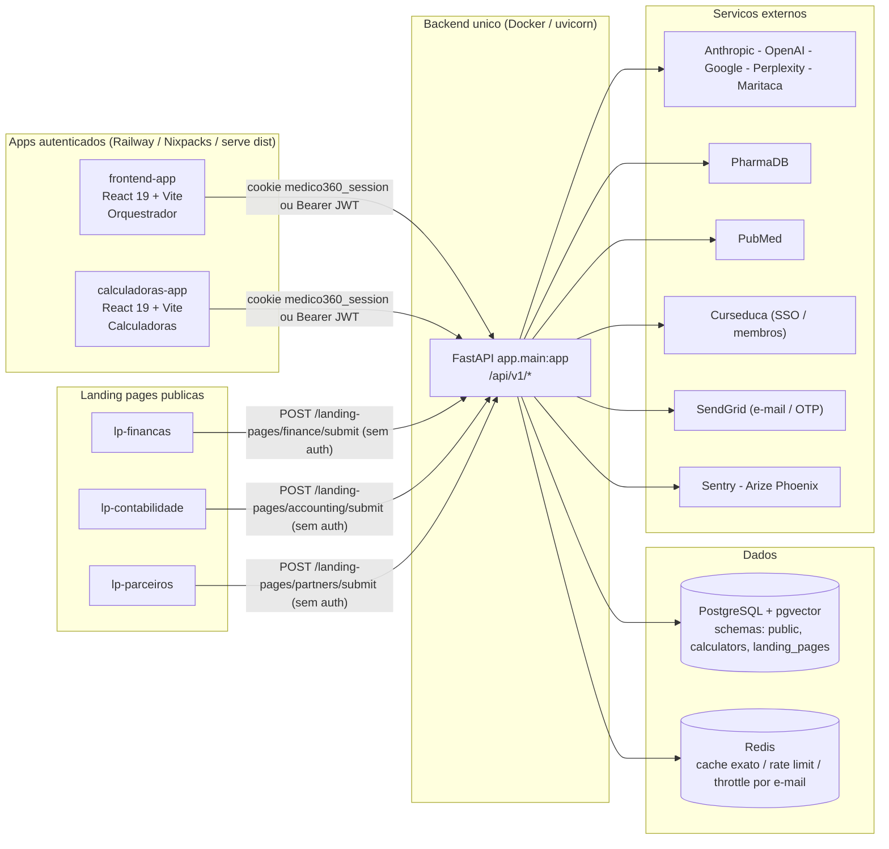
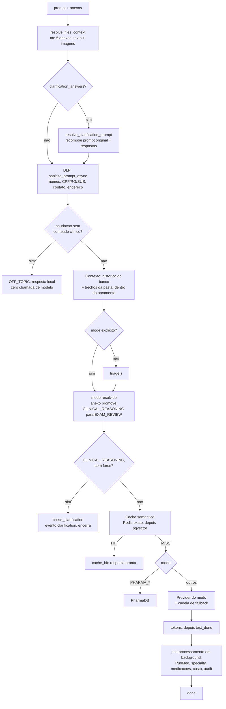

# Arquitetura Técnica — Médico 360

> Levantamento estático do código em **2026-09-09**. Referências `arquivo:linha` apontam para a raiz do repositório.
> Substitui a versão de 2026-09-08 — o que mudou desde então está no §1.

## 0. Como ler este documento

Se você tem uma tarde para entender o sistema, leia nesta ordem:

1. **§2 — topologia.** Quantos serviços existem de verdade e quem fala com quem.
2. **§5 — pipeline do Orquestrador.** É o produto. Todo o resto do backend orbita este fluxo.
3. **§3.4 — identidade profissional.** Como o médico é reconhecido e de onde vem a especialidade dele. É o trabalho mais recente e o que mais toca os três frontends.
4. **§6 — contexto e memória.** Histórico, orçamento de tokens e pastas-como-projeto. É fácil de quebrar sem perceber.
5. **§11 — banco.** O ER completo e as constraints que a aplicação assume.
6. **§17 — pontos de atenção.** Onde estão as armadilhas conhecidas, e o mapa de dívidas com tamanho e risco.

O resto é referência: tabelas de rotas, variáveis de ambiente, CI, scripts.

Documentos irmãos, que este aqui não duplica:

| Arquivo | O que traz |
|---|---|
| `docs/regras-de-negocio-v2.2.md` | Regras de negócio numeradas (RN-*) |
| `docs/Calculadoras_Cientificas_Regras_de_Arquitetura_v1.0.md` | Contrato de arquitetura do módulo de calculadoras |
| `docs/debitos.md` | 16 débitos técnicos, com status e justificativa de cada um |
| `docs/runbook.md` | Operação: incidentes, rotação de segredos, backup/restore (com números medidos), retenção |
| `docs/teste-e2e.md` | Roteiro manual de E2E + como rodar o E2E automatizado com chamada real aos provedores |
| `README.md` | Setup local |

---

## 1. O que mudou desde o levantamento anterior (8 → 9 de setembro)

Uma frente: **o localizador de DEA** (§7-B), um módulo novo do zero — schema, API pública,
app frontend. Em produção desde 09/09.

### 1.0 O primeiro módulo público do produto

Até aqui, toda rota que servia conteúdo exigia usuário autenticado e todo frontend era
embedado no LMS. O `dea-app` quebra as duas premissas: é público, anônimo e não vive em
iframe. O que isso muda para quem conhecia o sistema:

- **`origens_confiaveis()` ganhou uma exceção.** `DEA_URL` entra no CORS de `app/main.py`
  mas não na lista anti-CSRF — não há requisição autenticada do `dea-app` para proteger.
  É a única divergência intencional entre as duas listas.
- **A escrita pública trouxe defesas que não existiam no projeto**: densidade geográfica,
  honeypot, `status=pendente` como etiqueta de confiança (§7-B.2).
- **`DEA_IP_HASH_SALT` é fail-closed no startup** com `DEA_ENABLED=true`.
- **Nenhuma extensão nova no banco.** A busca por raio usa bounding box + Haversine em SQL
  em vez de PostGIS, por testabilidade (§7-B.4).

### 1.0-A Levantamento anterior (2 → 8 de setembro)

O que segue continua válido.

Vinte commits em um dia, em cinco frentes. As duas primeiras são produto; as três últimas saíram de revisões que encontraram defeitos **abertos em produção**.

### 1.1 Contexto de anexos — o exame no meio da conversa

O médico discutia um caso, anexava um exame e escrevia "e esse aqui?" — e recebia uma resposta confiante construída **sem o exame**. Três causas independentes, com o mesmo sintoma:

1. A triagem só vê o TEXTO. Para "e esse aqui?" ela devolvia `QUICK_SEARCH`, que roteia para `sonar-pro` — **um modelo sem visão**. A promoção para `EXAM_REVIEW` existia, mas rodava só *antes* da triagem, então nunca via o modo que ela escolheu.
2. O gate de confiança baixa pedia reformulação de uma pergunta que estava completa: o texto é curto porque o conteúdo está no arquivo.
3. As duas cadeias de fallback chamavam `provider.complete` **sem `image_content`** — quando o primário falhava, a imagem ficava para trás. `MODES_REQUIRING_VISION` documentava essa garantia e não era lida por ninguém.

Junto veio o **orçamento separado para anexos** (§6.2): com teto único de 6000 tokens, um laboratorial completo (~4700) ocupava 78% do espaço e expulsava a discussão do caso.

### 1.2 Pastas com evolução do paciente

`folders.clinical_context` — texto que o médico escreve e que entra **na íntegra em toda mensagem daquela pasta**, e `folders.folder_kind` (`clinical` | `general`), que decide a marcação com que esse texto é injetado. Ver §6.3.

A distinção não é cosmética: o contexto por similaridade que já existia chega ao modelo marcado como *"material de APOIO, pode ser de outro paciente"*. A evolução é o oposto — é o caso atual e é autoritativa. Numa pasta de estudos, porém, anunciá-la como "evolução do paciente" faz o modelo inventar um paciente que não existe.

### 1.3 Modo `DATA_OCEAN` (Maritaca)

Bases de dados públicas brasileiras — DATASUS, CNES, ANVISA, InfoDengue, IBGE — consultadas no momento da pergunta, com a fonte junto. Ver §5.3.

É uma ferramenta **agêntica que roda do lado da Maritaca**: o Sabiá decide quais bases consultar, executa, cruza e devolve só a resposta final. Isso impõe restrições que nenhum outro modo tem — sem streaming, sem fallback, sem cache, sem triagem.

### 1.4 Revisão de segurança — quatro achados corrigidos

Varredura do código inteiro (não só do diff), em quatro frentes paralelas. Injeção/upload e config/frontend saíram limpos. Os quatro achados:

| Achado | Gravidade |
|---|---|
| `orquestrador_shared` instanciava `OpenAIProvider()` direto — **o único provider fora do registry**, e portanto o único que escapava do `DlpEnforcingProvider`. O verificador de clarificação mandava histórico e evolução da pasta em claro para a OpenAI. `clinical_context` também não passava por DLP em lugar nenhum | HIGH |
| O cache semântico servia resposta **condicionada a um paciente**: a chave é `(modo, prompt)`, mas a resposta era gerada com a evolução da pasta injetada | HIGH |
| O `/query` devolvia `conversation_id` de **outro médico** no cache hit. O `/stream` já corrigia isso, com comentário explicando o risco — a correção nunca foi propagada | HIGH |
| CSRF em `/uploads/extract`, a única rota multipart do projeto e por isso a única sem preflight CORS | MEDIUM |

### 1.5 Revisão de performance e manutenção

Medição contra o banco de produção, não intuição:

- **Latência real por modo** (§5.4). `CLINICAL_REASONING` tem p50 de 32,8s e p95 de 56,7s. O gargalo é LLM, não banco: as tabelas têm centenas de linhas.
- **O cache semântico nunca acertou** — 0 hits em 240 interações. A causa não é threshold nem índice: *o que se repete não pode ser cacheado, e o que pode não se repete*. Desligado por flag, com a análise registrada (§6.4, débito 16).
- **`record_cost` não existia no `/query`** — o quarto bug da família de divergência `/query` ↔ `/stream`. `check_limit` lia um contador que só o `/stream` incrementava, e o limite semanal era inaplicável no caminho de todos os modos PharmaDB.
- **`DlpEnforcingProvider` anulava o timeout de todos os providers** — declarava `timeout: int = 30` e repassava sempre, sobrescrevendo os 120s do Maritaca e os 45s do Perplexity. Foi o que derrubou a primeira consulta real ao Data Ocean.
- **`PerplexityProvider` não streamava** — chamava `complete()` e fatiava o texto pronto. O médico esperava 3 a 15 segundos em tela parada no modo mais usado.
- **Extração para o `shared`**: `pos_processar_interacao` e `registrar_hit_de_cache`. As construções de modelo que estavam duplicadas nos dois serviços (`PubmedValidation`, `InteractionMedication`, a `Interaction` do cache hit) agora existem **num lugar só**, com testes que falham se voltarem.

> **A divergência `/query` ↔ `/stream` é o problema estrutural nº 1 deste projeto.** Quatro bugs distintos vieram dela num único dia. `orquestrador_shared` existe para consolidar o que é comum, e os testes em `tests/test_orquestrador_paridade.py` e `tests/test_cache_paridade.py` travam o que já foi consolidado.

### 1.6 Levantamento anterior (28 de agosto → 2 de setembro)

Duas frentes: o módulo de notícias e a identidade profissional do médico.

**Notícias (`noticias-app` + schema `news`)** — feed clínico por tema, alimentado por um pipeline PubMed → tagger → redator. O médico escolhe temas e palavras-chave; o feed casa artigos contra as duas coisas. Ver §7-A.

**Identidade profissional** — reescrita de como o sistema sabe quem é o médico:

- **A especialidade passou a ter dono e proveniência.** `users.specialty` era texto livre sem validação; agora existe um vocabulário canônico (`app/medicina/especialidades.py`, 55 especialidades do CFM) e uma regra de precedência entre as quatro fontes que podem escrevê-la (`app/medicina/identidade.py`).
- **Ela chega sozinha, dos grupos de acesso da Curseduca.** A página de cadastro (outro sistema, outro time) consulta o CFM e cria um grupo `[CFM] <especialidade>`. O payload do membro já era baixado a cada login de embed e descartado; agora dele saem o nome e a especialidade.
- **O onboarding virou uma tela só, compartilhada pelos três apps** (`shared/onboarding/`). O servidor calcula o que falta (`onboarding_pendencias`); os apps só renderizam. Antes existia em um app só, e os outros dois nem checavam.
- **O CRM deixou de ser exigido.** A prova de registro vem do grupo `[CFM]`; um CRM digitado à mão não acrescentava prova. A coluna continua, e continua sendo gravada de fonte confiável.
- **Os frontends passaram a buildar por Dockerfile**, com contexto na raiz do monorepo — o `shared/` fica fora da pasta de cada app e o Nixpacks não o enxergava. Ver §13.2.
- **`services/` ganhou um subpacote `integracoes/`** com os seis clientes de sistemas externos, que estavam soltos entre os demais.
- **Roteamento do Orquestrador unificado.** O bloco que decide qual agente atende era escrito duas vezes e já tinha divergido: na mesma situação de confiança baixa, `/query` e `/stream` diziam textos diferentes ao médico. Agora é `orquestrador_shared.decidir_rota`.
- **A cascata de exclusão de conta saiu do endpoint** para `auth_repository`, e ganhou os primeiros testes — eram 25 linhas de SQL cru sem cobertura nenhuma, onde a ORDEM das exclusões é o que impede erro de chave estrangeira.

---

## 2. Topologia real

Não existem "3 instâncias" no sentido de serviços de backend independentes. A arquitetura é:

- **1 backend único** (`app/`) — FastAPI monolítico que serve todos os domínios (Orquestrador/Agregador, Calculadoras, Notícias, Landing Pages) no mesmo processo, mesmo banco, mesmo router raiz.
- **7 frontends React**, cada um com deploy próprio no Railway:

| App | Papel | Porta dev | Rotas de backend que consome |
|---|---|---|---|
| `frontend-app/` | Chat do Orquestrador, histórico, pastas, anexos | 5173 | `/auth`, `/orquestrador`, `/agregador`, `/conversations`, `/folders`, `/uploads`, `/users/usage` |
| `calculadoras-app/` | Calculadoras clínicas | 5174 | `/auth`, `/calculators`, `/prevent`, `/landing-pages/calculators` |
| `noticias-app/` | Feed clínico por tema | 5176 | `/auth`, `/news`, `/meta` |
| `dea-app/` | Metrônomo de RCP + mapa de desfibriladores. **Público, sem login** | 5179 | `/dea` |
| `lp-financas/` | LP de captação — finanças | 5175 | `/landing-pages/finance` |
| `lp-contabilidade/` | LP de captação — contabilidade | 5178 | `/landing-pages/accounting` |
| `lp-parceiros/` | LP de captação — parceiros | 5177 | `/landing-pages/partners` |

Fora das pastas de app existe **`shared/`**, na raiz do monorepo: código que os três apps autenticados importam via alias `@shared`. Hoje contém só o onboarding (§3.4). Não é workspace npm — é alias de Vite + `paths` de TypeScript, e é o motivo de os três buildarem por Dockerfile com contexto na raiz (§13.2).

Os frontends não conversam entre si, e **os três autenticados são embedados separadamente** como iframes no LMS (Curseduca) — cada um com seu próprio `EmbedAuthPage`. Cada um faz seu próprio `/auth/embed/token` e carrega a sessão no header `Authorization`.

**Não há SSO por cookie entre eles, e não pode haver na topologia atual.** Os quatro serviços são subdomínios diretos de `up.railway.app` (`medico360-ia`, `frontend-medico-360-production`, `calculadoras-medico-360`, `news-m360`), cujo único pai comum está na Public Suffix List — nenhum navegador aceita cookie nele. Por isso `COOKIE_DOMAIN` fica vazio: não existe valor que funcione, e o cookie `medico360_session` vale só por origem. O SSO real só passa a existir com domínios próprios sob uma raiz comum (`api.` / `app.` / `calc.` / `news.medico360.app`), decidido para a saída do Railway.

O que os três de fato compartilham é o **banco**: uma linha em `users` serve aos três, e é por isso que o onboarding preenchido em qualquer um vale para todos.

As LPs são públicas — não autenticam, exceto `/landing-pages/calculators/submit`, que é chamada de dentro do módulo logado.

> **Atenção ao ler código antigo:** o `noticias-app` foi um repositório separado (`medico360-news`) antes de migrar para cá. O schema `news` no Postgres tem migrations próprias na cadeia principal desde a `004`.



Pontos-chave:

- Nunca há chamada HTTP entre serviços internos — é sempre frontend → backend único.
- Banco físico único. Os schemas `calculators` e `landing_pages` são separação **lógica**, com FKs cruzando para o schema público (`users`, `company`, `interactions`).
- O CORS é montado no boot a partir de `frontend_url + calculadoras_url + embed_allowed_origins + landing_pages_origins` (`app/main.py:87-94`); fora de produção, cada origem também entra na variante `localhost`/`127.0.0.1`, que o browser trata como distintas.

---

## 3. Backend — stack e estrutura

### 3.1 Stack

- Python 3.12, FastAPI 0.141, SQLAlchemy 2.0 async (`asyncpg`), Alembic 1.14.
- `slowapi` (rate limiting sobre Redis), `httpx` (cliente compartilhado com pool), `sse-starlette`, `spaCy` `pt_core_news_sm` (NER do DLP), `pgvector`, `sendgrid`.
- Parsers de upload: `pdfplumber`, `python-docx`, `openpyxl`.
- Observabilidade: Sentry (`app/core/error_tracking.py`, com scrubbing de PII obrigatório) e OpenTelemetry/Arize Phoenix (`app/core/telemetry.py`).
- Imagem Docker única na raiz, servida por `uvicorn`.

### 3.2 Estrutura de pastas

```
app/
├── main.py            bootstrap FastAPI: logging → Sentry → Phoenix → http_client →
│                       warmup do NER → registry de fórmulas → tarefa de expurgo;
│                       CORS, GZip, RequestId, handler global de exceção
├── api/
│   ├── deps.py         get_current_user (Bearer JWT ou cookie de sessão)
│   └── v1/
│       ├── router.py    agrega todos os sub-routers sob /api/v1
│       └── endpoints/   auth, conversations, folders, agregador, orquestrador,
│                        uploads, usage, health, landing_pages, news, meta
├── calculators/         módulo self-contained das calculadoras
│   ├── engine/           motor de execução (coerção de campos, validação)
│   ├── formulas/         fórmulas por especialidade, auto-carregadas no boot
│   ├── registry/         mapa formula_key → função pura (@register_formula)
│   ├── repositories/     acesso ao schema `calculators`
│   ├── routers/          calculators_router.py, prevent_router.py
│   ├── schemas/          Pydantic de entrada/saída
│   ├── services/         execução + extração de campos via LLM
│   └── cache.py          cache in-process do catálogo (TTL 300s)
├── core/                config (Settings), database, limiter, circuit_breaker,
│                        http_client, logging_config, error_tracking, telemetry,
│                        prompts, alarme (evento operacional no Sentry)
├── medicina/            DOMINIO PURO — nao importa banco, HTTP nem config
│   ├── especialidades.py  vocabulario canonico do CFM (55), normalizacao,
│   │                      leitura dos grupos `[CFM]` da Curseduca
│   └── identidade.py      precedencia de escrita da especialidade e calculo
│                          das pendencias de perfil
├── news/                DOMINIO PURO — taxonomia de temas e lista de periodicos
├── middleware/          dlp.py (mascaramento de PII antes do LLM), ner.py (spaCy pt)
├── models/              models.py (public), calculators.py, landing_pages.py, news.py
├── repositories/        auth_repository.py
├── schemas/             agregador, auth, conversations, usage, landing_pages, news
└── services/
    ├── integracoes/     clientes de sistemas externos (ver 3.3)
    └── ...              servicos de dominio
```

**O padrão que emergiu, e que vale seguir em coisa nova:** `calculators/`, `news/` e
`medicina/` são fatias verticais — trazem o próprio domínio e não dependem de
infraestrutura. `app/services/` (32 arquivos, ~9.600 linhas) é o núcleo antigo,
organizado horizontalmente. Não há projeto para reorganizá-lo; a orientação é
**construir o novo como fatia e deixar o antigo encolher por atrito**.

### 3.3 Serviços — o que cada um faz

| Módulo | Responsabilidade |
|---|---|
| `orquestrador_service.py` | Pipeline não-streaming de `/orquestrador/query` |
| `orquestrador_stream_service.py` | Mesmo pipeline via SSE; abre sessão de banco própria |
| `orquestrador_shared.py` | Peças comuns aos dois: título, posse da conversa, clarificação, montagem de contexto, vínculo de anexos |
| `orquestrador_modes.py` | **Definição única** dos modos: enum, mapa modo→modelo, temperatura, cadeia de fallback, modos que exigem visão, teto de tokens por esforço |
| `triage_service.py` | Classificação da pergunta em um modo; atalho local para saudações |
| `agregador_service.py` | Consulta paralela a N modelos (produto legado, fora da UI) |
| `conversation_history.py` | Histórico lido do banco (nunca do cliente) |
| `context_budget.py` | Corte do histórico por orçamento de tokens estimado |
| `folder_context_service.py` | Contexto entre conversas da mesma pasta, por similaridade |
| `semantic_cache_service.py` | Cache semântico pgvector + fast-path exato no Redis |
| `cache_service.py` | Wrapper de Redis (get/set/throttle) |
| `file_extractor_service.py` | Validação, extração de texto e resolução de anexos |
| `medication_extractor.py` | Extrai fármacos mencionados na interação |
| `orquestrador_shared.py` (cont.) | `decidir_rota` — **as regras de roteamento vivem aqui**, não nos dois serviços |
| `response_metadata.py` | Serializa fontes/PubMed em `InteractionResponse.extra_metadata` |
| `specialty_detector.py` | Detecta especialidade/tópico da interação |
| `usage_service.py` | Limite semanal de custo por usuário |
| `pricing.py` | Preços por modelo, cache TTL 1h |
| `auth_service.py` | Login OTP/convite/embed + `reconciliar_especialidade_do_embed` (§3.4) |
| `news_feed_service.py` | Monta o feed por temas + palavras-chave; piso de especialidade |
| `news_tagger_service.py` / `news_writer_service.py` / `news_collector_service.py` | Pipeline PubMed → tema → texto em português |
| `news_digest_service.py` / `news_keyword_service.py` | Digest diário e palavras-chave do médico |
| `consent_service.py` / `data_subject_service.py` | Consentimento LGPD e exportação do titular |
| `expurgo_agendado.py` | Expurgo de retenção rodando dentro do processo |
| `vigilancia_service.py` | Mede cache, custo e última rodada de expurgo; `avaliar` decide o que vira alarme |
| `vigilancia_agendada.py` | Laço de 6h que roda as medições e alarma no Sentry |
| `email_service.py` | SendGrid |

**`services/integracoes/` — quem fala com o mundo de fora.** Separado porque todos
compartilham a mesma forma: timeout explícito, disjuntor (`app/core/circuit_breaker.py`)
e uma **decisão deliberada sobre o que fazer quando o outro lado não responde** — que
é diferente em cada um.

| Módulo | Sistema externo | Política de falha |
|---|---|---|
| `ai_providers.py` | Anthropic / OpenAI / Gemini / Perplexity + `DlpEnforcingProvider` | cadeia de fallback entre modelos |
| `curseduca_service.py` | API da Curseduca (validação de matrícula) | **fail-closed** — a dúvida é sobre direito de acesso |
| `pharmadb_service.py` | PharmaDB (bula, interação, receita, genérico) | degrada com aviso |
| `pubmed_service.py` / `pubmed_eutils.py` | PubMed (validação de citação, diretrizes) | degrada com aviso |
| `news_pubmed.py` | PubMed (coleta do feed) | pula a rodada |

### 3.4 Autenticação e identidade profissional

**Sessão.** `get_current_user` (`app/api/deps.py`) aceita `Authorization: Bearer <jwt>`
**ou** o cookie `medico360_session`; decodifica com `jwt_secret_key`, valida `sub` como
UUID e busca o `User` com `status=true`. O cookie é setado em `_set_session_cookie`
(`auth.py`) com `httponly`, `secure=is_production`, `domain=COOKIE_DOMAIN` e
`samesite=none` em produção (`lax` fora dela). O `none` não é preferência: os apps rodam
dentro do iframe da Waid, então toda chamada à API é cross-site e `lax` faria o navegador
aceitar o cookie e nunca mais enviá-lo. Como `none` exige `Secure` e `Secure` exige HTTPS,
em desenvolvimento o par seria rejeitado — daí a condicional.
Todas as rotas exigem autenticação, exceto as marcadas "não" nas tabelas do §4.

**Como o médico entra.** Quatro caminhos: OTP por e-mail, convite, auto-cadastro
(desligado por padrão) e — o que importa na prática — **embed do LMS**
(`POST /auth/embed/token`). A página pede identidade por `postMessage` ao `window.parent`;
a Waid devolve um token opaco de uso único, que trocamos server-to-server por
`{uuid, name, email}` — **o e-mail é resultado da verificação, não entrada**. O `?email=`
legado foi desligado (`embed_email_fallback_enabled=False`), e o handshake vive em
`shared/embed/identidade.ts`. A validação server-to-server na Curseduca segue obrigatória
em produção — `CURSEDUCA_VALIDATION_ENABLED=false` derruba o startup (fail-closed), porque
sem ela o endpoint voltaria a confiar só no `Origin`, que é forjável.

Isso **não funciona nos aplicativos da Waid**, que abrem a seção em webview direto, sem
iframe: sem `window.parent` não há quem responda ao pedido. No mobile o médico entra por
OTP — e o `noticias-app`, que não tem tela de login, fica sem saída (ticket aberto).

#### De onde vem a especialidade

A página de cadastro — **outro sistema, outro time** — coleta CRM e consulta o CFM, e
cria na Curseduca um grupo de acesso chamado `[CFM] <especialidade>` (ou
`[CFM] GENERALISTA`, quando o Conselho não devolve especialidade). O payload do membro
que já era baixado para validar a matrícula traz `name` e `groups`; **os dois eram
descartados**. Hoje `auth_service.reconciliar_especialidade_do_embed` os lê a cada login
de embed.

Quatro fontes podem escrever a especialidade, com precedência estrita
(`app/medicina/identidade.py`):

```
admin  >  cadastro  >  cfm  >  waid_grupo  >  declarado
```

`declarado` — o que o médico digita — fica no **fundo**, e isso é deliberado:
`users.specialty` não é preferência de leitura, é identidade profissional, e a intenção
é que passe a definir acesso a conteúdo pago. Se fosse editável pelo app, trocar de
especialidade alcançaria produto não contratado. O que o médico ajusta livremente é o que
ele **lê** (`news.user_topics`), não quem ele é. Correção só por suporte
(`PATCH /auth/admin/users/{id}/especialidade`, com `AuditLog`) — é o que sustenta a trava
perante o direito de correção da LGPD (art. 18, III).

Invariantes que o código protege, e que têm teste:

- **`[CFM] GENERALISTA` não vira "Clínica Médica".** Clínica Médica é especialidade real,
  com RQE; afirmá-la para quem o Conselho diz não ter nenhuma seria gravar registro falso.
  O generalista fica com `specialty` NULL — e o conteúdo dele é resolvido noutra camada,
  pelo `ESPECIALIDADE_PISO` do feed.
- **Duas residências são guardadas** (`users.specialties`, JSONB). Clínica Médica é
  pré-requisito de quase toda residência clínica; guardar só uma revogaria o acesso à
  outra. `specialty_slug` é só a principal, para exibição e prompt.
- **A reconciliação nunca derruba o login.** Enriquecer perfil é acessório; autenticar não.
- **Ela só roda em `/auth/embed/token`.** Quem reaproveita sessão não é enriquecido até o
  token expirar ou abrir outro app. É a explicação para "funcionou no segundo app e não no
  primeiro".

#### O onboarding

Uma tela só, em **`shared/onboarding/`**, importada pelos três apps. O servidor calcula
`onboarding_pendencias` (`identidade.pendencias`) e os apps **apenas renderizam** — nenhum
deles decide o que falta. É o que permite acrescentar uma exigência no backend e os três
herdarem; se cada um decidisse, uma regra nova viraria três divergências. Foi exatamente
assim que o repo acabou com três listas de especialidade incompatíveis.

Sobrou pouco a perguntar, porque quase tudo chega sozinho:

| Pendência | Por que ainda é perguntada |
|---|---|
| `med_status` | Nenhuma fonte distingue residente de especialista — o R1 aparece no CFM sem RQE, igual ao generalista |
| `aceite_termos` | Ninguém consente pelo titular. Fica aqui, e não na página de cadastro, porque a versão dos documentos (`consent_service.VERSAO_DOCUMENTOS`) é nossa |
| `nome`, `especialidade` | Só quando não chegaram do LMS |

**CRM não é pendência**, decisão de 2026-09-02: a prova de registro é o grupo `[CFM]`;
um número digitado à mão não acrescenta prova. A coluna existe e continua sendo gravada
de fonte confiável.

Comportamento por app: `frontend-app` e `noticias-app` **bloqueiam** (no segundo, o perfil
define o que ele vai ler); `calculadoras-app` só **avisa**, e só sobre o aceite — não
filtra nada por especialidade, então cobrar o perfil ali prometendo "conteúdo da sua
especialidade" seria prometer o que aquele app não entrega.

---

## 4. Rotas

### 4.1 `/auth` (`app/api/v1/endpoints/auth.py`)

| Método | Path | Auth | Rate limit | Descrição |
|---|---|---|---|---|
| POST | /api/v1/auth/register | não | 5/min | Cadastro público (se `allow_public_registration`); envia convite por e-mail |
| POST | /api/v1/auth/invite/generate | sim (admin) | 30/min | Gera token de convite; grava `AuditLog action=invite.generate` |
| POST | /api/v1/auth/invite/accept | não | 10/min | Aceita convite por token+e-mail; seta cookie SSO |
| POST | /api/v1/auth/embed/token | não | 5/min | SSO para embeds; valida `Origin` e o membro via Curseduca; cria usuário se necessário; **reconcilia nome e especialidade** (§3.4) |
| POST | /api/v1/auth/otp/request | não | 3/15min (+3/900s por e-mail) | Solicita OTP por e-mail |
| POST | /api/v1/auth/otp/verify | não | 5/min (+10/900s por e-mail) | Verifica OTP; seta cookie SSO |
| POST | /api/v1/auth/onboarding | sim | 30/min | Aplica o que veio e o SERVIDOR decide se acabou; consentimento na mesma transação |
| GET | /api/v1/auth/me | sim | — | Usuário logado + `onboarding_pendencias`, `med_status_opcoes`, `specialty_editavel` |
| PATCH | /api/v1/auth/me | sim | 30/min | Nome, e-mail, CRM+UF e especialidade — esta última só se `specialty_editavel` (senão 409) |
| PATCH | /api/v1/auth/admin/users/{id}/especialidade | sim (admin) | 30/min | Correção pelo suporte, com `AuditLog`. É o que sustenta a trava do §3.4 perante a LGPD |
| GET | /api/v1/auth/me/consentimentos | sim | — | Situação dos consentimentos LGPD + versão vigente |
| POST | /api/v1/auth/me/consentimentos/{tipo}/revogar | sim | 10/h | Revoga consentimento (exceto `termos_e_privacidade`) |
| GET | /api/v1/auth/me/export | sim | 5/h | Portabilidade LGPD art. 18, V |
| DELETE | /api/v1/auth/me | sim | 10/min | Exclusão de conta em cascata (a cascata vive em `auth_repository`) |

> Os números de linha saíram desta tabela de propósito: envelheciam a cada edição do
> arquivo e já apontavam para o lugar errado. O nome da função é âncora melhor.

### 4.1-A `/meta` (`app/api/v1/endpoints/meta.py`)

| Método | Path | Auth | Descrição |
|---|---|---|---|
| GET | /api/v1/meta/especialidades | **não** | As 55 especialidades canônicas (`{slug, nome}`), `Cache-Control: 1h` |

Público porque a tela de cadastro precisa da lista **antes** de existir sessão. Exigir
token aqui devolveria a lista para dentro do TSX, que é o que este trabalho desfez.

### 4.2 `/orquestrador` (`app/api/v1/endpoints/orquestrador.py`)

| Método | Path | Linha | Rate limit | Descrição |
|---|---|---|---|---|
| POST | /api/v1/orquestrador/query | 74 | 30/min | Triagem + roteamento, resposta completa |
| POST | /api/v1/orquestrador/stream | 118 | 30/min | Mesmo pipeline via SSE. Não atende `PHARMA_CHECK` — use `/query` |

Body `OrquestradorRequest` (`orquestrador.py:21-72`):

| Campo | Tipo | Nota |
|---|---|---|
| `prompt` | str (1–4000) | obrigatório |
| `conversation_id` | UUID? | ausente = cria conversa nova |
| `force` | bool | pula a etapa de clarificação |
| `clarification_answers` | str? | respostas às perguntas de clarificação |
| `effort` | `rápido` \| `detalhado` | teto de tokens de saída (700 / 4096) |
| `mode` | str? | modo explícito; pula a triagem automática |
| `folder_id` | UUID? | pasta da nova conversa |
| `file_id` | UUID? | **deprecado** — tratado como lista de um |
| `file_ids` | UUID[] | até 5 anexos por mensagem |

O campo `history` **não existe mais**: o servidor lê o histórico do banco.

Eventos SSE de `/stream`: `start` · `cache_hit` · `clarification` · `token` · `text_done` · `done` · `error`. `text_done` existe para o cliente liberar a digitação sem esperar o pós-processamento (PubMed, custo, specialty), que sai no `done`.

### 4.3 `/agregador` (produto legado, fora da UI)

| Método | Path | Linha | Rate limit | Descrição |
|---|---|---|---|---|
| GET | /api/v1/agregador/models | 45 | — | Modelos ativos, com disponibilidade derivada da chave configurada e `cost_tier` |
| POST | /api/v1/agregador/query | 93 | 30/min | Consulta a N modelos em paralelo (`MAX_MODELS_PER_QUERY`) |
| POST | /api/v1/agregador/stream | 123 | 30/min | SSE multi-modelo; eventos `delta`/`complete`/`error`/`pubmed`/`disclaimer`/`done` |
| GET | /api/v1/agregador/history | 292 | — | Histórico pesquisável por query/modelo/data |

### 4.4 `/conversations` e `/folders`

| Método | Path | Arquivo:linha | Rate limit | Descrição |
|---|---|---|---|---|
| GET | /api/v1/conversations | conversations.py:23 | 60/min | Conversas ativas do usuário, paginadas, `updated_at desc` |
| GET | /api/v1/conversations/{id} | conversations.py:42 | 60/min | Detalhe + mensagens; devolve anexos, citações e validação PubMed por mensagem |
| GET | /api/v1/folders | folders.py:34 | 60/min | Lista pastas |
| POST | /api/v1/folders | folders.py:49 | 30/min | Cria |
| PUT | /api/v1/folders/{id} | folders.py:65 | 30/min | Renomeia |
| DELETE | /api/v1/folders/{id} | folders.py:86 | 30/min | Apaga (conversas ficam sem pasta, `SET NULL`) |
| PATCH | /api/v1/folders/conversations/{id}/folder | folders.py:104 | 60/min | Move 1 conversa |
| PATCH | /api/v1/folders/conversations/bulk | folders.py:134 | 30/min | Move até 100 conversas |

`ConversationDetail` (`app/schemas/conversations.py:69`) carrega `messages[]` com `role`, `content`, `attachments[]`, `mode`, `citations[]` e `pubmed_validation` — é o que permite a conversa reabrir com as fontes intactas.

### 4.5 `/uploads`

| Método | Path | Linha | Rate limit | Descrição |
|---|---|---|---|---|
| POST | /api/v1/uploads/extract | 45 | 20/min | Valida content-type **e** magic bytes; extrai texto em thread; imagem vira descrição via Claude Haiku (custo cobrado); trunca em `MAX_EXTRACTED_CHARS`; grava `FileExtraction`; devolve `file_id` e um `warning` opcional |

Limites (`app/services/file_extractor_service.py:36-46`): 10 MB por arquivo (5 MB para imagem, limite do base64 da Anthropic), 50 000 caracteres extraídos, 100 páginas de PDF, 20 000 parágrafos/linhas de tabela DOCX, 50 000 linhas XLSX, 200 MB descompactados (proteção contra zip-bomb), 5 anexos por mensagem.

O `warning` é deliberado: um PDF digitalizado sem OCR não faz o upload falhar — o médico pode ter motivo para anexar assim — mas ele precisa saber que o conteúdo não chegou ao modelo (`docs/debitos.md`, item 2).

### 4.6 `/calculators` e `/prevent`

| Método | Path | Arquivo:linha | Rate limit | Descrição |
|---|---|---|---|---|
| GET | /api/v1/calculators | calculators_router.py:23 | 60/min | Lista, filtro opcional por especialidade |
| GET | /api/v1/calculators/{slug} | calculators_router.py:34 | 60/min | Detalhe (campos, versão ativa) |
| POST | /api/v1/calculators/{slug}/execute | calculators_router.py:45 | 60/min | Executa (`inputs`, `dry_run` opcional) |
| POST | /api/v1/calculators/{slug}/extract | calculators_router.py:64 | 30/min | Extrai campos de texto livre via LLM |
| PUT / DELETE | /api/v1/calculators/{slug}/favorite | calculators_router.py:88 / :99 | 60/min | (Des)favorita |
| GET | /api/v1/calculators/{slug}/history | calculators_router.py:110 | 60/min | Histórico de execuções do usuário |
| POST | /api/v1/prevent/calculate | prevent_router.py:12 | 60/min | Escore PREVENT (AHA, Khan et al. 2024), seis desfechos. **Sem estado**: não grava execução nem audit log |

O PREVENT é um caso à parte de propósito: campos fora da faixa de validade voltam `None` desfecho a desfecho, seguindo `AHAprevent::pred_risk_base` — a AHA invalida por desfecho, não em bloco. Onde a AHA diverge do MDCalc, o projeto segue a AHA; as faixas vivem em `_REGRAS` dentro de `app/calculators/formulas/cardiologia/prevent.py`.

### 4.7 `/landing-pages`

| Método | Path | Linha | Auth | Rate limit | Descrição |
|---|---|---|---|---|---|
| GET | /api/v1/landing-pages/{slug}/check | 62 | não | 60/min | `already_submitted` por e-mail; `slug` validado contra a lista fixa `ALLOWED_SLUGS` |
| POST | /api/v1/landing-pages/finance/submit | 75 | não | 20/min | 409 se já houver submissão com o mesmo e-mail |
| POST | /api/v1/landing-pages/accounting/submit | 108 | não | 20/min | Idem + seleções de dor (1:N) |
| POST | /api/v1/landing-pages/partners/submit | 148 | não | 20/min | Idem + categorias (1:N) |
| POST | /api/v1/landing-pages/calculators/submit | 185 | **sim** | 20/min | Pedido de calculadora nova, feito de dentro do módulo logado — identidade vem da conta, não do body; 409 por `user_id` |

O bloqueio por e-mail só se aplica quando o e-mail veio na URL (embed do fornecedor): sem e-mail não há como identificar reenvio, e a submissão segue permitida.

### 4.8 `/news`

Ver §7-A.4 — a tabela completa está lá, junto do contexto do módulo.

### 4.9 `/users/usage` e `/health`

| Método | Path | Arquivo:linha | Auth | Descrição |
|---|---|---|---|---|
| GET | /api/v1/users/usage | usage.py:12 | sim | Uso/limite semanal |
| GET | /api/v1/health | health.py:33 | não | Liveness pura — não toca dependência nenhuma |
| GET | /api/v1/health/ready | health.py:63 | não | Readiness: Postgres (`SELECT 1`) e Redis (`ping`) em paralelo, timeout 3s cada; 503 se algo falhar |

---

## 5. Pipeline do Orquestrador

É o coração do produto. `/query` e `/stream` seguem o mesmo caminho; o que é comum vive em `orquestrador_shared.py` (os dois serviços nasceram como cópias e já tinham divergido — um chegou a importar função privada do outro).



### 5.1 Roteamento por modo (`app/services/orquestrador_modes.py`)

| Modo | Modelo primário | Fallback | Temp. |
|---|---|---|---|
| `QUICK_SEARCH` | `sonar-pro` (Perplexity) | `gemini-2.5-flash` | 0.0 |
| `CLINICAL_REASONING` | `claude-sonnet-4-6` | `gpt-4o` → `gemini-2.5-flash` | 0.0 |
| `EXAM_REVIEW` | `claude-sonnet-4-6` | `gpt-4o` → `gemini-2.5-flash` (todos com visão) | 0.0 |
| `PRODUCTIVITY` | `gpt-5.4-nano` | `gemini-2.5-flash` | 0.7 |
| `DATA_OCEAN` | `sabia-4-thinking` (Maritaca) | **nenhum, de propósito** | 0.0 |
| `PHARMA_CHECK` / `PHARMA_BULA` / `PHARMA_RECEITA` / `PHARMA_GENERICO` | PharmaDB (sem LLM) | — | — |
| `OFF_TOPIC` | atalho local | — | — |

Detalhes que não são óbvios:

- **`EXAM_REVIEW` só pode cair em modelo com visão** (`MODES_REQUIRING_VISION`). Rotear para Perplexity entregaria ao médico uma leitura de exame feita sem o exame — baseada só na descrição textual gerada por outro modelo, sem ele saber.
- **A promoção para `EXAM_REVIEW` acontece por anexo, não por triagem** (`upgrade_mode_for_attachments`), e roda **duas vezes**: antes da triagem, para o modo explícito, e depois dela, para o modo que a triagem escolheu. Só a primeira existia, e por isso "e esse aqui?" com um exame junto escapava — a triagem devolvia `QUICK_SEARCH` e o exame ia para um modelo **sem visão**. `QUICK_SEARCH` também promove, e é o caso mais frequente na prática. Um modo escolhido explicitamente na interface **nunca** é promovido; anexar um documento e pedir "resuma isto" continua sendo `PRODUCTIVITY`.
- **Com anexo, confiança baixa não pede reformulação.** O texto é curto porque o conteúdo está no arquivo — mandar o médico reescrever "e esse aqui?" é pedir que ele reenvie o que já enviou.
- **`MODOS_NAO_TRIADOS`**: modos que a triagem nunca pode devolver, só a interface. Hoje contém `DATA_OCEAN` (§5.3). O prompt de triagem nem o lista, mas um LLM pode devolver qualquer string, e `decidir_rota` descarta.
- **`PHARMA_CHECK` exige confiança ≥ 0.90** (`PHARMA_CHECK_MIN_CONFIDENCE`). Um modo explícito ainda passa pela triagem, para resolver o sub-modo (bula / receita / genérico / interação), mas ignora o gate de confiança.
- **`ModeEnum` em `app/models/models.py` NÃO é a fonte dos modos** — é resíduo do ERD original (BIZU, SHERLOCK, FARMACIA…), com valores que nunca corresponderam aos modos reais e que nenhum código do orquestrador lê. Mexer nele é mudança de schema, não de serviço.
- O toggle Rápido/Detalhado só limita o tamanho da resposta (`EFFORT_MAX_TOKENS`: 700 / 4096) — o que reduz tempo de geração e custo de saída.

### 5.2 DLP

`app/middleware/dlp.py` + `ner.py` (RN-SEC-001). Mascara antes de qualquer envio externo: nomes com palavra-gatilho → `[PACIENTE]`/`[MÉDICO]` (regex), nomes sem gatilho → `[NOME]` (NER spaCy), CPF/RG/Cartão SUS → `[DOCUMENTO]`, telefone/e-mail → `[CONTATO]`, endereço → `[ENDEREÇO]`.

Não há re-identificação: o placeholder vai ao modelo e volta no texto. Um falso positivo apaga o termo em definitivo — por isso o passo de NER é conservador, e os filtros anti-epônimo em `ner._is_person` existem por medição real. **Não simplifique sem ler a justificativa.** `DlpEnforcingProvider` é a rede de segurança: `get_provider_by_type` envolve **todo** provider nele, e ele sanitiza o prompt e cada mensagem do histórico antes de repassar.

Duas coisas aprendidas em 2026-09-08, ambas corrigidas:

- **A rede tinha exatamente um furo.** `orquestrador_shared` instanciava `OpenAIProvider()` direto para o verificador de clarificação — a única instância fora do registry, e portanto a única sem o wrapper. Ela recebe o histórico da conversa **e o bloco de evolução da pasta**. `tests/test_dlp_enforcement.py` varria o `PROVIDER_TYPE_REGISTRY` e passava inteiro, porque essa instância nunca entrava lá. Hoje um teste varre o **código-fonte** atrás de `XProvider()` fora de `ai_providers.py`.
- **`folders.clinical_context` era o único texto clínico que entrava no banco sem DLP.** Passa a ser sanitizado **na escrita** (`folders.py`), não na leitura: o dado identificável deixa de existir no banco, em vez de ficar lá esperando o próximo caminho de leitura que esqueça de filtrar.

**O wrapper não decide timeout.** Ele declarava `timeout: int = 30` e repassava sempre — como envolve todos os providers, 30 s virava o timeout efetivo de todos, anulando os 120 s do Maritaca e os 45 s do Perplexity. Foi o que derrubou a primeira consulta ao Data Ocean, com um `httpx.ReadTimeout` cujo `str()` é vazio: o log saiu como `"Stream falhou em sabia-4-thinking: ."`, sem dizer a causa. Hoje `timeout=None` omite a chave e cada provider usa o seu.

O modelo de NER é carregado no boot (`ner.warmup()`), fora do caminho da primeira requisição — custava ~1s ao primeiro usuário.

---

### 5.3 `DATA_OCEAN` — bases públicas brasileiras (Maritaca)

Modo que consulta dezenas de bases oficiais no momento da pergunta — DATASUS, CNES, ANVISA, InfoDengue, IBGE, e outras não clínicas — devolvendo números com a fonte junto. Atendido pelo Sabiá (`sabia-4-thinking`) com a flag `data_ocean`.

**O que ele é, do ponto de vista desta arquitetura:** uma flag no corpo da requisição que liga um **fluxo agêntico do lado da Maritaca**. O modelo decide quais bases consultar, escreve e executa as consultas, cruza fontes e devolve só a mensagem final. Nada disso roda aqui, e nada disso é observável daqui.

Quatro restrições que nenhum outro modo tem, todas consequência disso:

| Restrição | Por quê |
|---|---|
| **Sem streaming** | `stream: true` com ferramenta integrada devolve HTTP 400. `MaritacaProvider.stream()` é simulado a partir de `complete()` — mesmo caminho que o Perplexity usou até 2026-09-08, por outro motivo |
| **Sem fallback** | Nenhum outro modelo consulta essas bases. Cair para o Claude devolveria uma resposta fluente, construída da memória de treino, com números possivelmente inventados e **a mesma aparência** de uma consulta real ao DATASUS. Falhar visivelmente é melhor |
| **Sem cache** | Alerta epidemiológico, leito livre e cobertura vacinal mudam por dia. Servir do cache entregaria número velho com cara de atual |
| **Sem triagem** | É lento e cobrado por uso de ferramenta; só o médico o aciona (`MODOS_NAO_TRIADOS`) |

**Custo — a diferença é de ordem de grandeza.** `data_ocean: true` liga junto `web_search` e `code_execution`, e as três são cobradas por **uso**, não por token: GB processados, páginas lidas, minutos de execução. A API reporta isso em `usage.tool_execution_details`, que o projeto guarda cru em `InteractionResponse.extra_metadata` e converte em `pricing.calcular_custo_ferramentas`.

Medição da primeira consulta real em produção (2026-09-08):

| | |
|---|---|
| Tempo | 97,9 s |
| Tokens de entrada | 147 862 |
| Dados processados | 25,2 GB |
| Custo em tokens | US$ 0,1635 |
| **Custo em ferramentas** | **US$ 0,4844** |
| **Total** | **US$ 0,6479** — 22× uma pergunta clínica comum |

Os 147 mil tokens de entrada **não vêm do prompt do projeto** (que tem 574): vêm do que a ferramenta leu das bases e injetou no contexto do modelo, do lado da Maritaca. Não há controle sobre isso daqui.

Foi essa medição que forçou a subida do teto beta de US$ 1,00 para US$ 5,00 (§9): com o teto antigo cabia **uma vez e meia** por semana, e na segunda consulta o médico perdia todos os modos, inclusive os que custam centavos.

**Os preços da Maritaca são em BRL e o sistema calcula em USD.** A conversão usa `pricing.BRL_POR_USD`, **fixo em 5,20** — gap conhecido e aceito, registrado como débito 15, com a faixa de dólar que dispara revisão (R$ 4,80–5,60). Os preços ficam guardados em reais (`PRECOS_FERRAMENTAS_BRL`) porque é o número que dá para conferir contra a fatura; a conversão acontece num lugar só.

**Espera na interface.** Como não há streaming e a resposta leva ~1,5 minuto, `ChatView` mostra cronômetro e etapas que avançam (§10.1). As etapas são **ilustrativas e o código diz isso**: o fluxo é interno à Maritaca e não expõe em que passo está.

### 5.4 Latência real por modo

Medido em produção (`Interaction.response_time_ms`, janela de 90 dias, 2026-09-08):

| Modo | n | p50 | p95 |
|---|---|---|---|
| `CLINICAL_REASONING` | 35 | **32,8 s** | **56,7 s** |
| `QUICK_SEARCH` | 107 | 13,3 s | 28,5 s |
| `EXAM_REVIEW` | 8 | 18,1 s | 25,3 s |
| `PHARMA_*` | 66 | 2,4 – 7,8 s | 6 – 24 s |
| `DATA_OCEAN` | 1 | 97,9 s | — |

Dois fatos que orientam qualquer trabalho de performance aqui:

- **O gargalo é LLM, não banco.** As tabelas têm centenas de linhas (`interactions` 38, `audit_logs` 551). Otimização de query não muda nada hoje — os índices da `011` são preventivos, não corretivos.
- **A troca de `claude-sonnet-4-20250514` por `claude-sonnet-4-6` aumentou a latência em 56%** (p50 de 21 s para 33 s). Parte é resposta mais longa (912 → 1350 tokens de saída), mas a diferença é maior que a proporção.

O caminho crítico tinha 4 a 6 chamadas de rede **sequenciais** antes do primeiro token, e todo o `asyncio.gather` do arquivo estava no pós-processamento — que já não bloqueia nada. Corrigido em parte: histórico e roteamento agora rodam em paralelo, e um disjuntor (`circuit_breaker.openai_auxiliares`) cobre as três chamadas auxiliares ao `gpt-5.4-nano` (triagem, clarificação, normalização do cache). Sem ele, uma degradação da OpenAI custava **28 segundos de timeouts sequenciais** para chegar exatamente ao mesmo fallback que daria resultado em zero.

## 6. Contexto e memória

### 6.1 Histórico vem do banco, não do cliente

`app/services/conversation_history.py`. Antes o histórico chegava no corpo da requisição. Duas consequências: o servidor mandava ao modelo — e cobrava do usuário — um texto que nunca verificou (um cliente podia afirmar qualquer coisa como "dito anteriormente pelo assistente"); e o que o médico via na tela podia divergir do que o modelo recebia. Lê no máximo `MAX_INTERACTIONS_LIDAS = 40` interações.

Os turnos viram papéis de verdade (`user`/`assistant`), não um bloco de texto achatado com rótulos dentro — o modelo distinguia quem falou o quê por um rótulo textual, que ele podia ignorar ou confundir com conteúdo.

### 6.2 Orçamento por tokens

`app/services/context_budget.py`. `DEFAULT_HISTORY_TOKEN_BUDGET = 6000`, `CHARS_PER_TOKEN = 3.2` (medido contra dados reais em 2026-08-27), `TOKEN_OVERHEAD_POR_MENSAGEM = 4`.

A contagem é estimativa de propósito: `tiktoken` só vale para OpenAI e o projeto fala com cinco provedores. **Errar para menos é inofensivo aqui** — o orçamento está muito abaixo da janela de qualquer modelo em uso (200k no Sonnet); ele é controle de custo e de ruído, não proteção contra limite técnico. Isso inverte a intuição comum sobre contagem de tokens, e é por isso que a razão é calibrada pela mediana e não por um percentil pessimista.

**Anexos têm orçamento SEPARADO** — `DEFAULT_ATTACHMENT_TOKEN_BUDGET = 12000`, aplicado por `fit_turns_with_attachment_budget`.

Com teto único, o texto de um exame anexado disputava espaço com a conversa e ganhava por tamanho: um laboratorial completo (~4700 tokens) ocupava 78% dos 6000, e a discussão do caso era descartada. O médico anexava um exame e, três mensagens depois, o modelo tinha o exame e havia esquecido o caso — a mesma dor de "ele não entende contexto", pelo outro lado. Numa conversa longa com exame, a separação preserva 6 turnos a mais sem perder o anexo.

O valor de 12000 vem de medição contra os limites reais de `file_extractor_service` (`MAX_EXTRACTED_CHARS = 50 000` → ~15 600 tokens por anexo), não de estimativa. **Um valor abaixo de ~4700 é regressão silenciosa**: derruba anexos que o orçamento único já aceitava, e o sintoma aparece como "o modelo parou de ver meu exame". O teste `test_anexo_que_passava_no_orcamento_unico_continua_passando` trava esse piso, e `test_o_formato_do_anexo_casa_com_o_extrator` trava o acoplamento com o formato que o extrator escreve.

Um anexo que não cabe vira **aviso explícito**, nunca some em silêncio: o médico continua vendo o arquivo na tela, e o modelo precisa saber que houve algo que não alcança.

### 6.3 Pastas como projetos

`app/services/folder_context_service.py` + tabela `message_embeddings`. Uma conversa dentro de uma pasta pode usar as **outras** conversas daquela pasta como contexto, recuperadas sob demanda por similaridade (`text-embedding-3-small`, 1536 dims, `SIMILARITY_FLOOR = 0.25`, até 4 trechos de 2000 caracteres).

Por que não injetar a pasta inteira: uma pasta de acompanhamento acumula dezenas de conversas — estouraria a janela, subiria o custo sem teto e afogaria o caso atual em ruído de casos parecidos.

**A garantia que mais importa é o isolamento.** A busca cruza conversas — exatamente o tipo de recurso que vaza dado de um paciente para a discussão de outro se o filtro estiver frouxo. Todo caminho de leitura filtra por `user_id` **e** `folder_id`; `user_id` é denormalizado em `message_embeddings` para que o filtro não dependa de um JOIN que alguém possa esquecer de escrever. Teste dedicado: `tests/test_folder_context.py`.

O bloco da pasta entra **antes** do histórico próprio, como turno de usuário: é pano de fundo, não a última coisa dita. E disputa o mesmo orçamento — se a conversa própria for longa, ela ganha o espaço, que é o comportamento certo (o caso atual vale mais que casos vizinhos).

A indexação é agendada fora do caminho da resposta (`agendar_indexacao`), até `MAX_INDEXAR_POR_VEZ = 60` trechos por vez.

#### Evolução do paciente — contexto DECLARADO (migrations 009 e 010)

`folders.clinical_context` é diferente de tudo acima: não é recuperado por similaridade, é escrito pelo médico, e entra **na íntegra em toda mensagem daquela pasta**.

A distinção está na marcação enviada ao modelo, e não é cosmética:

| Origem | Como chega ao modelo |
|---|---|
| Trechos por similaridade (`formatar_bloco`) | *"material de APOIO, pode ser de outro paciente. Não trate como parte do caso atual."* |
| Evolução, pasta `clinical` (`formatar_bloco_evolucao`) | *"Evolução do paciente — informada pelo médico nesta pasta. Vale como parte do caso atual."* |
| Evolução, pasta `general` | *"Contexto desta pasta — objetivo e escopo declarados. **NÃO é um caso clínico** nem descreve um paciente."* |

Reusar a marcação de apoio para a evolução entregaria ao modelo um texto autoritativo carimbado com "não confie nisto" — e o modelo obedeceria. Já anunciar como "evolução do paciente" o conteúdo de uma pasta de estudos faz ele inventar um paciente que não existe. Tipo desconhecido cai no cabeçalho clínico: descrever um texto como contexto do caso é menos danoso do que **negar** que um texto clínico seja clínico.

**A evolução é acrescentada DEPOIS do corte por orçamento**, e é o único bloco que não o disputa. Se entrasse junto com os turnos, uma conversa longa dentro da pasta descartaria justamente o texto que o médico escreveu para ser sempre considerado — e ele não teria como perceber. O contrato do campo é "está em toda mensagem desta pasta"; um orçamento que às vezes o remove é outro contrato. O custo fica limitado na origem: `MAX_CHARS_EVOLUCAO = 8000` (~2500 tokens), recusado com 422 na API.

No `PUT /folders/{id}`, **campo ausente significa "não mexa"**, e string vazia significa "limpar". O endpoint era rename puro e o frontend manda só `{"name": ...}`: tratar ausente como apagar destruiria a evolução do paciente ao corrigir um typo no nome da pasta. Travado por `test_renomear_sem_mandar_evolucao_nao_a_apaga`.

### 6.4 Cache semântico

`app/services/semantic_cache_service.py`. Pipeline: guardrail + normalização por LLM (expande siglas: PAC → pneumonia adquirida na comunidade) → embedding → fast-path exato no Redis (TTL 30 dias) → busca cosine no pgvector (`SIMILARITY_THRESHOLD = 0.88`, TTL 30 dias).

`QUICK_SEARCH` é sempre cacheável se o guardrail passar; `CLINICAL_REASONING` só sem dados de paciente específico.

A chave de cache usa o **prompt atual sem histórico** — separação deliberada, senão cada conversa teria chave própria e o cache nunca acertaria.

> **DESLIGADO desde 2026-09-08** (`semantic_cache_enabled = False`). O código continua inteiro; religar é mudar a flag. A razão está três parágrafos abaixo, e **não é defeito**.

**A decisão de cacheabilidade vive num lugar só:** `orquestrador_shared.pode_usar_cache(mode, mensagens)`, que junta as três condições — flag ligada, modo em `MODOS_CACHEAVEIS`, e contexto **sem dado de paciente**. Quatro pontos decidiam isso separadamente (leitura e gravação, nos dois caminhos) e podiam divergir.

**A terceira condição fechou um vazamento real.** A chave é `(modo, prompt_sanitizado)` — sem usuário, sem pasta, sem histórico. Mas a resposta é gerada **com a evolução do paciente injetada**. "Qual anti-hipertensivo escolher?" dentro da pasta de alguém com DRC e alergia a IECA produz uma conduta calibrada para aquela função renal; o próximo médico com a mesma pergunta receberia aquilo. Vazamento de dado clínico de terceiro **e** risco clínico direto. O guardrail não cobria: ele avalia só o TEXTO da pergunta, que por construção não contém o contexto que ele deveria julgar. O gate vale na leitura **e** na gravação — bloquear só a leitura deixaria a resposta condicionada entrar no cache e vazar depois.

**Por que 0 acertos em 240 interações — e por que isso não é bug.** Medição de 2026-09-08 (`scripts/medir_cache_semantico.py`, 90 dias): zero hits, 6 entradas gravadas. A causa é que **o que se repete não pode ser cacheado, e o que pode não se repete**:

- As perguntas repetidas são casos clínicos com dado de paciente — *"mulher 34a, cefaleia thunderclap + fotofobia"* apareceu 6× entre 3 médicos. O guardrail as recusa corretamente.
- As 6 entradas gravadas são perguntas genéricas, cada uma sobre um assunto diferente (aftas, transplante cardíaco, semaglutida). Nenhuma se repetiu.

Com 18 usuários ativos, a chance de dois médicos fazerem a mesma pergunta genérica é baixa por construção. O threshold de 0,88 nunca chegou a ser testado, porque nada chegou lá. Enquanto isso, o cache cobrava **~500–1150 ms por pergunta** em duas chamadas sequenciais à OpenAI (normalização + embedding), antes do primeiro token.

Débito 16, com o gatilho de revisão: algumas centenas de médicos ativos.

**Histórico de defeito, vale conhecer:** o cache ficou desligado em silêncio desde sempre. `_normalize_prompt` mandava `max_tokens`, que a família gpt-5 recusa com HTTP 400, e toda escrita era pulada sem erro visível. Corrigido em `f31dd2c`. Com a tabela ainda vazia, a migration `003` aproveitou para trocar o índice ivfflat por HNSW: ivfflat calcula os centroides no momento da criação, e o índice do baseline nasceu sobre uma tabela vazia — recall degradado até alguém lembrar de reindexar, e `lists = 100` dimensionado para ~10 000 linhas que a tabela nunca teve. HNSW constrói o grafo incrementalmente e some com a classe inteira de bug. Há um script de medição: `scripts/medir_cache_semantico.py`.

---

## 7. Calculadoras

Módulo self-contained (`app/calculators/`), com contrato próprio em `docs/Calculadoras_Cientificas_Regras_de_Arquitetura_v1.0.md`.

- **Definição em dados, execução em código.** `calculator_definitions` / `calculator_fields` / `calculator_versions` vivem no banco (populados por seeds); a `formula_key` da versão ativa aponta para uma função pura registrada via `@register_formula` no `registry`.
- **Fail-fast no boot**: `load_all_formulas()` roda no lifespan e importa todos os módulos de fórmula. Uma `formula_key` órfã derruba o startup, não a primeira execução clínica em produção.
- **Uma versão ativa por calculadora**, garantido por índice único parcial no banco (§11.3).
- Fórmulas em Python hoje: CHA₂DS₂-VASc + HAS-BLED, Cockcroft-Gault, CURB-65, PREVENT.
- O **Risco CV SBC 2025** é um caso especial: a fórmula em Python foi removida e o wizard passou a viver no frontend (`calculadoras-app/src/calculators/riscoCv/`), consumindo `/prevent/calculate` para a parte quantitativa. A definição continua no banco (seed `seed_risco_cv_sbc2025`) e o E2E cobre o fluxo.

---

## 7-A. Notícias

Feed clínico por tema. Migrou de um repositório separado (`medico360-news`); o schema
`news` entra na cadeia de migrations desde a `004`.

### 7-A.1 O pipeline

```
PubMed  →  collector  →  tagger  →  writer  →  published
           (coleta)      (temas)   (reescreve em pt)
```

`app/services/news_collector_service.py` busca por ISSN dos periódicos listados em
`app/news/journals.py`; `news_tagger_service.py` classifica cada artigo contra o
**vocabulário fechado** de `app/news/taxonomia.py` (51 temas) — slug fora da lista é
descartado com WARNING; `news_writer_service.py` reescreve em português.

### 7-A.2 Dois eixos de personalização, de propósito

| Eixo | Casa contra | Por quê |
|---|---|---|
| **Temas** (`news.user_topics`) | o que o tagger atribuiu | vocabulário controlado, curado |
| **Palavras-chave** (`news.user_keywords`) | o TEXTO do artigo (`busca_tsv`) | o médico digita o que quiser |

Palavra-chave **não podia ser "mais um tema"**: o tagger escolhe de uma lista fechada, e
um tema criado pelo usuário nunca estaria nela — ele veria o tema marcado na tela e
receberia zero destaques para sempre, sem erro e sem log. Os pesos do `tsvector` (`A` no
título, `B` no corpo) são o que separa "artigo SOBRE amiloidose" de "artigo que menciona
amiloidose uma vez".

### 7-A.3 O papel da especialidade

`news.topic_specialties` liga tema ↔ especialidade com peso (`core` / `relevante`) e casa
**por rótulo**, não por FK — daí a regra 8 do §17. A especialidade do médico:

- **pré-marca** os temas na primeira visita (`temas_sugeridos_para`), usando **todas** as
  especialidades dele (`users.specialties`);
- **preenche** o feed quando ele tem poucos itens, com temas da área que ele não marcou
  (`preenchimento=True` — e esses **nunca** disparam o digest por e-mail: completar a tela
  é cortesia de navegação, não motivo para interromper alguém);
- **não decide nada depois disso.** O que ele escolheu manda.

`ESPECIALIDADE_PISO = "Clínica Médica"` atende quem não tem especialidade — o embed cria
usuário só com e-mail. O piso **não filtra por peso**, porque nenhum tema é `core` de
Clínica Médica; exigir `core` ali devolveria lista vazia. Toda vez que ele é acionado sai
`news.piso_especialidade` no log: **essa contagem é a métrica de sucesso do trabalho de
identidade do §3.4.**

### 7-A.4 Rotas (`/api/v1/news`, todas autenticadas)

| Rota | O que faz |
|---|---|
| `GET /news/highlights` | O feed montado (temas + palavras-chave + preenchimento) |
| `GET /news/articles/{id}` | Um destaque |
| `GET` / `PUT /news/me/topics` | Temas escolhidos; o GET traz os sugeridos e a especialidade |
| `GET` / `POST` / `DELETE /news/me/keywords` | Palavras-chave |
| `GET /news/keywords/preview` | Quantos destaques um termo traria **antes** de salvar |
| `GET` / `POST /news/favorites` | Favoritos |
| `POST /news/feedback/nao-interessa` | Registra desinteresse, com a especialidade do momento |
| `GET` / `PUT /news/me/preferences` | E-mail do digest |
| `POST /news/admin/pipeline` | Dispara o pipeline (admin) |

---

## 7-B. Localizador de DEA

Mapa colaborativo de desfibriladores externos automáticos, mais um metrônomo de RCP.
**Único módulo público do produto**: sem login, sem embed, sem identidade.

Código: `app/dea/` (pacote auto-contido, molde de `app/calculators/`), `app/models/dea.py`,
`dea-app/` (porta de dev 5179).

### 7-B.1 Ser público: o que muda no código

| | |
|---|---|
| **Sem FK para `users`** | O autor é um hash rotativo de IP. Nenhuma tabela do schema referencia o usuário |
| **`DEA_URL` no CORS, não em `origens_confiaveis()`** | O app não manda cookie nem `Authorization`; não há requisição autenticada para o anti-CSRF proteger. Única divergência intencional entre as duas listas |
| **`DEA_IP_HASH_SALT` é fail-closed no startup** | Com `DEA_ENABLED=true` em produção, o backend não sobe sem ele |

⚠️ **Rota nova aqui exige decisão explícita em `tests/test_authorization.py`.** A auth
neste projeto é rota a rota — esquecer a dependency não dá erro, dá vazamento silencioso.
As três atuais são `PUBLICA`; uma rota administrativa precisa de `ADMIN`.

### 7-B.2 Rotas (`/api/v1/dea`, todas públicas)

| Rota | O que faz |
|---|---|
| `GET /dea/locais` | Busca por raio. `raio_km` ≤ 25, `limite` ≤ 50 (tetos = defesa contra raspagem) |
| `POST /dea/locais` | Cadastra local + primeiro dispositivo. Nasce `pendente` |
| `POST /dea/dispositivos/{id}/verificacoes` | "Encontrei / não encontrei". Promove `pendente`→`ativo` quando a confirmação vem de **origem diferente** da que cadastrou |

### 7-B.3 Defesas da escrita pública

| Defesa | Onde | O que barra |
|---|---|---|
| Densidade geográfica | `antivandalismo.densidade_excedida` | >5 locais novos/hora num raio de ~1 km → 429 |
| `status='pendente'` | `cadastro_service.criar` | Não bloqueia; o pin nasce marcado como não confirmado |
| Honeypot + tempo mínimo | `antivandalismo.parece_bot` | Campo oculto e <3 s. Responde **201 com id falso**, nunca 400 |
| Limite por origem | `cache_service.rate_limit_exceeded` | 5 cadastros/h, 20 verificações/h por `ip_hash` |

Três comportamentos que o código não deixa óbvio:

- **A densidade conta só locais novos, nunca verificações.** Trinta alunos confirmando o
  mesmo DEA num curso de ACLS é o caso de uso, não ataque. Há teste amarrando.
- **O limite por origem é a defesa mais fraca**: `Dockerfile:22` usa
  `--forwarded-allow-ips "*"`, então o `X-Forwarded-For` é forjável. Quem sustenta o mapa é
  a densidade geográfica, que não depende de identificar a origem.
- **Redis fora** → `limite_por_origem_excedido` devolve `None`, o cadastro é aceito como
  `pendente`. Não perde contribuição nem publica sem revisão.

### 7-B.4 Confiança que envelhece

Substitui o `verified: bool` do protótipo, que não tinha eixo de tempo. A confiança é
derivada do histórico (`dea.verificacoes`) em `app/dea/services/confianca.py` — função
pura, testável sem banco:

| Nível | Quando |
|---|---|
| `alta` | 2+ confirmações e verificação ≤90 dias |
| `media` | ao menos 1 confirmação, ou `alta` que envelheceu |
| `baixa` | nunca confirmado, ou passou de 365 dias |
| `contestado` | negativas ≥ positivas — **domina qualquer histórico positivo** |

Limiares em `Settings` (`DEA_DIAS_PARA_EXPIRAR`, `DEA_DIAS_PARA_RECENTE`,
`DEA_CONFIRMACOES_PARA_ALTA`).

⚠️ **A API não devolve score numérico** — só o rótulo e os fatos crus (`confirmacoes`,
`dias_desde_ultima_verificacao`). Um número viraria porcentagem em alguma tela, e
porcentagem parece medida. A interface nunca diz "há um DEA aqui": diz "confirmado por 3
pessoas · há 12 dias".

### 7-B.5 Busca por raio sem PostGIS

Bounding box sobre o índice btree `(latitude, longitude)` + Haversine em SQL, numa ida ao
banco (`app/dea/repositories/locais_repository.py`).

⚠️ **O motivo é testabilidade, não performance.** `tests/conftest.py` monta o schema com
`Base.metadata.create_all`: índice de expressão ou extensão criados só na migration não
existiriam em teste, e o teste da busca exercitaria outro caminho. **A `012_dea` não cria
extensão nenhuma.** Migrar para PostGIS derruba essa premissa — o teste de índices em
`tests/test_dea_busca.py` é o que avisa.

### 7-B.6 Modelo (schema `dea`)

`locais` (o prédio) → `dispositivos` (N por local) → `verificacoes` (histórico).

- **`locais` separado de `dispositivos`** existe para poder fundir duplicatas: repontar
  `local_id`. O índice `ix_dea_locais_dedupe` (lat/lon a 4 casas, ~11 m) detecta a
  duplicata; não é `UNIQUE` porque prédios vizinhos caem na mesma célula.
- **Horário é texto livre** (`horario_texto` + `acesso_24h`), exibido e nunca interpretado.
  Uma tabela de janelas por dia foi desenhada e cortada: ficaria quase sempre vazia, e
  "vazia" seria indistinguível de "24 h".
- **Contadores materializados** em `dispositivos` (`verificacoes_positivas/negativas`,
  `ultima_verificacao_em`) — `COUNT`+`MAX` correlacionado dentro da busca fica lento cedo.
  `verificacoes` é a fonte auditável e permite recomputá-los.
- **Nada é deletado.** Duas contestações → `nao_encontrado`, e o registro **continua no
  mapa** marcado. Só `removido` e `spam` saem da listagem; as linhas ficam.
- **Status é `VARCHAR`, não ENUM nativo** — status novo não deve exigir `ALTER TYPE`.
- **`ip_hash` = `sha256(sal ‖ ip ‖ dia)`.** O bucket diário rotaciona o hash a cada 24 h:
  preserva dedupe e rate limit dentro do dia, impede rastreio de longo prazo.

### 7-B.7 Frontend (`dea-app/`)

CSS puro, sem Tailwind. Duas telas por hash (`#/metronomo`, `#/mapa`).

**Metrônomo** (`src/lib/metronomo.ts`): agenda no relógio do `AudioContext` com lookahead
de 100 ms, **não** com `setInterval` — que é estrangulado a 1 disparo/segundo em aba
oculta e acumula erro. A referência é sempre a próxima batida, nunca `currentTime`. Testes
medem deriva <1 ms em 2 minutos.

**Mapa**: Leaflet + OpenStreetMap, sem chave e sem billing (a atribuição é exigida pela
licença). A coordenada vem do toque no mapa, não de geocoding. A confiança aparece em cor
**e em texto** — cor sozinha excluiria quem não distingue verde de vermelho.

⚠️ **`VITE_API_URL` precisa de linha `ARG` no `dea-app/Dockerfile` e valor no painel.** Sem
o `ARG`, o Vite assa o default no bundle e só rebuild conserta. Ver `docs/runbook.md` ›
"Publicar o `dea-app`".

### 7-B.8 O que o módulo não tem, por decisão

Fila de moderação (o pin aparece marcado, e segurar mataria a contribuição onde ela é mais
valiosa), tela de admin (moderar é `UPDATE ... SET status='spam'`), geocoding, e upload de
foto — `foto_url` existe na tabela, mas exigiria storage e moderação de imagem.

---

## 8. Landing pages

Schema `landing_pages` no mesmo banco. Modelagem: catálogo (`landing_pages`) → submissão comum (`submissions`) → resposta tipada por LP (`finance_answers`, `accounting_answers`, `partner_answers`) ou seleção 1:N (`benefit_selections`, `calculator_selections`, `accounting_pain_selections`, `partner_category_selections`).

`submissions.user_id` → `public.users` (`SET NULL`) liga a submissão ao usuário logado quando ela vem de dentro do produto. `email_missing` marca explicitamente a submissão sem e-mail vindo da URL — distinguir "não informou" de "não veio no embed" importa para a análise. `notify_on_availability` guarda o "quero ser avisado quando disponível".

Os três apps de LP são React 19 + Vite + Tailwind 4 + shadcn/ui, cada um com `railway.json` e `nixpacks.toml` próprios, servidos por `npx serve dist`.

---

## 9. LGPD, segurança e vigilância

| Mecanismo | Onde | Nota |
|---|---|---|
| DLP antes do LLM | `app/middleware/dlp.py`, `ner.py`, `DlpEnforcingProvider` | RN-SEC-001; sem re-identificação |
| Consentimento | `consent_service.py`, tabela `consent_logs` | Registrado com IP e user-agent; `termos_e_privacidade` não é revogável |
| Portabilidade (art. 18, V) | `data_subject_service.py`, `GET /auth/me/export` | 5/h |
| Exclusão de conta | `DELETE /auth/me` | Cascata sobre conversas, interações, alertas, preferências |
| Expurgo de retenção (art. 16) | `expurgo_agendado.py` | Roda **dentro do backend**, a cada 24h, 90s após o boot; grava `audit_logs.action='expurgo.rodada'` |
| Vigilância de garantias | `vigilancia_agendada.py` | Laço de 6h: alarma se o cache parou de gravar, se o custo triplicou ou se o expurgo não roda |
| Scrubbing de PII no Sentry | `app/core/error_tracking.py` | Obrigatório e testado — sem ele o prompt clínico bruto sai em cada evento, inclusive nos frames do stack trace |
| Fail-closed em produção | `config._validate_production_secrets` | Ver §12 |
| Rate limiting | `slowapi` + throttle por e-mail no Redis | OTP tem os dois |
| Autorização / IDOR | `tests/test_authorization.py`, `test_idor.py`, `test_calculadoras_isolamento.py` | A política das rotas está declarada em teste |

Sobre o expurgo estar no processo em vez de num cron: o agendamento vivia no painel do Railway — fora do repositório, invisível a testes, CI e code review. Parou de rodar e ninguém soube por 39 dias; o código continuava correto e a suíte verde, só o dado vencido acumulava. Trocar um cron por outro resolveria a instância, não a classe. Como código, ele aparece no diff, tem teste, e não some sem o backend cair junto. Com várias réplicas todas rodam o expurgo, o que é inofensivo (operação idempotente e barata); há alarme no Sentry quando o expurgo atrasa mais de `ATRASO_TOLERADO_DIAS = 2`.

### 9.1 Observabilidade

Três camadas, com papéis distintos:

| Camada | Ferramenta | Responde a |
|---|---|---|
| Erro | Sentry (`core/error_tracking.py`) | "o que estourou, e em qual requisição?" |
| Trace de LLM | Arize Phoenix (`core/telemetry.py`) | "o que foi mandado ao modelo, com quantos tokens?" |
| Log | JSON estruturado (`core/logging_config.py`) | "o que aconteceu antes disso?" |

O que costura as três é o **`request_id`**: aceito do proxy se vier, gerado se não, propagado por `ContextVar` para qualquer `logger` da pilha, carimbado como tag no Sentry e devolvido no header `X-Request-ID`. Dado um erro, dá para reconstruir a requisição inteira atravessando as camadas.

Os spans do Phoenix são escritos **à mão**, seguindo o schema OpenInference: o projeto chama os providers via `httpx` direto, sem SDK oficial, então os auto-instrumentors não enxergam nada.

O log nunca carrega conteúdo de prompt, texto extraído de arquivo ou e-mail. Correlação se faz por id, não por dado de paciente.

### 9.2 Vigilância — por que instrumentar não bastou

As três camadas acima observam **requisições**. Nenhuma delas observa **garantias que param de valer sem ninguém errar**.

Foi assim que o cache semântico ficou meses sem gravar uma linha. O detalhe que dói: `interactions.cache_hit` é gravado em toda interação desde sempre, e um `SELECT avg(cache_hit::int)` teria devolvido zero a qualquer momento. Não faltou instrumentação — faltou alguém perguntando.

`vigilancia_agendada.py` é a pergunta, feita a cada 6h pelo próprio backend:

| Alarme | Dispara quando | Por que o limiar é esse |
|---|---|---|
| `cache_semantico_sem_escrita` | ≥50 interações elegíveis em 7d **e** zero entradas vigentes | Abaixo de 50, "tabela vazia" não se distingue de "ninguém perguntou nada cacheável" |
| `custo_escalando` | Custo de 7d ≥3x o dos 7d anteriores, base ≥US$ 5 | 3x é grosseiro de propósito: pega laço de retry e abuso, não crescimento de produto |
| `expurgo_parado` / `expurgo_sem_rastro` | Sem rodada registrada em `audit_logs` há >2 dias, ou nunca | Complementa o alarme de dentro do expurgo: aquele dispara quando a rodada acontece e acha atraso; estes, quando ela não acontece |

Três decisões de desenho que valem conhecer antes de mexer:

- **Medir e decidir são coisas separadas.** `medir_*` só lê o banco; `avaliar` é função pura que recebe números e devolve alarmes. Isso permite testar todo limiar sem banco, e permite que `scripts/verificar_vigilancia.py` mostre as mesmas medições sem disparar nada — mesmo motivo pelo qual `verificar_expurgo.py` reusa `medir_passivo`.
- **Um alarme por tag por dia** (`SILENCIO_POR_TAG_HORAS`). Uma condição que persiste renderia quatro eventos diários e ensinaria o time a arquivar sem ler — o mecanismo exato pelo qual um alarme deixa de proteger qualquer coisa. O registro é em memória e some no deploy, de propósito: depois de um deploy você quer saber de novo.
- **Ordem de boot é uma dependência real.** `vigilancia_agendada.ATRASO_INICIAL_SEGUNDOS` (900s) precisa ser maior que o do expurgo (90s), senão todo boot de banco novo alarma `expurgo_sem_rastro`. Só um teste protege isso (`test_vigilancia_roda_depois_do_expurgo_no_boot`).

**O limite honesto:** este laço não vigia a si mesmo. Se a tarefa morrer, nada avisa. É um degrau a menos de silêncio, não zero — e o degrau restante é o processo, que já é observado de fora por `/health/ready`, de um jeito que um cron externo nunca foi.

---

## 10. Frontends

### 10.1 `frontend-app/` — Orquestrador

React 19 + Vite 8 + React Router 7 + TanStack Query + `react-markdown`/`remark-gfm`/`rehype-sanitize`. Testes com Vitest + Testing Library + jsdom.

```
src/
├── App.tsx, main.tsx     rotas: /cadastro /login /invite /onboarding /embed-auth /
├── api/                  agregador, auth, conversations, folders, orquestrador, uploads, usage
├── components/           ChatView, InputBar, ModelSelector, Sidebar, Topbar,
│                         ClarificationPrompt, ModeChip/ModeIntro, ProfileModal, EmptyState
│   └── sidebar/           ConvItem, DropZoneNoPasta, FolderRow, groupByDate
├── hooks/                 useIsMobile
├── lib/                   auth, useCurrentUser, useUserUsage, appModes, documentos,
│                          enterParaEnviar, intercom/IntercomIdentity, modelDescriptions, styles
├── pages/                 EmbedAuth, Invite, Login, Onboarding, Register
└── test/                  setup, utils, harness.test.tsx
```

Testes: `App.streaming`, `App.pasta`, `App.agregador-oculto`, `InputBar` (+ anexos, aviso), `Sidebar`, `harness`.

Comportamentos de UI com razão de ser documentada: Enter envia / Shift+Enter quebra linha (`lib/enterParaEnviar.ts`); a sidebar abre colapsada, expande no hover e fixa no clique; o Agregador foi retirado de `APP_MODES` mas o tipo `AppMode` mantém `'agregador'` porque conversas gravadas ainda carregam `feature: 'AGREGADOR'` e precisam ser reconhecidas para serem filtradas.

### 10.2 `calculadoras-app/`

React 19 + Vite, mesmo padrão de deploy. E2E com Playwright.

```
src/
├── App.tsx               rotas: /login /embed-auth / /calculadoras/risco-cv-sbc2025 /calculadoras/:slug
├── api/                   auth, calculators, prevent
├── calculators/           formSpecs registrados por side-effect import (index.ts):
│                          cockcroftGault, cha2ds2vaschHasbled, curb65
│   └── riscoCv/            wizard dedicado do risco CV: RiskCalculator, StepIndicator,
│       └── steps/          RiscoCvResultDashboard, visibility.ts, riskGoals.ts,
│                           steps: Triagem, Diabetes, Agravantes, AltoRisco, Prevent
├── components/            AiPrefillBox/Section, CalculatorCard, CalculatorTopbar,
│                          DynamicCalculatorForm, FieldWidget, GenericResultPanel,
│                          ResultPanel, WizardStepper, RequestCalculatorModal
├── hooks/                 useCalculatorDetail, useCalculators, useExecuteCalculator,
│                          useExtractFields, useFavorites, usePreventCalculator
├── lib/                   auth, specialtyStyles, useCurrentUser
└── pages/                 CalculatorsList, EmbedAuth, GenericCalculator, Login, RiscoCvSbc2025
e2e/                       risco-cv-sbc2025.spec.ts + helpers (auth, wizard)
```

Duas formas de calculadora: **genérica**, um `formSpec` declarativo renderizado por `DynamicCalculatorForm`; e **com wizard próprio**, uma página dedicada. `RequestCalculatorModal` é a ponte para `/landing-pages/calculators/submit`.

### 10.3 `noticias-app/`

React 19 + Vite, **sem React Router e sem design tokens** — é o mais enxuto dos três.
Duas telas: `TemasPage` (escolha de temas, com amostra real de conteúdo em cada um) e
`HighlightsMagazine` (o feed). O estado é uma máquina de quatro fases
(`carregando | erro | temas | feed`) no próprio `App.tsx`.

É o único que guarda o **dono do token** (`medico360_noticias_email` + `tokenPertenceA`):
em navegador compartilhado — estação de clínica, plantão — o `?email=` do LMS muda mas o
token antigo continua no `localStorage`, e o segundo médico herdaria a sessão do primeiro.
`frontend-app` e `calculadoras-app` **não têm essa proteção**.

### 10.4 `shared/` — código comum aos três apps autenticados

Na raiz do monorepo, fora das pastas de app. Hoje só o onboarding
(`shared/onboarding/`), importado via alias `@shared`.

Não é workspace npm — introduzir workspaces arrastaria build, CI e Dockerfile dos três de
uma vez. É alias de Vite + `paths` no tsconfig. Duas consequências que travaram o deploy e
estão resolvidas, mas convém conhecer antes de mexer:

- **TypeScript não acha o React a partir de `shared/`** (ele fica fora do `node_modules`
  de cada app): daí o `paths` para `@types/react` no `tsconfig.app.json` dos três.
- **Vite também não**, em runtime: daí `resolve.dedupe: ['react','react-dom']` no
  `vite.config.ts` dos três — que de quebra garante uma cópia só do React, já que duas
  quebrariam os hooks.

O componente é **autossuficiente por necessidade**: traz a própria paleta (cópia do
`:root` do `frontend-app`) e a própria fonte, porque o `noticias-app` não define variável
de CSS nenhuma. Se o `:root` daquele app mudar, `shared/onboarding/estilos.ts` **não
acompanha sozinho** — é o custo de não ter tokens compartilhados, e está anotado no topo
do arquivo.

### 10.5 LPs

`lp-financas`, `lp-contabilidade`, `lp-parceiros`: React 19 + Vite + Tailwind 4 + shadcn/ui, cada uma com um formulário (`LeadForm` / `InterestForm` / `PartnerForm`), schema de perguntas em `src/lib/*-interest-schema.ts` e `src/lib/api.ts` apontando para o backend via `VITE_API_URL`.

---

## 11. Banco de dados

PostgreSQL com extensão `vector` (pgvector), três schemas no **mesmo** banco físico: `public`, `calculators`, `landing_pages`.

### 11.1 Cadeia de migrations

```
000_baseline → 000a_lp_schema → 000b_lp_tables → 000c → 000d → 000e → 000f → 000g
             → 000h_lp_partners → 001_file_interaction → 002_msg_embeddings
             → 003_cache_hnsw → 004_news_monorepo → 005_news_taxonomia
             → 006_news_keywords → 007_identidade_profissional → 008_waid_uuid
             → 009_folder_evolucao_clinica → 010_folder_tipo
             → 011_indices_auditoria → 012_dea   (head)
```

Estado em produção (Railway) em 2026-09-09: `012_dea`.

| Revisão | O que faz |
|---|---|
| `000_baseline` | Schema completo (`down_revision=None`). Cria a extensão `vector` e o schema `calculators` |
| `000a`–`000h` | Schema `landing_pages`: criação, tabelas, índice em `submissions.email`, flag `email_missing`, rework de `accounting_answers`, vínculo com `users`, flag `notify_on_availability`, tabelas de parceiros |
| `001_file_interaction` | `file_extractions.interaction_id` (nullable, `SET NULL`) — liga o anexo à mensagem em que foi enviado |
| `002_msg_embeddings` | Tabela `message_embeddings` para o contexto de pasta |
| `003_cache_hnsw` | Troca o índice de `semantic_cache` de ivfflat para HNSW, com `CONCURRENTLY` |
| `004_news_monorepo` | Schema `news` inteiro (artigos, temas, escolhas do usuário), vindo do repositório separado |
| `005_news_taxonomia` | Seed idempotente da taxonomia de temas (`ON CONFLICT DO NOTHING`) |
| `006_news_keywords` | `news.user_keywords` + coluna gerada `articles.busca_tsv` (tsvector, peso A/B) |
| `007_identidade_profissional` | 10 colunas em `users` para a identidade profissional (§3.4). Todas nullable, **sem backfill** — preencher é trabalho revisável de `scripts/normalizar_especialidades.py`, não efeito colateral de um `alembic upgrade` |
| `008_waid_uuid` | `users.waid_uuid` — identidade do aluno na Waid como chave estável, com precedência sobre o e-mail |
| `009_folder_evolucao_clinica` | `folders.clinical_context` (TEXT, nullable) — a evolução do paciente escrita pelo médico (§6.3). Nasce nula, sem backfill: é informação que só o médico tem. O teto de tamanho vive na API (`MAX_CHARS_EVOLUCAO`), não na coluna, para que um texto longo receba 422 explicativo em vez de 500 do driver |
| `010_folder_tipo` | `folders.folder_kind` (`clinical` \| `general`), NOT NULL com default `clinical` e CHECK. Decide a **marcação** com que o contexto é injetado no prompt. O default é deliberado: as pastas da `009` nasceram quando o campo era descrito como evolução de paciente, e assumir o contrário reclassificaria dado clínico existente. `VARCHAR`+CHECK em vez de ENUM porque a lista tende a crescer e ENUM exigiria `ALTER TYPE` a cada valor novo |
| `011_indices_auditoria` | Três índices que faltavam: `audit_logs (action, created_at)` — a vigilância faz `max(created_at) WHERE action = ...` a cada 6h numa tabela escrita uma vez por interação; `audit_logs (user_id)` — anonimização na exclusão de conta (LGPD); `interactions (conversation_id, status, started_at)` — `load_history` roda em **toda mensagem** e ordenava o histórico inteiro em memória para pegar 40 linhas |

| `012_dea` | Schema `dea` do localizador público de desfibriladores: `locais`, `dispositivos`, `verificacoes`. **Nenhuma extensão nova** — a busca por raio usa bounding box sobre o índice btree `(latitude, longitude)` mais Haversine em SQL. A alternativa (PostGIS ou `cube`+`earthdistance`) foi descartada porque `tests/conftest.py` monta o schema com `Base.metadata.create_all`: índice de expressão ou extensão criados só na migration não existiriam no banco de teste, e o teste da busca deixaria de exercitar o caminho de produção. Sem FK para `users` — é o único módulo público do produto, e a autoria é um hash rotativo de IP |

`alembic/versions_legacy/` é histórico arquivado, **fora da cadeia ativa** — não deve ser alterado nem referenciado por migrations novas.

Decisões registradas nas próprias migrations, que vale ler antes de mexer:

- `message_embeddings` é tabela nova, e não coluna vetorial em `interactions`: uma interação vira **dois** trechos indexáveis (pergunta e resposta), e uma coluna só não comportaria os dois. `content` é duplicado ali de propósito — ir buscar o texto na origem exigiria uma segunda consulta no caminho quente, por linha recuperada.
- `message_embeddings` **não tem índice ivfflat**, ao contrário de `semantic_cache`: a busca é sempre dentro de uma pasta de um usuário, o conjunto filtrado é pequeno, e a varredura exata é mais correta e rápida o bastante (débito 11).
- `file_extractions.interaction_id` é `SET NULL` e não CASCADE: apagar uma conversa não deve apagar o arquivo, que pode estar referenciado em outra mensagem.
- A `011` **não** usa `CREATE INDEX CONCURRENTLY`, que seria o correto para tabelas grandes: exige rodar fora de transação, e o Alembic envolve cada migration numa. Com as tabelas no tamanho atual (centenas de linhas) o lock é de milissegundos. Se o projeto chegar a milhões de linhas antes de alguém reindexar, o índice precisará ser criado à mão.

Não há `CREATE TYPE` (enums nativos) nem triggers: campos categóricos (`role`, `status`, `feature`, `engine_type`…) são `VARCHAR` validados na camada de aplicação (Pydantic). A única exceção é `folders.folder_kind`, que tem CHECK a partir da `010` — ali o conjunto é fechado e pequeno, e um valor inválido mudaria a marcação enviada ao modelo.

**Todas as migrations da série 009–011 foram validadas contra Postgres real** nos quatro cenários: upgrade, downgrade, reaplicação sobre estrutura já existente (são idempotentes, com `IF NOT EXISTS`) e — no caso da `011` — `EXPLAIN` confirmando que o planner usa o índice criado.

### 11.2 Diagrama ER

```mermaid
erDiagram
    COMPANY ||--o{ USERS : "company_id"
    USERS ||--o{ CONSENT_LOGS : "user_id"
    USERS ||--o{ FILE_EXTRACTIONS : "user_id (CASCADE)"
    USERS ||--o{ FOLDERS : "user_id"
    USERS ||--o| USER_PREFERENCES : "user_id (UNIQUE)"
    USERS ||--o| USER_WEEKLY_USAGE : "user_id (UNIQUE, CASCADE)"
    USERS ||--o{ CONVERSATIONS : "user_id"
    USERS ||--o{ INVITE_TOKENS : "created_by"
    FOLDERS ||--o{ CONVERSATIONS : "folder_id (SET NULL)"
    CONVERSATIONS ||--o{ INTERACTIONS : "conversation_id"
    USERS ||--o{ INTERACTIONS : "user_id"
    COMPANY ||--o{ INTERACTIONS : "company_id"
    INTERACTIONS ||--o{ AUDIT_LOGS : "interaction_id"
    USERS ||--o{ AUDIT_LOGS : "user_id"
    INTERACTIONS ||--o{ INTERACTION_MEDICATIONS : "interaction_id"
    INTERACTIONS ||--o{ INTERACTION_RESPONSES : "interaction_id"
    INTERACTIONS ||--o{ PHARMA_ALERTS : "interaction_id"
    INTERACTIONS ||--o{ PUBMED_VALIDATIONS : "interaction_id"

    SPECIALTIES ||--o{ CALCULATOR_DEFINITIONS : "specialty_id"
    CALCULATOR_DEFINITIONS ||--o{ CALCULATOR_FIELDS : "calculator_id (CASCADE)"
    CALCULATOR_DEFINITIONS ||--o{ CALCULATOR_VERSIONS : "calculator_id (CASCADE)"
    CALCULATOR_DEFINITIONS ||--o{ CALCULATOR_FAVORITES : "calculator_id (CASCADE)"
    USERS ||--o{ CALCULATOR_FAVORITES : "user_id (CASCADE)"
    CALCULATOR_DEFINITIONS ||--o{ CALCULATOR_EXECUTIONS : "calculator_id"
    CALCULATOR_VERSIONS ||--o{ CALCULATOR_EXECUTIONS : "version_id"
    USERS ||--o{ CALCULATOR_EXECUTIONS : "user_id"
    COMPANY ||--o{ CALCULATOR_EXECUTIONS : "company_id"
    INTERACTIONS ||--o{ CALCULATOR_EXECUTIONS : "interaction_id"

    COMPANY {
        uuid id PK
        varchar name
        varchar slug UK
        jsonb settings
        boolean company_status
        varchar legacy_company_id
        timestamptz created_at
        timestamptz updated_at
    }
    USERS {
        uuid id PK
        varchar phone_number
        uuid company_id FK
        varchar email UK
        varchar name
        varchar crm
        varchar crm_state
        varchar role
        varchar med_status
        varchar specialty "rotulo legado, casa por string com news"
        varchar specialty_slug "chave canonica (007)"
        varchar specialty_source "de onde veio: decide precedencia"
        timestamptz specialty_updated_at
        varchar specialty_rqe
        jsonb specialties "todas as especialidades do CFM"
        varchar profissao
        varchar crm_status
        timestamptz crm_verified_at
        jsonb cfm_payload
        varchar cadastro_externo_id
        varchar waid_uuid "identidade estavel na Waid (008)"
        date enrollment_date
        boolean onboarding_complete
        boolean status
        varchar legacy_user_id
        timestamptz created_at
        timestamptz updated_at
    }
    CONSENT_LOGS {
        uuid id PK
        uuid user_id FK
        varchar consent_type
        boolean accepted
        inet ip_address
        text user_agent
        timestamptz accepted_at
        timestamptz revoked_at
        timestamptz created_at
    }
    FILE_EXTRACTIONS {
        uuid id PK
        uuid user_id FK "ON DELETE CASCADE"
        varchar file_name
        varchar file_type
        uuid interaction_id FK "ON DELETE SET NULL"
        text extracted_text
        text image_base64
        varchar image_media_type
        timestamptz created_at
    }
    FOLDERS {
        uuid id PK
        uuid user_id FK
        varchar name
        varchar folder_kind "clinical ou general (CHECK, default clinical)"
        text clinical_context "evolucao declarada pelo medico"
        timestamptz created_at
        timestamptz updated_at
    }
    INVITE_TOKENS {
        uuid id PK
        uuid token UK
        varchar email
        uuid created_by FK
        timestamptz created_at
        timestamptz expires_at
        boolean used
    }
    USER_PREFERENCES {
        uuid id PK
        uuid user_id FK,UK
        jsonb selected_models
        jsonb ui_settings
        jsonb notification_prefs
        timestamptz updated_at
    }
    USER_WEEKLY_USAGE {
        uuid id PK
        uuid user_id FK,UK "ON DELETE CASCADE"
        timestamptz week_start
        numeric total_cost_usd
        timestamptz created_at
        timestamptz updated_at
    }
    CONVERSATIONS {
        uuid id PK
        uuid user_id FK
        uuid folder_id FK "ON DELETE SET NULL"
        varchar title
        varchar feature
        boolean status
        timestamptz created_at
        timestamptz updated_at
    }
    INTERACTIONS {
        uuid id PK
        uuid conversation_id FK
        uuid user_id FK
        uuid company_id FK
        varchar feature
        varchar mode
        varchar input_type
        text prompt_text
        boolean prompt_sanitized
        float triage_confidence
        varchar triage_category
        integer response_time_ms
        boolean cache_hit
        numeric token_cost_usd
        float confidence_score
        varchar specialty_detected
        varchar topic_detected
        varchar status
        jsonb clarification_questions
        timestamptz started_at
        timestamptz completed_at
        timestamptz created_at
    }
    AUDIT_LOGS {
        uuid id PK
        uuid user_id FK
        uuid interaction_id FK
        varchar action
        varchar entity_type
        uuid entity_id
        jsonb metadata
        inet ip_address
        text user_agent
        timestamptz created_at
    }
    INTERACTION_MEDICATIONS {
        uuid id PK
        uuid interaction_id FK
        varchar medication_raw
        varchar medication_normalized
        varchar atc_code
        varchar source
        timestamptz created_at
    }
    INTERACTION_RESPONSES {
        uuid id PK
        uuid interaction_id FK
        varchar model_used
        text response_text
        integer response_time_ms
        integer tokens_in
        integer tokens_out
        numeric cost_usd
        boolean is_fallback
        text error_message
        jsonb extra_metadata
        timestamptz created_at
    }
    PHARMA_ALERTS {
        uuid id PK
        uuid interaction_id FK
        integer alert_level
        varchar alert_color
        text description
        varchar source_api
        text doctor_justification
        timestamptz acknowledged_at
        timestamptz created_at
    }
    PUBMED_VALIDATIONS {
        uuid id PK
        uuid interaction_id FK
        varchar pmid
        text article_title
        text abstract_snippet
        float relevance_score
        timestamptz created_at
    }
    MODEL_PRICING {
        uuid id PK
        varchar model_id UK
        varchar provider
        varchar provider_type
        varchar display_name
        numeric input_per_million
        numeric output_per_million
        boolean status
        timestamptz updated_at
        timestamptz created_at
    }
    OTP_CODES {
        uuid id PK
        varchar email "idx"
        varchar code
        boolean used
        integer failed_attempts
        timestamptz created_at
        timestamptz expires_at
    }
    SEMANTIC_CACHE {
        uuid id PK
        varchar mode
        text normalized_prompt
        vector prompt_embedding "vector(1536), ivfflat idx"
        jsonb response_json
        integer hit_count
        timestamptz created_at
        timestamptz expires_at "idx"
    }
    SPECIALTIES {
        uuid id PK
        varchar name
        varchar slug UK
        timestamptz created_at
        timestamptz updated_at
    }
    CALCULATOR_DEFINITIONS {
        uuid id PK
        uuid specialty_id FK
        varchar slug UK
        varchar name
        text description
        varchar engine_type
        varchar status
        timestamptz created_at
        timestamptz updated_at
    }
    CALCULATOR_FIELDS {
        uuid id PK
        uuid calculator_id FK "ON DELETE CASCADE"
        varchar key
        varchar label
        varchar field_type
        varchar unit
        boolean required
        float min_value
        float max_value
        integer max_length
        jsonb options
        integer display_order
        timestamptz created_at
        timestamptz updated_at
    }
    CALCULATOR_VERSIONS {
        uuid id PK
        uuid calculator_id FK "ON DELETE CASCADE"
        integer version_number
        varchar formula_key
        jsonb interpretation_rules
        text clinical_reference
        boolean is_active "unique parcial: 1 ativa por calculadora"
        timestamptz created_at
    }
    CALCULATOR_FAVORITES {
        uuid id PK
        uuid user_id FK "ON DELETE CASCADE"
        uuid calculator_id FK "ON DELETE CASCADE"
        timestamptz created_at
    }
    CALCULATOR_EXECUTIONS {
        uuid id PK
        uuid calculator_id FK
        uuid version_id FK
        uuid user_id FK
        uuid company_id FK
        uuid interaction_id FK
        jsonb inputs
        jsonb result
        text interpretation
        timestamptz created_at
    }
    MESSAGE_EMBEDDINGS {
        uuid id PK
        uuid interaction_id FK "ON DELETE CASCADE"
        uuid conversation_id FK "ON DELETE CASCADE"
        uuid user_id FK "ON DELETE CASCADE, denormalizado"
        varchar role "user ou assistant"
        text content "duplicado de proposito"
        vector embedding "vector(1536), sem indice ivfflat"
        timestamptz created_at
    }
    LP_LANDING_PAGES {
        uuid id PK
        varchar slug UK
        varchar name
        timestamptz created_at
    }
    LP_SUBMISSIONS {
        uuid id PK
        uuid landing_page_id FK "ON DELETE RESTRICT"
        uuid user_id FK "public.users, ON DELETE SET NULL"
        varchar name
        varchar email "idx"
        boolean email_missing
        varchar phone
        timestamptz lgpd_consent_at
        boolean notify_on_availability
        timestamptz created_at
    }
    LP_FINANCE_ANSWERS {
        uuid id PK
        uuid submission_id FK,UK "ON DELETE CASCADE"
        varchar career_stage
        varchar main_pain_point
        timestamptz created_at
    }
    LP_ACCOUNTING_ANSWERS {
        uuid id PK
        uuid submission_id FK,UK "ON DELETE CASCADE"
        varchar career_stage
        varchar income_method
        varchar accountant_status
        varchar revenue_range
        varchar willingness_to_pay
        timestamptz created_at
    }
    LP_PARTNER_ANSWERS {
        uuid id PK
        uuid submission_id FK,UK "ON DELETE CASCADE"
        varchar career_stage
        varchar desired_brands
        timestamptz created_at
    }
    LP_SELECTIONS {
        uuid id PK
        uuid submission_id FK "ON DELETE CASCADE"
        varchar option
        timestamptz created_at
    }

    INTERACTIONS ||--o{ MESSAGE_EMBEDDINGS : "interaction_id (CASCADE)"
    CONVERSATIONS ||--o{ MESSAGE_EMBEDDINGS : "conversation_id (CASCADE)"
    USERS ||--o{ MESSAGE_EMBEDDINGS : "user_id (CASCADE)"
    INTERACTIONS ||--o{ FILE_EXTRACTIONS : "interaction_id (SET NULL)"

    LP_LANDING_PAGES ||--o{ LP_SUBMISSIONS : "landing_page_id (RESTRICT)"
    USERS ||--o{ LP_SUBMISSIONS : "user_id (SET NULL)"
    LP_SUBMISSIONS ||--o| LP_FINANCE_ANSWERS : "submission_id (CASCADE)"
    LP_SUBMISSIONS ||--o| LP_ACCOUNTING_ANSWERS : "submission_id (CASCADE)"
    LP_SUBMISSIONS ||--o| LP_PARTNER_ANSWERS : "submission_id (CASCADE)"
    LP_SUBMISSIONS ||--o{ LP_SELECTIONS : "accounting_pain / benefit / calculator / partner_category"
```



> No diagrama, `LP_*` são as tabelas do schema `landing_pages`; `LP_SELECTIONS` representa as quatro tabelas de seleção 1:N, que têm a mesma forma (`accounting_pain_selections`, `benefit_selections`, `calculator_selections`, `partner_category_selections`). Um `FileExtraction` agora aponta para a `Interaction` em que foi enviado (nullable: extrações anteriores à migration `001`, e o intervalo entre o upload e o envio da mensagem).

### 11.3 Constraints e regras notáveis

- **`semantic_cache.prompt_embedding`**: `VECTOR(1536)`; índice **`semantic_cache_embedding_hnsw_idx`** — `USING hnsw (prompt_embedding vector_cosine_ops)` desde a migration `003` (era ivfflat `lists = 100`, criado sobre tabela vazia). Índice composto `semantic_cache_mode_expires_idx (mode, expires_at)` para varredura de expiração por modo.
- **`message_embeddings`**: dois índices B-tree — `ix_message_embeddings_user_conversation (user_id, conversation_id)`, que é a garantia de isolamento e não uma otimização, e `ix_message_embeddings_interaction (interaction_id, role)`, usado para saber o que falta indexar. **Sem índice vetorial**, de propósito.
- **`calculators.calculator_versions`**: índice único parcial `uq_calculator_versions_one_active` — `CREATE UNIQUE INDEX ... ON calculator_versions (calculator_id) WHERE is_active` — no máximo **uma** versão ativa por calculadora, sem impedir múltiplas versões históricas.
- **`calculators.calculator_favorites`**: `UNIQUE(user_id, calculator_id)`.
- **`calculators.calculator_fields`**: `UNIQUE(calculator_id, key)`.
- **`calculators.calculator_versions`**: `UNIQUE(calculator_id, version_number)`.
- **`landing_pages.landing_pages.slug`**: `UNIQUE`; `submissions.landing_page_id` é `ON DELETE RESTRICT` (o catálogo não some por baixo de submissões existentes); cada tabela `*_answers` tem `UNIQUE(submission_id)` — uma resposta tipada por submissão.
- **`users.email`**, **`company.slug`**, **`model_pricing.model_id`**, **`invite_tokens.token`**, **`specialties.slug`**, **`calculator_definitions.slug`**: todos `UNIQUE`.
- **`user_preferences.user_id`** e **`user_weekly_usage.user_id`**: `UNIQUE` (1:1 com `users`).
- **Cascades explícitos**: `file_extractions.user_id`, `user_weekly_usage.user_id`, `calculator_favorites.user_id/calculator_id`, `calculator_fields.calculator_id`, `calculator_versions.calculator_id`, `message_embeddings.*`, `landing_pages.*_answers.submission_id` → `ON DELETE CASCADE`. `conversations.folder_id`, `file_extractions.interaction_id`, `landing_pages.submissions.user_id` → `ON DELETE SET NULL`.
- **`folders.folder_kind`**: `CHECK (folder_kind IN ('clinical','general'))`, criado como `NOT VALID` na `010` — o CHECK vale para toda escrita nova imediatamente, e as linhas existentes são cobertas pelo `DEFAULT 'clinical'`, que só produz valores válidos. É a **única** CHECK constraint do schema (ver o item abaixo).
- **`audit_logs`**: `ix_audit_logs_action_created_at (action, created_at)` e `ix_audit_logs_user_id (user_id)`, da `011`. A tabela é escrita **uma vez por interação** em três serviços e não tinha índice nenhum; a vigilância fazia `max(created_at) WHERE action = ...` a cada 6h, e a anonimização da LGPD um `UPDATE ... WHERE user_id`, ambos em Seq Scan.
- **`interactions`**: `ix_interactions_conversation_status_started_at (conversation_id, status, started_at)`, da `011`. Os índices anteriores cobriam o WHERE de `load_history` mas nenhum cobria o `ORDER BY started_at` — o Postgres ordenava o histórico inteiro da conversa em memória para pegar 40 linhas, **em toda mensagem**.
- **Sem enums nativos e sem triggers** — validação de valores categóricos e regras de workflow vivem na camada de aplicação. A exceção é `folders.folder_kind`: ali o conjunto é fechado, pequeno, e um valor inválido mudaria a marcação enviada ao modelo (§6.3). Ainda assim é `VARCHAR`+CHECK e não `CREATE TYPE`, porque a lista de tipos tende a crescer e um ENUM exigiria `ALTER TYPE` a cada valor novo.
- **Isolamento lógico, não físico**: os três schemas no mesmo database; FKs cruzam livremente (`calculator_favorites.user_id → public.users`, `calculator_executions.interaction_id → public.interactions`, `landing_pages.submissions.user_id → public.users`).

---

## 12. Variáveis de ambiente

### 12.1 Backend (`app/core/config.py`)

| Variável | Default | Obrigatória em produção |
|---|---|---|
| APP_ENV | **sem default, de propósito** | sim |
| APP_DEBUG | False | não |
| LOG_LEVEL | INFO | não |
| DATABASE_URL | — | sim |
| JWT_SECRET_KEY | — | sim |
| JWT_ALGORITHM | HS256 | não |
| JWT_ACCESS_TOKEN_EXPIRE_MINUTES | 60 | não |
| ANTHROPIC_API_KEY / OPENAI_API_KEY / GOOGLE_AI_API_KEY / PERPLEXITY_API_KEY | "" | não |
| MARITACA_API_KEY | "" | não — sem ela só o modo `DATA_OCEAN` fica indisponível; os demais seguem normais |
| SEMANTIC_CACHE_ENABLED | `False` | não — desligado por decisão medida, ver §6.4 |
| PHARMADB_API_KEY / PUBMED_API_KEY | "" | não |
| SENDGRID_API_KEY | "" | sim |
| SENDGRID_FROM_EMAIL | noreply@medico360.com.br | não |
| FRONTEND_URL | http://localhost:5173 | não |
| CALCULADORAS_URL | http://localhost:5174 | não |
| INVITE_TOKEN_EXPIRE_HOURS | 72 | não |
| OTP_EXPIRE_MINUTES | 10 | não |
| ALLOW_PUBLIC_REGISTRATION | False | não |
| COOKIE_DOMAIN | None | não (e **sem valor útil hoje**: `up.railway.app` está na Public Suffix List — ver §2) |
| EMBED_ALLOWED_ORIGINS | `["https://adminportalmedico360.curseduca.pro"]` | não |
| **LANDING_PAGES_ORIGINS** | `["http://localhost:5175"]` | não (mas necessária para as LPs em produção) |
| CURSEDUCA_VALIDATION_ENABLED | False | sim (deve ser `true`) |
| CURSEDUCA_API_BASE | https://prof.curseduca.pro | sim, se validação habilitada |
| CURSEDUCA_API_KEY | "" | sim, se validação habilitada |
| CURSEDUCA_ACCESS_TOKEN | "" | exigida na prática pelo endpoint `members/by` |
| INTERCOM_IDENTITY_SECRET | "" | não |
| REDIS_URL | redis://localhost:6379/0 | não |
| SENTRY_DSN / SENTRY_RELEASE | "" | não (vazio desliga o Sentry) |
| SENTRY_TRACES_SAMPLE_RATE | 0.05 | não (amostra de transações: dá a taxa de 4xx/5xx por rota; baixar se o tráfego crescer no plano free) |
| PHOENIX_API_KEY / PHOENIX_PROJECT_NAME / PHOENIX_ENDPOINT | "" / medico-360 / app.phoenix.arize.com/s/ruben-nogueira | não |
| MAX_MODELS_PER_QUERY | 4 | não |
| MAX_PROMPT_CHARS | 4000 | não |
| DEFAULT_TIMEOUT_SECONDS | 30 | não |
| CALCULATOR_TEXT_FIELD_MAX_CHARS | 2000 | não |
| CALCULATOR_CATALOG_CACHE_TTL_SECONDS | 300 | não |
| CALCULATOR_EXTRACTION_MAX_CONCURRENCY | 8 | não |
| CALCULATOR_EXTRACTION_TIMEOUT_SECONDS | 15 | não |

Duas sutilezas que já causaram incidente:

- **`APP_ENV` não tem default.** Todo o endurecimento de produção está atrás de `is_production` — docs fechada, cookie `Secure`, validação fail-closed do embed. Com um default, esquecer a variável fazia a aplicação rodar em modo de desenvolvimento em produção, em silêncio. Aconteceu. Hoje a falta de `APP_ENV` derruba o startup com mensagem clara.
- **`LANDING_PAGES_ORIGINS` usa `NoDecode`.** O auto-parse JSON do pydantic-settings roda *antes* de qualquer `field_validator` e derrubava o processo no import se a env não viesse com colchetes e aspas exatos — foi o que aconteceu em produção. O validator próprio aceita JSON array, CSV (`a,b`) ou uma URL única.

**Validação fail-closed em produção** (`_validate_production_secrets`): o startup levanta `ValueError` se `jwt_secret_key`, `database_url` ou `sendgrid_api_key` estiverem vazios; se `curseduca_validation_enabled` for `false`; ou se estiver `true` e faltar `curseduca_api_base`/`curseduca_api_key`. O motivo do segundo: sem validação server-to-server, `/auth/embed/token` confia apenas no header `Origin` (forjável) e emite JWT para qualquer e-mail.

Use `python -m scripts.verificar_prontidao_producao` para saber, sem mudar nada, se a aplicação subiria com `APP_ENV=production`.

### 12.2 Frontends (build-time, Vite)

| Variável | Usada em | Comportamento |
|---|---|---|
| VITE_API_URL | `frontend-app/src/api/*.ts` | fallback `http://localhost:8000` |
| VITE_API_URL | `calculadoras-app/src/api/*.ts` | em dev, ausência = caminho relativo (o proxy do Vite cuida do CORS); em prod aponta para o domínio do backend |
| VITE_API_URL | `lp-*/src/lib/api.ts` | idem |
| VITE_INTERCOM_APP_ID | `frontend-app/src/main.tsx` | só no frontend-app; ativa o widget do Intercom |

---

## 13. Infraestrutura e deploy

### 13.1 Backend — Dockerfile único (raiz)

```dockerfile
FROM python:3.12-slim
WORKDIR /app
COPY requirements.txt .
RUN pip install --no-cache-dir -r requirements.txt
RUN python -m spacy download pt_core_news_sm
COPY . .
RUN useradd --create-home --uid 1000 appuser && chown -R appuser:appuser /app
USER appuser
EXPOSE 8000
CMD ["uvicorn", "app.main:app", "--host", "0.0.0.0", "--port", "8000", "--proxy-headers", "--forwarded-allow-ips", "*"]
```

Não há `docker-compose.yml` nem `Procfile` — apenas este Dockerfile serve o backend.

### 13.2 Frontends — Dockerfile por app, contexto na raiz

Os três apps autenticados importam `shared/onboarding/`, que fica **fora da pasta de cada
um**. Com o Nixpacks e Root Directory apontando para a pasta do app, `../shared` não
existia no contexto do build e o `tsc -b` falhava. Cada um tem agora seu Dockerfile
multi-stage, com o contexto na raiz do monorepo.

No painel do Railway, por serviço:

| Campo | Valor |
|---|---|
| Root Directory | `/` |
| Builder | Dockerfile |
| `RAILWAY_DOCKERFILE_PATH` (variável) | `<app>/Dockerfile` |
| Config file path | vazio |

**As duas armadilhas, ambas silenciosas:**

1. **Sem `RAILWAY_DOCKERFILE_PATH`**, o Railway acha o `Dockerfile` da raiz — que é o do
   backend — e o serviço de frontend sobe `uvicorn`, quebrando por falta de `DATABASE_URL`.
   No log de um frontend deve aparecer `npm ci` e `vite build`, nunca `pip install`.
2. **`VITE_API_URL` é resolvida em tempo de BUILD.** Se faltar, o build passa e o bundle
   aponta para `localhost:8000` em produção. Só aparece quando alguém abre o app.

O `.dockerignore` da raiz é obrigatório: sem ele cada build enviaria `venv/`,
`node_modules/` e os **dumps de banco em `backups/`**.

> Config as Code (`railway.json` / `railway.toml`) está **depreciado** e para de ser lido
> em **2026-12-01**. Os arquivos dos três apps autenticados foram removidos porque
> sobrescreviam o painel; as quatro LPs ainda têm os seus. A substituição é
> Infrastructure as Code (`.railway/railway.ts`), que descreve o projeto inteiro num
> arquivo — migração pendente, e ela toca todos os serviços de uma vez.

### 13.3 Backup

**O Railway não faz backup gerenciado.** A estratégia real é dump manual verificado + armazenamento externo:

- `python -m scripts.backup_producao --dsn ... --saida backups/` — gera o dump com carimbo de data e **prova que ele é legível** antes de declarar sucesso.
- `python -m scripts.verificar_restore` — ensaio de restore: só faz `SELECT` (contagens, `max(created_at)`, `alembic_version`) nos dois bancos, e pode apontar para produção como origem sem risco.
- RPO/RTO medidos no ensaio de 2026-08-19 estão em `docs/runbook.md`, junto com os três achados daquele ensaio.

---

## 14. Testes e CI

### 14.1 Suíte

- **Backend** — `tests/`, 54 arquivos, **942 testes** (+ 4 e2e pulados por padrão), **70% de cobertura**. O piso de 50% cobrado no CI é catraca contra regressão, não atestado de qualidade — vale subi-lo agora que a medida real está bem acima.
  - Segurança/LGPD: `test_authorization`, `test_idor`, `test_lgpd`, `test_consentimento`, `test_dlp`, `test_dlp_enforcement`, `test_expurgo_agendado`, `test_calculadoras_isolamento`, `test_contexto_seguranca`
  - Orquestrador: `test_orquestrador_paridade` (garante que `/query` e `/stream` não divirjam — **leia este primeiro**, o docstring conta os dois incidentes que o motivaram), `test_orquestrador_stream`, `test_contexto`, `test_contexto_cache`, `test_folder_context`, `test_exames`, `test_conversas_referencias`, `test_response_metadata`
  - Identidade: `test_especialidades` (vocabulário, precedência, leitura dos grupos `[CFM]`), `test_reconciliacao_embed`, `test_onboarding_pendencias`, `test_prompts_contexto`, `test_normalizar_especialidades`, `test_exclusao_de_conta`
  - Notícias: `test_news_taxonomia` (coerência da taxonomia, sem banco), `test_news_feed`, `test_news_feed_multiespecialidade`, `test_news_pipeline`, `test_news_keywords`
  - Cache: `test_cache_semantico_contrato`, `test_cache_hit_historico`, `test_cache_paridade` (o gate único de cacheabilidade e o registro compartilhado do hit)
  - Data Ocean: `test_data_ocean` (o modo, o contrato com a API da Maritaca, e as três restrições — sem fallback, sem cache, sem triagem)
  - Segurança adicionada em 2026-09-08: `test_csrf_upload` (a única rota multipart, e por isso a única sem preflight CORS)
  - Resiliência/infra: `test_circuit_breaker`, `test_agregador_resiliencia`, `test_health`, `test_logging`, `test_error_tracking`, `test_usage_limits`, `test_harness`
  - Calculadoras: `tests/calculators/` (fórmulas + validação)
- **frontend-app** — Vitest + Testing Library, roda no CI **antes** do build (falha de teste deve aparecer como falha de teste, não como build verde de código quebrado).
- **calculadoras-app** — Playwright, contra backend e frontend reais (não mockados), por cima de seeds determinísticos.
- **E2E com chamada real aos provedores** — `tests/test_e2e_pergunta_real.py`. Exercita o caminho principal (pergunta → resposta gravada) contra as APIs de verdade: app real, banco real, request HTTP real, LLM real.

  ```bash
  E2E_REDE_REAL=1 pytest tests/test_e2e_pergunta_real.py -v
  ```

  **Dois portões, e os dois são necessários:** `@pytest.mark.rede_real` desarma o bloqueio de rede do conftest, e a variável de ambiente impede que um `pytest` distraído gaste cota real. Sem ela os quatro são pulados — o CI não tem chave de API nenhuma, então lá nunca rodam.

  Vale antes de um deploy, não a cada commit. Pega o que 942 unitários não pegam: contrato do provedor que mudou, campo renomeado, migration que não aplica, serialização que só quebra com dado real. As asserções são sobre **estrutura e efeito** (status, campos, o que foi gravado), nunca sobre o teor da resposta — um teste que exigisse certa redação falharia por variação normal, e alguém aprenderia a ignorá-lo.

**Harness de teste** (`tests/conftest.py`): trava de banco explícita — o nome do banco precisa conter `test`, senão o pytest se recusa a rodar. O `.env` do projeto aponta para o banco hospedado; sem a trava, um `pytest` distraído roda migrations e apaga tabelas em produção. Rodar localmente exige o container pgvector:

```bash
docker run -d --name m360-test-db -p 55433:5432 \
    -e POSTGRES_USER=test -e POSTGRES_PASSWORD=test \
    -e POSTGRES_DB=medico360_test pgvector/pgvector:pg16
pytest
```

A imagem precisa ser `pgvector` (índices vetoriais). SQLite não serve — os modelos usam JSONB e UUID do dialeto PostgreSQL.

### 14.2 CI — `.github/workflows/ci.yml` (4 jobs, todos bloqueantes)

1. **backend**: serviço `pgvector/pgvector:pg16` na porta `55433` → `ruff check .` (escopo total; exceções declaradas em `ruff.toml`) → `pytest --cov=app --cov-fail-under=50` → **`alembic upgrade head` num banco vazio** → `pip-audit -r requirements.txt --strict`.
2. **frontend-app**: node 20 → `npm ci` → `npm run lint` → `tsc -b --noEmit` → `npm test` → `npm run build`.
3. **calculadoras-app**: igual, sem o passo de teste unitário.
4. **e2e-calculadoras**: sobe Postgres pgvector, `alembic upgrade head` + seeds (`seed_calculators`, `seed_risco_cv_sbc2025`, `seed_usuario_e2e`), sobe backend e o dev server na 5174 em background, **espera as duas portas responderem** e roda o Playwright.

Detalhes do CI que valem saber antes de mexer:

- O passo de migrations existe porque a cadeia ficou **quebrada por muito tempo** — o schema nasceu de um `create_all` fora do Alembic. O harness monta o schema pelos models, então sem este passo uma migration quebrada passaria despercebida.
- Os seeds rodam como `python -m scripts.x`, nunca `python scripts/x.py`: a forma com caminho coloca `scripts/` no `sys.path` em vez da raiz, e os seeds importam `app.*`. Mesma causa do `prepend_sys_path` que o Alembic precisou.
- As senhas dos serviços são derivadas do `github.run_id`, e os segredos JWT gerados com `openssl rand`: literal com cara de credencial dispara scanner, e scanner que dá alarme falso é scanner ignorado.
- A espera pelos servidores foi o que eliminou a intermitência do E2E. O alvo é `/api/v1/health` (o router tem prefixo) e é liveness puro, não consulta banco.

---

## 15. Scripts operacionais (`scripts/`)

| Script | Para quê |
|---|---|
| `backup_producao.py` | Dump com carimbo de data que **prova** ser legível antes de reportar sucesso |
| `verificar_restore.py` | Ensaio de restore; só faz `SELECT`, seguro contra produção |
| `verificar_prontidao_producao.py` | "A aplicação subiria com `APP_ENV=production`?" — lista o que falta, não muda nada |
| `expurgar_dados_vencidos.py` | Expurgo LGPD manual (o automático roda no backend) |
| `verificar_expurgo.py` | Conta o que já passou do prazo e continua no banco; não apaga |
| `verificar_vigilancia.py` | Mostra cache, custo e último expurgo agora; só `SELECT`, sai 1 se algo estiver em alarme |
| `verificar_sentry.py` | Envia um evento de teste e confirma que o scrubbing funciona no ambiente real |
| `simular_erro_de_usuario.py` | Exercita o contexto de **requisição** no Sentry (corpo, headers, cookie, query) |
| `medir_cache_semantico.py` | Mede o cache antes de mexer no índice vetorial |
| `seed_calculators.py` + `seed_*` | Catálogo e calculadoras (Cockcroft-Gault, CURB-65, CHA₂DS₂-VASc/HAS-BLED, Risco CV SBC 2025) |
| `seed_usuario_e2e.py` | Usuário fixo de UUID conhecido que o Playwright usa para assinar token |
| `add_gemini_2_5_flash.py`, `deactivate_gemini_3_flash.py`, `update_claude_sonnet_model_id.py` | Manutenção de `model_pricing` — a disponibilidade de modelo é controlada pelo backend, nunca por exclusão hardcoded no frontend |
| `generate_dev_token.py` | JWT de desenvolvimento (não versionado no git) |

---

## 16. Convenções do repositório

- **Commits direto na `main`**, sem branch. Mensagens em português, no formato `tipo(escopo): o que mudou` — descrevem o efeito observável, não o mecanismo.
- **Comentários no código carregam o porquê, não o quê.** Boa parte do raciocínio de arquitetura deste sistema está em docstrings de módulo e em cabeçalhos de migration; várias seções acima são resumo delas. Ao mexer numa dessas áreas, leia o cabeçalho antes.
- `ruff` em escopo total, exceções declaradas em `ruff.toml` via `per-file-ignores`.
- Diretórios não versionados: `.venv/`, `venv/`, `medico-360/` (rascunho antigo), `backups/` (o dump ali é local).

---

## 17. Pontos de atenção para quem for mexer

Armadilhas conhecidas, em ordem de quanto custam se ignoradas:

1. **Nunca rode `pytest` sem a trava de banco.** O `.env` aponta para o banco hospedado. A trava exige `test` no nome do banco — não a contorne.
2. **Migrations partem de `000_baseline`.** `alembic/versions_legacy/` é arquivo morto; não altere nem referencie.
3. **Os filtros de DLP têm exceções calibradas por medição real** (epônimos médicos — "manobra de Valsalva" não é um paciente). Simplificar `ner._is_person` sem ler a justificativa reintroduz falsos positivos que apagam termos clínicos em definitivo.
4. **O isolamento da busca em pasta é filtro por `user_id` + `folder_id` em todo caminho de leitura.** É o ponto do sistema onde um filtro frouxo vaza dado de um paciente para a discussão de outro.
5. **`/query` e `/stream` precisam continuar equivalentes.** Há teste de paridade (`tests/test_orquestrador_paridade.py`) porque os dois já divergiram por cópia — duas vezes: o atalho de saudação (que virava erro interno no `/query`) e o texto do pedido de reformulação. Mudança em um dos dois provavelmente pertence a `orquestrador_shared.py`.
6. **Modos se definem em `orquestrador_modes.py` e em nenhum outro lugar.** O mapa modo→prompt em `core/prompts.py` ainda é um segundo lugar — é o débito 6, conhecido e aberto.
7. **Especialidade se escreve por `identidade.aplicar_especialidade`, e por mais nenhum caminho.** Um `user.specialty = ...` solto em qualquer lugar mata a precedência do §3.4 e o arquivo vira decoração.
8. **Renomear um rótulo de especialidade é MIGRAÇÃO DE DADOS.** `users.specialty` e `news.topic_specialties.specialty` casam por string. Há teste travando os 55 rótulos que estão em produção; se ele falhar, a pergunta não é "como conserto o teste".
9. **Não há backup automático do Railway.** Antes de qualquer operação destrutiva no banco, rode `scripts/backup_producao.py`.
10. **Alarme novo exige medição nova.** Toda garantia que o sistema passar a oferecer em silêncio (uma tarefa agendada, um cache, um limite) deve virar uma medição em `vigilancia_service.py`. As falhas silenciosas de agosto não foram falta de código correto — foram falta de alguém perguntando.
11. **`docs/debitos.md` tem o raciocínio de cada débito** — incluindo os já resolvidos e um marcado como "não é dívida". Vale ler antes de propor melhorias: várias já foram consideradas e recusadas por motivo registrado.

### 17.1 Mapa de dívidas — tamanho e risco

Para quem for avaliar por onde começar. A coluna que importa é a última: o que dói hoje.

| Dívida | Tamanho | Risco de mexer | O que dói hoje |
|---|---|---|---|
| `orquestrador_service` + `_stream` — ~1.200 linhas em dois métodos gigantes. A persistência **já foi extraída** (`pos_processar_interacao`, `registrar_hit_de_cache`); resta o payload de resposta, o atalho de saudação e o preâmbulo | dias | **alto** — é o caminho principal do produto | Bug corrigido num não chega no outro. Aconteceu **quatro vezes**, todas em 2026-09-08: promoção de modo por anexo, imagem perdida no fallback, cache hit com id de outro usuário, e `record_cost` ausente no `/query` |
| SQL direto em 21 services e 6 endpoints | grande, contínuo | baixo **se de carona** | Nada agudo. Vira campanha cara se tratado como projeto |
| `services/` com 32 arquivos soltos (~9.600 linhas) | médio | baixo — é mover arquivo | Achar coisa depende de grep |
| Taxonomia de temas de notícias sem revisão médica | não é código | — | Nasceu de rascunho de engenharia; erro ali é silencioso (o tema não é sugerido a ninguém) |
| Backup manual, sem agendamento | pequeno | — | RPO = idade do último dump. Deve ser resolvido na migração para AWS, não aqui |
| Câmbio fixo (`BRL_POR_USD = 5,20`) no custo da Maritaca | pequeno | baixo | Erro de ±8% no custo gravado desse provider. Débito 15, com faixa de revisão |
| Cache semântico desligado | — | — | Nada: 0 acertos em 240 interações. Débito 16, revisitar com centenas de médicos |
| Webhook de cadastro não construído | médio | baixo | O CRM não chega ao Médico 360; hoje isso é aceito de propósito (§3.4) |
| Migração para Railway IaC | médio | médio — toca todos os serviços | Prazo real: 2026-12-01 |

**O que NÃO é dívida, e já foi decidido:**

- Perseguir clean architecture no `services/` legado. O benefício real — domínio testável sem banco — já existe em `medicina/`, `news/` e `calculators/formulas/`. A orientação é construir o novo como fatia vertical e deixar o antigo encolher por atrito.
- `ESPECIALIDADE_PISO` no feed de notícias. Parece gambiarra e não é: o embed cria usuário só com e-mail, e sem o piso ele encara 51 caixas em branco. A contagem de quantas vezes ele é acionado (`news.piso_especialidade` no log) é a métrica de sucesso do trabalho de identidade.
- Índice vetorial em `message_embeddings`. A busca é sempre dentro de uma pasta de um usuário; varredura exata é mais correta e rápida o bastante (débito 11).

### 17.2 Onde as decisões estão escritas

Este repositório documenta **por que**, não **o quê** — os comentários de código são a
fonte primária e costumam trazer o incidente que motivou a regra. Vale ler antes de
"simplificar":

| Arquivo | Decisão que ele guarda |
|---|---|
| `app/medicina/identidade.py` | Precedência da especialidade, por que `declarado` fica no fundo, por que o CRM saiu das pendências |
| `app/medicina/especialidades.py` | Por que os 55 rótulos do TSX foram eleitos canônicos; por que GENERALISTA não vira Clínica Médica |
| `app/news/taxonomia.py` | Que o arquivo é PRODUTO e ainda não passou por revisão médica |
| `app/services/integracoes/curseduca_service.py` | O molde de cliente externo: disjuntor, timeout, fail-closed |
| `app/services/news_feed_service.py` | O piso de especialidade e por que ele não filtra por peso |
| `alembic/versions/*.py` | Cada migration explica a decisão de modelagem no topo |
| `docs/debitos.md` | Débitos com status e justificativa |
| `docs/runbook.md` | Operação: incidentes, rotação de segredos, backup/restore com números medidos |
