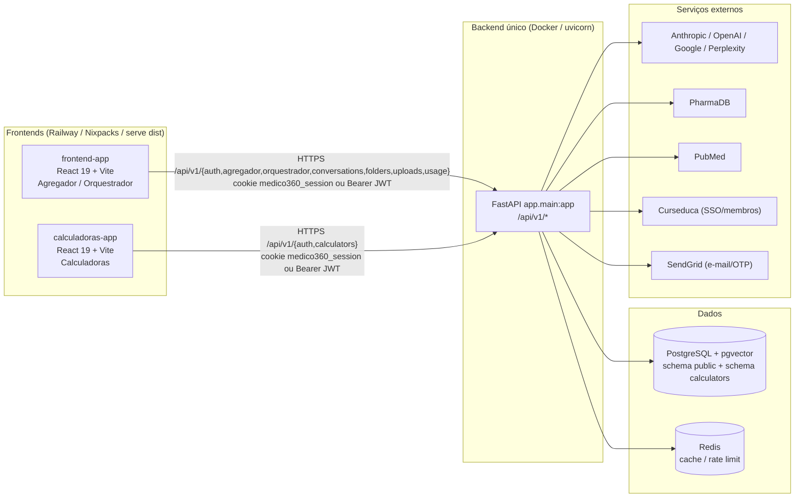
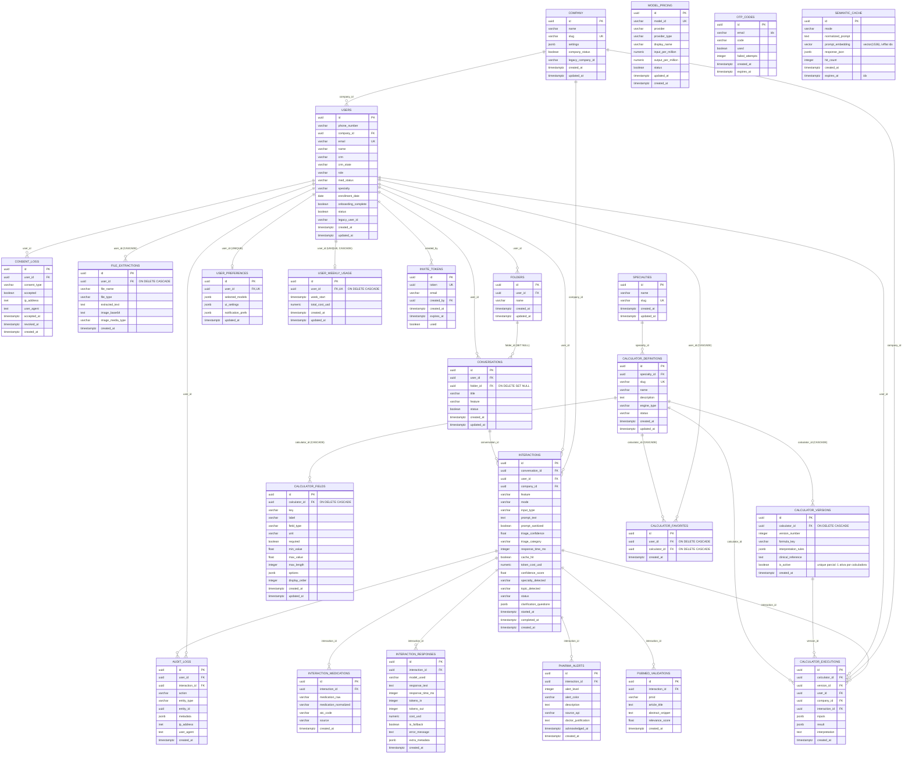

# Arquitetura Técnica — Médico 360

> Documento gerado por levantamento estático do código em 2026-08-20. Referências `arquivo:linha` apontam para a raiz do repositório.

## 0. Correção de premissa

Não existem "3 instâncias" no sentido de 3 serviços/deploys independentes de backend. A arquitetura real é:

- **1 backend único** (`app/`) — FastAPI monolítico que serve dois domínios de negócio (Agregador de IA + Orquestrador Multi-Agente, e Calculadoras Científicas) sob o mesmo processo, mesmo banco, mesmo router raiz.
- **2 frontends React separados**, cada um um deploy próprio no Railway:
  - `frontend-app/` — UI do Agregador/Orquestrador (chat com IA, histórico, pastas).
  - `calculadoras-app/` — UI das calculadoras clínicas.
- Não há módulo "news" no repositório.

Os dois frontends não conversam entre si nem chamam um ao outro — ambos falam apenas com o backend único, e compartilham sessão via cookie SSO (`medico360_session`, domínio comum) mais um fluxo dedicado (`/auth/embed/token`) para embeds externos (portal Curseduca).

---

## 1. Visão geral e comunicação entre as partes



Pontos-chave:
- Não há chamada HTTP interna entre "instâncias" — é sempre frontend → backend único.
- SSO entre os dois frontends é feito via cookie compartilhado (`COOKIE_DOMAIN`), não via chamada de API entre eles.
- Banco físico único; o schema `calculators` é apenas separação lógica dentro do mesmo Postgres, com FKs cruzando para tabelas do schema público (`users`, `company`, `interactions`).

---

## 2. Backend — `app/`

### 2.1 Stack
- Python 3.12, FastAPI, SQLAlchemy 2.0 (modo async, driver `asyncpg`), Alembic para migrations.
- `slowapi` para rate limiting, `httpx` para chamadas externas, `spaCy` (`pt_core_news_sm`) para NER usado no filtro de DLP.
- Observabilidade: Sentry (`error_tracking.py`) e OpenTelemetry/Arize Phoenix (`telemetry.py`).
- Empacotado em imagem Docker única (`Dockerfile`), servido por `uvicorn`.

### 2.2 Estrutura de pastas

```
app/
├── main.py            bootstrap FastAPI, CORS, GZip, middleware de Request-Id, monta api_v1_router
├── api/
│   ├── deps.py         get_current_user (JWT Bearer ou cookie), nome do cookie
│   └── v1/
│       ├── router.py    agrega todos os sub-routers sob /api/v1
│       └── endpoints/   auth, conversations, folders, agregador, orquestrador, uploads, usage, health
├── calculators/         módulo self-contained das calculadoras científicas
│   ├── engine/           motor de execução de fórmulas (coerção de campos, validação)
│   ├── formulas/         implementações por especialidade (cardiologia, infectologia, nefrologia)
│   ├── registry/         registro das calculadoras disponíveis
│   ├── repositories/     acesso a dados do schema `calculators`
│   ├── routers/          calculators_router.py — rotas HTTP
│   ├── schemas/          Pydantic de entrada/saída
│   ├── services/         orquestra execução e extração de campos via LLM
│   └── cache.py          cache do catálogo de calculadoras
├── core/                config (Settings), database (engine/session async), limiter, circuit breaker,
│                         cliente http, logging, error tracking (Sentry), telemetria, prompts de sistema
├── middleware/          dlp.py (sanitização de PII antes de enviar a LLM), ner.py (NER em pt/spaCy)
├── models/              ORM: models.py (schema público), calculators.py (schema calculators)
├── repositories/        auth_repository.py
├── schemas/             Pydantic: agregador, auth, conversations, usage
└── services/            agregador_service, orquestrador_service(+stream), ai_providers (Anthropic/OpenAI/
                         Google/Perplexity), auth_service, cache_service (Redis), consent_service (LGPD),
                         curseduca_service, data_subject_service (export LGPD), email_service (SendGrid),
                         file_extractor_service, medication_extractor, pharmadb_service, pricing,
                         pubmed_service, semantic_cache_service (pgvector), specialty_detector,
                         triage_service, usage_service
```

### 2.3 Autenticação (transversal a todas as rotas)

`get_current_user` (`app/api/deps.py:20-81`): extrai `Authorization: Bearer <jwt>` **ou** o cookie `medico360_session`, decodifica com `jwt_secret_key`/`jwt_algorithm`, valida `sub` como UUID e busca o `User` com `status=true`. O cookie é setado por `_set_session_cookie` (`auth.py:48-59`) com `httponly=True`, `secure=is_production`, `samesite=lax`, `domain=settings.cookie_domain`.

Todas as rotas abaixo exigem essa autenticação, **exceto** as marcadas "não" na coluna Auth.

### 2.4 Rotas — `/auth` (`app/api/v1/endpoints/auth.py`)

| Método | Path | Arquivo:linha | Auth | Rate limit | Descrição |
|---|---|---|---|---|---|
| POST | /api/v1/auth/register | auth.py:62 | não | 5/min | Cadastro público (se `allow_public_registration`); envia convite por email |
| POST | /api/v1/auth/invite/generate | auth.py:72 | sim (admin) | 30/min | Gera token de convite; grava `AuditLog action=invite.generate` |
| POST | /api/v1/auth/invite/accept | auth.py:105 | não | 10/min | Aceita convite por token+email; seta cookie SSO |
| POST | /api/v1/auth/embed/token | auth.py:125 | não | 5/min | SSO para embeds (Curseduca); valida `Origin` contra `embed_allowed_origins ∪ {calculadoras_url}`; valida membro ativo via Curseduca; cria usuário se necessário |
| POST | /api/v1/auth/otp/request | auth.py:173 | não | 3/15min (+3/900s por e-mail) | Solicita OTP por e-mail |
| POST | /api/v1/auth/otp/verify | auth.py:180 | não | 5/min (+10/900s por e-mail) | Verifica OTP; seta cookie SSO |
| POST | /api/v1/auth/onboarding | auth.py:189 | sim | 30/min | Completa onboarding + registra consentimento de termos na mesma transação |
| GET | /api/v1/auth/me | auth.py:223 | sim | — | Dados do usuário logado + hash para Intercom |
| PATCH | /api/v1/auth/me | auth.py:230 | sim | 30/min | Atualiza nome/email (valida unicidade) |
| GET | /api/v1/auth/me/consentimentos | auth.py:252 | sim | — | Situação de consentimentos LGPD + versão vigente |
| POST | /api/v1/auth/me/consentimentos/{tipo}/revogar | auth.py:269 | sim | 10/h | Revoga consentimento (exceto `termos_e_privacidade`) |
| GET | /api/v1/auth/me/export | auth.py:302 | sim | 5/h | Portabilidade LGPD art. 18, V — exporta dados do titular |
| DELETE | /api/v1/auth/me | auth.py:318 | sim | 10/min | Exclusão de conta em cascata (conversas, interações, alertas, preferências etc.) |

### 2.5 Rotas — `/conversations`

| Método | Path | Arquivo:linha | Rate limit | Descrição |
|---|---|---|---|---|
| GET | /api/v1/conversations | conversations.py:17 | 60/min | Lista conversas ativas do usuário, paginado, ordenado por `updated_at desc` |
| GET | /api/v1/conversations/{id} | conversations.py:36 | 60/min | Detalhe + mensagens paginadas; distingue `feature=AGREGADOR` (múltiplas respostas por interação) de `ORQUESTRADOR` (1 resposta) |

### 2.6 Rotas — `/folders`

| Método | Path | Arquivo:linha | Rate limit | Descrição |
|---|---|---|---|---|
| GET | /api/v1/folders | folders.py:34 | 60/min | Lista pastas do usuário |
| POST | /api/v1/folders | folders.py:49 | 30/min | Cria pasta |
| PUT | /api/v1/folders/{id} | folders.py:65 | 30/min | Renomeia |
| DELETE | /api/v1/folders/{id} | folders.py:86 | 30/min | Apaga |
| PATCH | /api/v1/folders/conversations/{id}/folder | folders.py:104 | 60/min | Move 1 conversa (ou remove, `folder_id=null`) |
| PATCH | /api/v1/folders/conversations/bulk | folders.py:134 | 30/min | Move até 100 conversas de uma vez |

### 2.7 Rotas — `/agregador`

| Método | Path | Arquivo:linha | Rate limit | Descrição |
|---|---|---|---|---|
| GET | /api/v1/agregador/models | agregador.py:45 | — | Lista modelos ativos com disponibilidade calculada por chave de API configurada e `cost_tier` |
| POST | /api/v1/agregador/query | agregador.py:93 | 30/min | Consulta não-streaming, múltiplos modelos em paralelo, checa limite semanal de uso |
| POST | /api/v1/agregador/stream | agregador.py:123 | 30/min | SSE streaming; DLP via `sanitize_prompt_async`; histórico de até 10 turnos; 1 task assíncrona por modelo; eventos `delta`/`complete`/`error`/`pubmed`/`disclaimer`/`done`; `effort` ajusta max_tokens (rápido=700, detalhado=4096) |
| GET | /api/v1/agregador/history | agregador.py:286 | — | Histórico pesquisável por query/modelo/data, paginado |

### 2.8 Rotas — `/orquestrador`

| Método | Path | Arquivo:linha | Rate limit | Descrição |
|---|---|---|---|---|
| POST | /api/v1/orquestrador/query | orquestrador.py:62 | 30/min | Triagem automática + roteamento não-streaming |
| POST | /api/v1/orquestrador/stream | orquestrador.py:103 | 30/min | Mesmo roteamento via SSE (não suporta modo PHARMA_CHECK) |

Roteamento por categoria de triagem: `QUICK_SEARCH` → Perplexity · `CLINICAL_REASONING` → Claude Sonnet · `PHARMA_CHECK`/`PHARMA_BULA`/`PHARMA_RECEITA`/`PHARMA_GENERICO` → PharmaDB · `PRODUCTIVITY` → GPT-5.4 Nano.

Body `OrquestradorRequest` (`orquestrador.py:21-59`): `prompt` (1–4000 chars), `conversation_id`, `force`, `clarification_answers`, `effort` (rápido|detalhado), `mode` (opcional, pula triagem), `history`, `folder_id`, `file_id`.

### 2.9 Rotas — `/uploads`

| Método | Path | Arquivo:linha | Rate limit | Descrição |
|---|---|---|---|---|
| POST | /api/v1/uploads/extract | uploads.py:39 | 20/min | Valida content-type + magic bytes; extrai texto (parsers em thread); para imagens gera descrição via Claude Haiku e cobra custo; trunca em `MAX_EXTRACTED_CHARS`; salva `FileExtraction`; retorna `file_id` |

### 2.10 Rotas — `/users/usage` e `/health`

| Método | Path | Arquivo:linha | Auth | Descrição |
|---|---|---|---|---|
| GET | /api/v1/users/usage | usage.py:12 | sim | Uso/limite semanal do usuário |
| GET | /api/v1/health | health.py:33 | não | Liveness pura, não toca dependências |
| GET | /api/v1/health/ready | health.py:63 | não | Readiness: checa Postgres (`SELECT 1`) e Redis (`ping`) em paralelo, timeout 3s cada; 503 se algo falhar |

### 2.11 Rotas — `/calculators` (`app/calculators/routers/calculators_router.py`)

| Método | Path | Arquivo:linha | Rate limit | Descrição |
|---|---|---|---|---|
| GET | /api/v1/calculators | calculators_router.py:23 | 60/min | Lista calculadoras, filtro opcional por especialidade |
| GET | /api/v1/calculators/{slug} | calculators_router.py:34 | 60/min | Detalhe (campos, versão ativa) |
| POST | /api/v1/calculators/{slug}/execute | calculators_router.py:45 | 60/min | Executa cálculo (`inputs`, `dry_run` opcional) |
| POST | /api/v1/calculators/{slug}/extract | calculators_router.py:64 | 30/min | Extrai campos via LLM a partir de texto livre |
| PUT | /api/v1/calculators/{slug}/favorite | calculators_router.py:88 | 60/min | Favorita |
| DELETE | /api/v1/calculators/{slug}/favorite | calculators_router.py:99 | 60/min | Desfavorita |
| GET | /api/v1/calculators/{slug}/history | calculators_router.py:110 | 60/min | Histórico de execuções do usuário (`limit` 1–200, `offset`) |

---

## 3. Frontend — `frontend-app/` (Agregador / Orquestrador)

- React 19 + Vite, deploy Railway via Nixpacks (`npm run build` → `serve dist`).
- Consome `/api/v1/{auth,agregador,orquestrador,conversations,folders,uploads,usage}`.

```
src/
├── App.tsx, main.tsx     bootstrap React/router
├── api/                  clients HTTP: agregador, auth, conversations, folders, orquestrador, uploads, usage
├── components/           ChatView, InputBar, ModelSelector, Sidebar, Topbar, ClarificationPrompt,
│                         ModeChip/ModeIntro, ProfileModal, EmptyState, Logo
│   └── sidebar/           ConvItem, DropZoneNoPasta, FolderRow, groupByDate — gestão de pastas/conversas
├── hooks/                 useIsMobile.ts
├── lib/                   auth.ts, useCurrentUser.ts, useUserUsage.ts, appModes.ts, documentos.ts,
│                         intercom.ts/IntercomIdentity.tsx, modelDescriptions.ts, styles.ts
├── pages/                 EmbedAuthPage, InvitePage, LoginPage, OnboardingPage, RegisterPage
└── tokens.ts, index.css
```

---

## 4. Frontend — `calculadoras-app/`

- React 19 + Vite, mesmo padrão de deploy Railway.
- Consome `/api/v1/{auth,calculators}` do mesmo backend.

```
src/
├── App.tsx, main.tsx
├── api/                   auth.ts, calculators.ts
├── calculators/           formSpecs por calculadora (CHA2DS2-VASc/HAS-BLED, Cockcroft-Gault, CURB-65,
│                         Risco CV SBC2025), formHelpers.ts, index.ts
│   └── riscoCv/            UI dedicada da calculadora de risco cardiovascular SBC2025
│       └── steps/            wizard: TriagemStep, DiabetesStep, AgravantesStep, AltoRiscoStep, PreventStep
├── components/            AiPrefillBox/Section, CalculatorCard, CalculatorTopbar, DynamicCalculatorForm,
│                         FieldWidget, GenericResultPanel, ResultPanel, WizardStepper
├── hooks/                 useCalculatorDetail, useCalculators, useExecuteCalculator, useExtractFields,
│                         useFavorites
├── lib/                   auth.ts, specialtyStyles.tsx, useCurrentUser.ts
├── pages/                 CalculatorsListPage, EmbedAuthPage, GenericCalculatorPage, LoginPage,
│                         RiscoCvSbc2025Page
└── tokens.ts, index.css
e2e/                        testes Playwright, playwright.config.ts
```

---

## 5. Banco de dados

PostgreSQL com extensão `vector` (pgvector). Baseline único em `alembic/versions/000_baseline_baseline_do_schema_completo.py` (`revision=000_baseline`, `down_revision=None`). Migrations antigas ficam arquivadas em `alembic/versions_legacy/` — fora da cadeia ativa, não devem ser tocadas. Não há `CREATE TYPE` (enums) nem triggers no baseline: campos categóricos (`role`, `status`, `feature`, `engine_type` etc.) são `VARCHAR` validados na camada de aplicação (Pydantic), não por CHECK constraint no banco.

O schema `calculators` é separação lógica dentro do **mesmo** banco físico — não é multi-tenant nem instância separada — e suas tabelas têm FKs cruzando para `public.users`, `public.company` e `public.interactions`.

### 5.1 Diagrama ER



### 5.2 Constraints e regras notáveis

- **`semantic_cache.prompt_embedding`**: `VECTOR(1536)` (pgvector); índice `semantic_cache_embedding_idx` — `CREATE INDEX ... USING ivfflat (prompt_embedding vector_cosine_ops) WITH (lists = 100)`; índice composto `semantic_cache_mode_expires_idx (mode, expires_at)` para varredura de expiração por modo.
- **`calculators.calculator_versions`**: índice único parcial `uq_calculator_versions_one_active` — `CREATE UNIQUE INDEX ... ON calculator_versions (calculator_id) WHERE is_active` — garante no máximo **uma** versão ativa por calculadora ao mesmo tempo, sem impedir múltiplas versões inativas/históricas.
- **`calculators.calculator_favorites`**: `UNIQUE(user_id, calculator_id)` (`uq_calculator_favorites_user_calculator`) — evita favoritar a mesma calculadora duas vezes.
- **`calculators.calculator_fields`**: `UNIQUE(calculator_id, key)` (`uq_calculator_fields_calculator_key`) — chave de campo única por calculadora.
- **`calculators.calculator_versions`**: `UNIQUE(calculator_id, version_number)` (`uq_calculator_versions_calculator_version`).
- **`users.email`**, **`company.slug`**, **`model_pricing.model_id`**, **`invite_tokens.token`**, **`specialties.slug`**, **`calculator_definitions.slug`**: todos `UNIQUE`.
- **`user_preferences.user_id`** e **`user_weekly_usage.user_id`**: `UNIQUE` (relação 1:1 com `users`).
- **Cascades explícitos**: `file_extractions.user_id`, `user_weekly_usage.user_id`, `calculator_favorites.user_id/calculator_id`, `calculator_fields.calculator_id`, `calculator_versions.calculator_id` → `ON DELETE CASCADE`. `conversations.folder_id` → `ON DELETE SET NULL`.
- **Sem enums nativos e sem triggers** no baseline — validação de valores categóricos e regras de negócio (ex.: workflow de status) vivem na camada de aplicação, não no banco.
- **Isolamento lógico, não físico**: schema `calculators` no mesmo database do schema público; FKs cruzam livremente entre os dois (`calculator_favorites.user_id → public.users`, `calculator_executions.company_id → public.company`, `calculator_executions.interaction_id → public.interactions`).

---

## 6. Variáveis de ambiente

### 6.1 Backend (`app/core/config.py`)

| Variável | Default | Obrigatória em produção |
|---|---|---|
| APP_ENV | — | sim |
| APP_DEBUG | False | não |
| LOG_LEVEL | INFO | não |
| DATABASE_URL | — | sim |
| JWT_SECRET_KEY | — | sim |
| JWT_ALGORITHM | HS256 | não |
| JWT_ACCESS_TOKEN_EXPIRE_MINUTES | 60 | não |
| ANTHROPIC_API_KEY | "" | não |
| OPENAI_API_KEY | "" | não |
| GOOGLE_AI_API_KEY | "" | não |
| PERPLEXITY_API_KEY | "" | não |
| PHARMADB_API_KEY | "" | não |
| PUBMED_API_KEY | "" | não |
| SENDGRID_API_KEY | "" | sim |
| SENDGRID_FROM_EMAIL | noreply@medico360.com.br | não |
| FRONTEND_URL | http://localhost:5173 | não |
| CALCULADORAS_URL | http://localhost:5174 | não |
| INVITE_TOKEN_EXPIRE_HOURS | 72 | não |
| OTP_EXPIRE_MINUTES | 10 | não |
| ALLOW_PUBLIC_REGISTRATION | False | não |
| COOKIE_DOMAIN | None | não |
| EMBED_ALLOWED_ORIGINS | `["https://adminportalmedico360.curseduca.pro"]` | não |
| CURSEDUCA_VALIDATION_ENABLED | False | sim (deve ser `true`) |
| CURSEDUCA_API_BASE | https://prof.curseduca.pro | sim, se validação habilitada |
| CURSEDUCA_API_KEY | "" | sim, se validação habilitada |
| CURSEDUCA_ACCESS_TOKEN | "" | efetivamente exigida pelo endpoint members/by |
| INTERCOM_IDENTITY_SECRET | "" | não |
| REDIS_URL | redis://localhost:6379/0 | não |
| SENTRY_DSN | "" | não |
| SENTRY_RELEASE | "" | não |
| PHOENIX_API_KEY / PHOENIX_PROJECT_NAME / PHOENIX_ENDPOINT | — / medico-360 / app.phoenix.arize.com/... | não |
| MAX_MODELS_PER_QUERY | 4 | não |
| MAX_PROMPT_CHARS | 4000 | não |
| DEFAULT_TIMEOUT_SECONDS | 30 | não |
| CALCULATOR_TEXT_FIELD_MAX_CHARS | 2000 | não |
| CALCULATOR_CATALOG_CACHE_TTL_SECONDS | 300 | não |
| CALCULATOR_EXTRACTION_MAX_CONCURRENCY | 8 | não |
| CALCULATOR_EXTRACTION_TIMEOUT_SECONDS | 15 | não |

Validação fail-closed em produção (`_validate_production_secrets`): o startup derruba (`ValueError`) se `jwt_secret_key`, `database_url` ou `sendgrid_api_key` estiverem vazios, se `curseduca_validation_enabled` for `false`, ou se estiver `true` mas faltar `curseduca_api_base`/`curseduca_api_key`.

### 6.2 Frontends (build-time, Vite)

| Variável | Usada em | Comportamento |
|---|---|---|
| VITE_API_URL | `frontend-app/src/api/*.ts` | fallback `http://localhost:8000` se ausente |
| VITE_API_URL | `calculadoras-app/src/api/{auth,calculators}.ts` | em dev, ausência = caminho relativo (proxy Vite cuida do CORS); em prod aponta para o domínio do backend |
| VITE_INTERCOM_APP_ID | `frontend-app/src/main.tsx` | só no frontend-app, ativa widget do Intercom |

---

## 7. Infraestrutura e deploy

### 7.1 Backend — Dockerfile único (raiz do repo)

```dockerfile
FROM python:3.12-slim
WORKDIR /app
COPY requirements.txt .
RUN pip install --no-cache-dir -r requirements.txt
RUN python -m spacy download pt_core_news_sm
COPY . .
RUN useradd --create-home --uid 1000 appuser && chown -R appuser:appuser /app
USER appuser
EXPOSE 8000
CMD ["uvicorn", "app.main:app", "--host", "0.0.0.0", "--port", "8000", "--proxy-headers", "--forwarded-allow-ips", "*"]
```

Não há `docker-compose.yml` nem `Procfile` no repositório — apenas este Dockerfile serve o backend.

### 7.2 Frontends — `railway.json` (idêntico nos dois)

```json
{
  "build": { "builder": "NIXPACKS", "buildCommand": "npm run build" },
  "deploy": {
    "startCommand": "npx serve dist -s -l tcp://0.0.0.0:$PORT",
    "healthcheckPath": "/"
  }
}
```

### 7.3 CI — `.github/workflows/ci.yml` (4 jobs)

1. **backend**: serviço `pgvector/pgvector:pg16` na porta `55433` (precisa do ivfflat, não Postgres puro) → `ruff check .` → `pytest -q --cov=app --cov-fail-under=50` → valida `alembic upgrade head` do zero → `pip-audit -r requirements.txt --strict`.
2. **frontend-app**: node 20 → `npm ci` → `npm run lint` → `tsc -b --noEmit` → `npm run build`.
3. **calculadoras-app**: idêntico ao anterior.
4. **e2e-calculadoras**: sobe Postgres pgvector, roda `alembic upgrade head` + seeds (`seed_calculators`, `seed_risco_cv_sbc2025`, `seed_usuario_e2e`), sobe backend e `calculadoras-app` (dev server, porta 5174) em background, espera `/api/v1/health` e a porta do front responderem, roda Playwright (`npm run test:e2e`).

---

## 8. Testes

- Backend: `tests/` (~20 arquivos), cobertura mínima de 50% cobrada em CI.
- `calculadoras-app/e2e/`: testes Playwright end-to-end contra backend + frontend reais (não mockados), rodando por cima de seeds determinísticos.

---

## 9. Pontos de atenção para quem for mexer no código

- O harness local de testes precisa do container `pgvector` na porta `55433` (ver [[medico360-harness-testes]] em memória) — não roda contra o Postgres de produção.
- A cadeia de migrations parte de `000_baseline`; `alembic/versions_legacy/` é histórico arquivado, não deve ser alterado nem referenciado por novas migrations.
- Os filtros de DLP (`app/middleware/dlp.py` + `ner.py`) têm exceções para epônimos médicos calibradas por medição real — não simplificar sem reler a justificativa.
- Não há backup automático gerenciado pelo Railway; a estratégia de continuidade é dump manual + armazenamento externo (ver runbook e memória de projeto).
