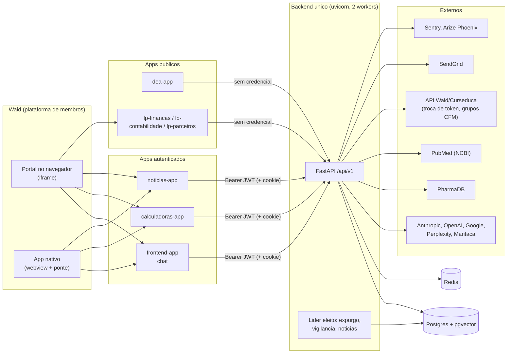
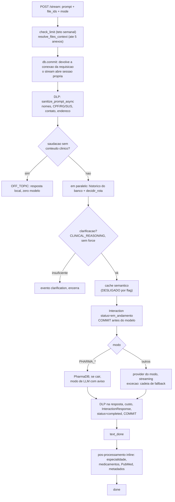

# Arquitetura Técnica — Médico 360

> Estado do código em **2026-09-25**, commit `bd76b44` na `main`, head do Alembic
> `015_otp_code_hmac`. Referências `arquivo:linha` apontam para a raiz do repositório
> e envelhecem; o nome da função é âncora melhor que o número da linha.
> Descreve o sistema como ele é hoje. O histórico vive no `git log`; o raciocínio de
> cada decisão, nos comentários do código e nos cabeçalhos das migrations.

## 0. Como ler este documento

Para entender o sistema numa tarde, leia nesta ordem:

1. **§1 — topologia.** Quantos serviços existem, quem fala com quem, onde a Waid entra.
2. **§2 — o repositório.** Quem mora em qual pasta.
3. **§5 — pipeline do Orquestrador.** É o produto; o resto do backend orbita esse fluxo.
4. **§3.4 e §9.3 — sessão e identidade.** O que mais mudou em setembro, e o que mais quebra no celular.
5. **§10 — banco.** As 46 tabelas versionadas, as 55 FKs e o que o código assume delas.
6. **§16 — riscos até o lançamento.** O que pode dar errado no evento, em ordem de impacto.

O resto é referência: rotas (§4), variáveis (§11), deploy (§12), testes e CI (§13), scripts (§14).

Documentos irmãos, que este não duplica:

| Arquivo | O que traz |
|---|---|
| `docs/regras-de-negocio.md` | Regras de negócio numeradas (RN-*), com arquivo e constante de cada número |
| `docs/Calculadoras_Cientificas_Regras_de_Arquitetura_v1.0.md` | Contrato de arquitetura do módulo de calculadoras (rascunho de junho) |
| `docs/debitos.md` | 17 débitos técnicos, com status e justificativa de cada um |
| `docs/runbook.md` | Operação: health, incidentes, rotação de segredos, backup/restore medido, retenção |
| `docs/subir-para-producao.md` | Roteiro de subida: backup → migrations → código, e a reversão |
| `docs/pendencias.md` | Inventário do que falta e de quem é (painel, homologação, decisões de produto) |
| `docs/pitacos-do-fable.md` / `pitacos-do-fable-2.md` | Varreduras de 18/09 e 24/09: itens numerados 1–93, placar e plano até o evento |
| `docs/inventario-tratamento-de-dados.md` | Inventário LGPD contra o código real |
| `docs/teste-e2e.md` | Roteiro manual de E2E e o E2E com chamada real aos provedores |
| `docs/juridico/` | Rascunhos de termos de uso, política de privacidade e de cookies |

> Os números de item (ex.: "item 66") referem-se às duas varreduras acima.

---

## 1. Topologia

**Um backend, sete frontends, um banco.** Não há microsserviços nem chamada HTTP entre
serviços internos: é sempre navegador → backend único.

| Serviço (Railway) | Pasta | Papel | Porta dev | Público? |
|---|---|---|---|---|
| Backend | `app/` (Dockerfile na raiz) | FastAPI monolítico: todos os domínios, `/api/v1/*` | 8000 | — |
| Chat | `frontend-app/` | Orquestrador ("Kortex"), histórico, pastas, anexos | 5173 | login |
| Calculadoras | `calculadoras-app/` | Calculadoras clínicas | 5174 | login |
| Notícias | `noticias-app/` | Feed clínico por tema + digest por e-mail | 5176 | login |
| DEA | `dea-app/` | Metrônomo de RCP + mapa colaborativo de desfibriladores | 5179 | **sem login** |
| LP finanças | `lp-financas/` | Captação | 5175 | sem login |
| LP contabilidade | `lp-contabilidade/` | Captação | 5176 ⚠ | sem login |
| LP parceiros | `lp-parceiros/` | Captação | 5177 | sem login |
| Postgres + pgvector | — | Banco único, schemas `public`, `calculators`, `landing_pages`, `news`, `dea` | 5432 | — |
| Redis | — | Contador do rate limit, cache de triagem/PharmaDB/PubMed, throttle por e-mail | 6379 | — |

⚠ `noticias-app` e `lp-contabilidade` usam a mesma porta de dev (5176) — só importa rodando os dois juntos.

**Como o médico chega.** Quase sempre pela **Waid** (plataforma de membros, antes chamada
Curseduca), de dois jeitos:

- **Portal no navegador** (`adminportalmedico360.curseduca.pro` / `www.medico360.app`): nossos apps rodam em **iframe**.
- **App nativo da Waid** (Android/iOS, versão ≥ 1.57.24): nossos apps rodam em **webview, sem iframe**; a identidade chega por uma ponte injetada na janela (`window.ReactNativeWebView`).

Os três apps autenticados são incorporados **separadamente** e cada um faz o próprio
login (`/auth/embed/token`). **Não há SSO por cookie entre eles** e não pode haver na
topologia atual: os serviços são subdomínios de `up.railway.app`, que está na Public
Suffix List. O que eles compartilham é o **banco** — uma linha em `users` serve aos três.



---

## 2. O repositório — quem mora onde

Monorepo. Não é workspace npm: cada app tem o próprio `package.json` e lockfile, e o
código comum entra por alias de Vite (`@shared`).

```
IA-Medico-360/
├── app/                   BACKEND (FastAPI). Ver §3.2
├── alembic/               migrations
│   ├── versions/            cadeia ativa: 000_baseline … 015_otp_code_hmac
│   └── versions_legacy/     ARQUIVO MORTO — não alterar nem referenciar
├── tests/                 suíte do backend (107 arquivos test_*.py, ~1600 testes)
├── scripts/               operação: backup, restore, seeds, medições (§14)
│   └── dados/model_pricing.json   preços dos modelos (fonte da verdade de model_pricing)
├── shared/                código comum aos frontends (§9.2)
│   ├── embed/               identidade Waid, sessão viva, reentrada, formulário preservado, LoginOtp, TelaDeEspera
│   ├── onboarding/          OnboardingGate + api/tipos/estilos
│   ├── design/              tokens.css (tipografia e alvos de toque responsivos), MedicoLogoAnimada
│   ├── documentos.ts        URLs e versão dos documentos jurídicos (casa com consent_service)
│   └── contrato-sse.ts      nomes dos eventos do stream (testado dos dois lados)
├── frontend-app/          chat do Orquestrador (§9.4)
├── calculadoras-app/      calculadoras (§9.5)
├── noticias-app/          notícias (§9.6)
├── dea-app/               DEA + metrônomo (§9.7)
├── lp-financas/  lp-contabilidade/  lp-parceiros/   landing pages (§9.7)
├── docs/                  documentação (ver tabela do §0)
├── .github/workflows/ci.yml   CI (7 jobs)
├── Dockerfile             imagem do BACKEND (cada frontend tem o seu, em <app>/Dockerfile)
├── .dockerignore          obrigatório: exclui venv, node_modules, .env, backups/, docs/
├── requirements.txt / requirements-dev.txt / pytest.ini / .coveragerc / ruff.toml / alembic.ini
└── .env.example           ⚠ desatualizado — ver §16.3
```

**Fora do git, mas na pasta de trabalho** (não confundir com código): `backups/` (dumps
reais de produção, sem criptografia — §16), `medico-360/` (protótipo do Claude Design,
28 MB), `venv/` e `.venv/`, `.coverage`.

**Regra de arquitetura que emergiu, e que vale seguir em coisa nova:** `calculators/`,
`dea/`, `medicina/` e `news/` são **fatias verticais** — trazem o próprio domínio e o
domínio não depende de infraestrutura. `app/services/` (~40 arquivos) é o núcleo antigo,
organizado horizontalmente. Não há projeto para reorganizá-lo: construa o novo como
fatia e deixe o antigo encolher por atrito.

---

## 3. Backend

### 3.1 Stack

Python 3.12 · FastAPI 0.141 · Pydantic 2.10 / pydantic-settings 2.7 · SQLAlchemy 2.0
async (`asyncpg`) · Alembic 1.14 · uvicorn 0.34 · PyJWT 2.13 · slowapi 0.1.9 (rate
limit, contador no Redis) · httpx 0.28 (cliente compartilhado) · sse-starlette 3.0 ·
spaCy 3.8 + `pt_core_news_sm` (NER do DLP) · pgvector 0.3 · redis 5.2 · sendgrid 6.11 ·
pdfplumber / python-docx / openpyxl · sentry-sdk 2.20 · arize-phoenix-otel 0.17.

~24.800 linhas de Python em `app/`.

### 3.2 Estrutura de `app/`

```
app/
├── main.py                  bootstrap: lifespan, middlewares, handlers, include do router /api/v1
├── api/
│   ├── deps.py              get_current_user (Bearer ou cookie; confere tv e auth_time),
│   │                        get_current_user_opcional, exigir_origem_confiavel (anti-CSRF)
│   └── v1/router.py         agrega os 14 routers sob /api/v1 com a guarda anti-CSRF global
│       endpoints/           auth, conversations, folders, agregador, health, landing_pages,
│                            meta, news, orquestrador, uploads, usage
├── core/
│   ├── config.py            Settings, validação fail-closed de produção, origens_confiaveis()
│   ├── database.py          engine async: pool 30+10, pool_timeout 5 s, idle_in_transaction 180 s
│   ├── lider.py             eleição de líder por advisory lock (classe Lideranca) — §3.3
│   ├── limiter.py           slowapi: chave user:<sub> com token, senão IP; Redis em produção
│   ├── security_headers.py  ASGI: nosniff, no-referrer, X-Frame DENY, no-store, CSP, HSTS;
│   │                        tira Allow-Credentials das origens públicas (DEA, LPs)
│   ├── body_limit.py        ASGI: 413 por Content-Length (2 MB geral; 11 MB em /uploads)
│   ├── sse.py               com_heartbeat: ": ping" a cada 15 s de silêncio
│   ├── circuit_breaker.py   disjuntores: pharmadb, pubmed, curseduca, openai_auxiliares
│   ├── http_client.py       httpx.AsyncClient compartilhado
│   ├── logging_config.py    log JSON + RequestIdMiddleware (X-Request-ID)
│   ├── error_tracking.py    Sentry com scrubbing de PII obrigatório
│   ├── telemetry.py         spans OpenInference para o Arize Phoenix (escritos à mão)
│   ├── alarme.py            evento operacional no Sentry, por tag
│   ├── prompts.py           system prompts por modo, clarificação, DISCLAIMER
│   └── citacoes_fonte.py    forma {url, title} das fontes + leitura do formato legado
├── middleware/              (utilitários, não middlewares ASGI) dlp.py + ner.py
├── medicina/                DOMÍNIO PURO: especialidades.py (vocabulário CFM, grupos [CFM]),
│                            identidade.py (precedência da especialidade, pendências do perfil)
├── news/                    DOMÍNIO PURO: taxonomia.py (51 temas ↔ especialidades), journals.py
├── calculators/             fatia vertical: engine/, formulas/ (por especialidade), registry/,
│                            repositories/, routers/ (calculators, prevent), schemas/, services/, cache.py
├── dea/                     fatia vertical: routers/, repositories/ (busca por raio), schemas/,
│                            services/ (anonimato, antivandalismo, cadastro, confianca)
├── models/                  models.py (public), calculators.py, landing_pages.py, news.py, dea.py
├── repositories/            auth_repository.py (usuário, OTP FOR UPDATE, cascata de exclusão LGPD)
├── schemas/                 Pydantic: agregador, auth, conversations, landing_pages, news, usage
└── services/
    ├── orquestrador_modes.py        FONTE ÚNICA de modos, modelos, temperaturas, fallbacks, max_tokens
    ├── orquestrador_shared.py       decidir_rota, clarificação, contexto, pos_processar_interacao, cache
    ├── orquestrador_stream_service.py   pipeline SSE (o caminho do produto)
    ├── orquestrador_service.py      /query (obsoleto) + handlers de farmácia usados pelo stream
    ├── triage_service.py            atalho de saudação + triagem (gpt-5.4-nano, cache 2 h)
    ├── conversation_history.py      histórico do banco (até 40 interações completed)
    ├── context_budget.py            orçamento de tokens (histórico 6000, anexos 12000)
    ├── folder_context_service.py    contexto entre conversas da pasta + evolução declarada
    ├── semantic_cache_service.py    cache semântico pgvector (DESLIGADO por flag)
    ├── file_extractor_service.py    parsers PDF/DOCX/XLSX, visão (claude-haiku-4-5)
    ├── medication_extractor.py / specialty_detector.py / response_metadata.py
    ├── usage_service.py             teto semanal, record_cost atômico
    ├── pricing.py                   preço por modelo, custo de ferramentas (Data Ocean), BRL_POR_USD
    ├── auth_service.py              JWT, convite, embed (Waid), OTP com HMAC, ContaInativa
    ├── consent_service.py / data_subject_service.py   LGPD: consentimento, export, retenção, expurgo
    ├── expurgo_agendado.py / vigilancia_agendada.py / vigilancia_service.py / news_agendado.py
    ├── news_collector / news_tagger / news_writer / news_feed / news_keyword /
    │   news_digest_service.py / news_digest_agenda.py   pipeline e feed de notícias
    ├── email_service.py / email_templates.py / html_seguro.py / cache_service.py
    ├── agregador_service.py         produto legado, fora da UI
    └── integracoes/                 quem fala com o mundo de fora (§3.5)
        ai_providers.py (1208 linhas), curseduca_service.py, pharmadb_service.py,
        pubmed_service.py, pubmed_eutils.py, news_pubmed.py
```

Maiores arquivos: `ai_providers.py` (1208), `orquestrador_service.py` (841),
`endpoints/auth.py` (766), `pharmadb_service.py` (752), `orquestrador_stream_service.py` (715).

### 3.3 Boot, middlewares e tarefas de fundo

**Importar `app.main` já valida as Settings** — em produção, fail-closed (§11.1). Depois,
o lifespan:

1. logging (JSON em produção) → 2. Sentry (se houver DSN) → 3. Phoenix → 4. cliente
httpx → 5. `ner.warmup()` (tira ~1 s da primeira requisição) → 6. `load_all_formulas()`
(uma `formula_key` órfã **derruba o boot**, não a primeira execução clínica) →
7. `Lideranca("agendadores").iniciar()` → `yield` → no shutdown, `lideranca.parar()` e o
fechamento do httpx.

**Middlewares, na ordem em que a requisição os atravessa:**
`CabecalhosDeSeguranca` → `CORS` → `RequestId` → `GZip` → `LimiteDeCorpo` → rota.
O CORS usa `origens_confiaveis()` — **a mesma lista** da guarda anti-CSRF, com
`allow_credentials=True`. O handler global de `Exception` devolve 500 genérico; o de
`RateLimitExceeded` devolve 429 com `detail` em português.

**Anti-CSRF global** (`deps.exigir_origem_confiavel`, pendurada no router `/api/v1`):
em método de escrita, um `Origin` fora de `origens_confiaveis()` leva 403. Requisição sem
`Origin` passa (não vem de navegador).

**Autorização é rota a rota.** Não há middleware de auth: a rota que esquecer
`Depends(get_current_user)` fica pública em silêncio. `tests/test_authorization.py`
declara a política de cada rota e falha para rota nova sem decisão.

**Eleição de líder** (`app/core/lider.py`). O backend roda com 2 workers
(`WEB_CONCURRENCY`), e as tarefas agendadas não podem rodar em dobro. Cada processo disputa
um `pg_try_advisory_lock` numa conexão dedicada (`NullPool`); **a disputa se repete a cada
60 s** — o líder confere a própria conexão com `SELECT 1` e, se ela cair, derruba os
agendadores e volta a disputar. Isso corrige o incidente de 24/09 (item 59): a versão
anterior tentava só no boot, e em todo deploy o container novo encontrava o lock preso
pelo antigo e ninguém assumia. **Homologado em produção:** deploy sem Restart, um worker
assumiu 60 s depois. Sobreposição máxima: um intervalo (60 s).

| Tarefa (só no líder) | Arquivo | 1ª execução | Frequência |
|---|---|---|---|
| Expurgo LGPD | `expurgo_agendado.py` | 90 s após assumir | 24 h; grava `audit_logs.action='expurgo.rodada'` |
| Vigilância | `vigilancia_agendada.py` | 900 s (tem de ser > expurgo) | 6 h; alarme no Sentry, 1 por tag por dia |
| Notícias | `news_agendado.py` | 120 s | dorme até a virada da hora (+30 s); coleta às `NEWS_RUN_HOUR` (11 UTC); digest a cada hora conforme a agenda de cada médico; recupera até 3 horas perdidas |

Rodam em **qualquer** worker, sem liderança: envio de OTP em segundo plano, indexação de
pasta, pós-processamento do `/query`, produtor do SSE.

### 3.4 Autenticação e sessão

**O token.** JWT HS256 com `{sub, role, exp, auth_time, tv}`.

- `exp = min(agora + 60 min, auth_time + 24 h)`. O token vive 60 min
  (`JWT_ACCESS_TOKEN_EXPIRE_MINUTES`) e a **sessão** vive no máximo 24 h desde o login
  (`SESSION_MAX_AGE_HOURS`). Quem entra por código de e-mail digita código uma vez por dia.
- `POST /auth/session/renew` troca um token válido por outro **sem** esticar o teto de
  24 h. O frontend renova quando faltam < 10 min, ao voltar para a aba
  (`shared/embed/sessao.ts`).
- `tv` é `users.token_version` (migration 014). `POST /auth/logout` o incrementa e
  **derruba todas as sessões do médico, em todos os aparelhos** — o JWT não tem id de
  sessão. `?revogar=false` só apaga o cookie (usado para descartar sessão de outra pessoa
  num iframe).

**Onde o backend lê o token** (`deps.get_current_user`): header `Authorization: Bearer`
primeiro, cookie `medico360_session` depois. Confere assinatura, `sub` UUID, usuário com
`status=true`, `tv` igual e o teto de `auth_time`. O cookie é `httponly`, e em produção
`secure` + `SameSite=None` — exigência do iframe, porque toda chamada é cross-site. Os
frontends usam, na prática, o **Bearer do `localStorage`**.

**Admin** não tem dependency: são três checagens inline de `role == "admin"`
(`invite/generate`, `admin/users/{id}/especialidade`, `news/admin/pipeline`). Todo
usuário novo nasce `beta_user`.

**Os caminhos de entrada:**

| Caminho | Rota | Nota |
|---|---|---|
| **Embed da Waid** (o que importa) | `POST /auth/embed/token` | Token opaco de uso único (5 min) trocado server-to-server por `{uuid, nome, e-mail}`. Busca por `waid_uuid`, depois por e-mail (com backfill do uuid); cria `beta_user` se não existir. uuid divergente → 403 `identidade_divergente` + alarme; conta desativada → 403 `conta_inativa`; token inválido → 401 (o cliente pede outro, até 3×); Waid fora → 503 + alarme. Reconcilia nome e especialidade (§3.6) sem nunca derrubar o login |
| Código por e-mail (OTP) | `POST /auth/otp/request` e `/verify` | Plano B quando a Waid não responde. O banco guarda só o **HMAC-SHA256** do código (migration 015); 5 tentativas; todos os códigos ativos valem e o erro conta em todos; o e-mail sai em segundo plano para não vazar, pelo tempo, se a conta existe |
| Convite | `POST /auth/invite/accept` | Gerado por admin |
| Auto-cadastro | `POST /auth/register` | Desligado (`ALLOW_PUBLIC_REGISTRATION=false`) |
| Identidade sem sessão | `POST /auth/embed/identidade` | Só para as LPs pré-preencherem nome e e-mail; não cria usuário |

O caminho legado `?email=` do embed está desligado (`EMBED_EMAIL_FALLBACK_ENABLED=false`)
e só existe atrás da flag.

**Rate limit** (`app/core/limiter.py`): a chave é `user:<sub>` quando há token válido e
**o IP quando não há** — ou seja, em todas as rotas de entrada. O contador vive no Redis
em produção (com fallback em memória, que conta por processo). O OTP tem, além disso,
throttle por e-mail no Redis. Os limites por IP das rotas de entrada
(`LIMITE_*_POR_IP` em `endpoints/auth.py`) foram subidos em 25/09 para aguentar um
evento com todos atrás do mesmo IP; o comentário ali explica onde está a defesa de verdade.

### 3.5 Integrações externas (`services/integracoes/`)

Todas com timeout explícito, disjuntor e uma decisão deliberada sobre o que fazer quando o
outro lado não responde:

| Módulo | Sistema | Política de falha |
|---|---|---|
| `ai_providers.py` | Anthropic, OpenAI, Gemini, Perplexity, Maritaca | cadeia de fallback por modo; **todo** provider é envolvido por `DlpEnforcingProvider` |
| `curseduca_service.py` | API da Waid (troca de token, membro, grupos `[CFM]`) | **fail-closed** para autenticar; fail-open para enriquecer perfil |
| `pharmadb_service.py` | PharmaDB (bula, interação, receita, genérico) | degrada para um modo de LLM **com aviso** — nunca "nenhuma interação conhecida" |
| `pubmed_service.py` / `pubmed_eutils.py` | PubMed (validação de citações, diretrizes novas) | degrada para "sem validação"; cadência de 8/s **por processo** (item 75) |
| `news_pubmed.py` | PubMed (coleta do feed) | pula a rodada |

Modelos auxiliares: `gpt-5.4-nano` (triagem, clarificação, especialidade, normalização do
cache, tagger de notícias) · `gpt-5.4-mini` (medicamentos, extração das calculadoras) ·
`claude-haiku-4-5` (descrição de imagem no upload, limpeza de bula) ·
`text-embedding-3-small` (pastas e cache) · `claude-sonnet-5` (redator de notícias).

### 3.6 Identidade profissional

**De onde vem a especialidade.** A página de cadastro — outro sistema, outro time —
consulta o CFM e cria na Waid um grupo `[CFM] <especialidade>` (ou `[CFM] GENERALISTA`).
A cada login de embed, `auth_service.reconciliar_especialidade_do_embed` lê os grupos do
membro. Cinco fontes podem escrever, com precedência estrita (`app/medicina/identidade.py`):

```
admin  >  cadastro  >  cfm  >  waid_grupo  >  declarado
```

`declarado` fica no fundo de propósito: `users.specialty` é identidade profissional e deve
passar a definir acesso a conteúdo pago. O médico ajusta o que **lê**
(`news.user_topics`), não quem **é**. Correção só pelo suporte
(`PATCH /auth/admin/users/{id}/especialidade`, com `AuditLog`).

Invariantes com teste:
- **`[CFM] GENERALISTA` não vira "Clínica Médica"** (seria registro falso); fica `NULL` e o feed usa o piso.
- **Duas residências são guardadas** (`users.specialties`, JSONB); `specialty_slug` é a principal.
- **A reconciliação nunca derruba o login**, e só roda em `/auth/embed/token`.
- **Especialidade só se escreve por `identidade.aplicar_especialidade`.**

**Onboarding.** Uma tela só (`shared/onboarding/OnboardingGate.tsx`); o **servidor**
calcula `onboarding_pendencias` e os apps só renderizam. Sobra perguntar: `med_status`
(nenhuma fonte distingue residente de especialista), `aceite_termos` (a versão dos
documentos é nossa — `consent_service.VERSAO_DOCUMENTOS` casa com `shared/documentos.ts`)
e, só se não vierem da Waid, nome e especialidade. **CRM não é pendência** (desde
02/09). O chat e as notícias **bloqueiam**; as calculadoras só **avisam**, e só sobre o
aceite.

---

## 4. Rotas

65 rotas, todas sob `/api/v1`. `/docs`, `/redoc` e `/openapi.json` só existem fora de
produção. Legenda de Auth: **user** = `get_current_user`; **admin** = user + checagem
inline; **opcional** = aceita sem token; **pública** = sem dependency.

### 4.1 `/auth` (`app/api/v1/endpoints/auth.py`)

| Método | Path | Auth | Limite | O que faz |
|---|---|---|---|---|
| POST | /auth/embed/token | pública (Origin + token Waid) | 120/min por IP | Login pelo embed (§3.4). `Origin` precisa estar em `EMBED_ALLOWED_ORIGINS ∪ {CALCULADORAS_URL}`; + throttle 20/15 min por uuid |
| POST | /auth/embed/identidade | pública | 60/min | Nome e e-mail para as LPs, sem sessão |
| POST | /auth/otp/request | pública | 30/15 min por IP + 3/15 min por e-mail | Envia código |
| POST | /auth/otp/verify | pública | 30/min por IP + 10/15 min por e-mail | Confere código, devolve JWT + cookie |
| POST | /auth/invite/accept | pública | 10/min | Aceita convite |
| POST | /auth/register | pública | 5/min | Auto-cadastro (403 com a flag desligada, que é o padrão) |
| POST | /auth/invite/generate | admin | 30/min | Gera convite + `AuditLog invite.generate` |
| POST | /auth/logout | opcional | 30/min | Apaga cookie e incrementa `token_version` (todos os aparelhos). `?revogar=false` só apaga o cookie. Sempre 204 |
| POST | /auth/session/renew | user | 60/h | Token novo, mesmo `auth_time` |
| POST | /auth/onboarding | user | 30/min | Aplica o perfil + consentimento na mesma transação; o servidor decide se acabou |
| GET | /auth/me | user | — | Perfil + `onboarding_pendencias`, `specialty_editavel`, `med_status_opcoes`, `intercom_user_hash` |
| PATCH | /auth/me | user | 30/min | Nome, CRM, especialidade (409 se travada). E-mail é somente leitura (409) |
| PATCH | /auth/admin/users/{id}/especialidade | admin | 30/min | Correção pelo suporte, com `AuditLog` |
| GET | /auth/me/consentimentos | user | — | Situação dos consentimentos + versão vigente |
| POST | /auth/me/consentimentos/{tipo}/revogar | user | 10/h | Só `uso_dados_anonimizados`; termos → 400 |
| GET | /auth/me/export | user | 5/h | Portabilidade (LGPD art. 18, V) |
| DELETE | /auth/me | user | 10/min | Exclusão de conta (exige `confirm_name`); cascata em `auth_repository.apagar_dados_do_usuario` |

### 4.2 `/meta`, `/users`, `/health`

| Método | Path | Auth | Limite | O que faz |
|---|---|---|---|---|
| GET | /meta/especialidades | **pública** | — | 55 especialidades `{slug, nome}`, `Cache-Control: 1h`. Pública porque o cadastro precisa dela antes da sessão |
| GET | /users/usage | user | — | `{has_limit, usage_percentage, week_reset_at}` |
| GET | /health | pública | — | Liveness puro, não toca dependência |
| GET | /health/ready | pública | — | Postgres (`SELECT 1`) + Redis (`PING`), 3 s cada; 503 se algo falhar |

### 4.3 `/orquestrador` — o produto

| Método | Path | Auth | Limite | O que faz |
|---|---|---|---|---|
| POST | /orquestrador/stream | user | 30/min | **Caminho principal.** Pipeline via SSE (§5) |
| POST | /orquestrador/query | user | 30/min | **OBSOLETA desde 21/09**, mas ainda funciona: loga `orquestrador_query_obsoleto` (com user_id, origin, user-agent) e devolve `Deprecation: true`. Sai quando o log ficar vazio por 1–2 semanas |

Body (`OrquestradorRequest`): `prompt` (1–4000), `conversation_id?` (ausente = conversa
nova), `mode?` (a UI sempre manda; padrão `QUICK_SEARCH`), `effort` (`rápido` 700 /
`detalhado` 4096 tokens de saída), `force` (pula a clarificação),
`clarification_answers?`, `folder_id?`, `file_ids` (até 5; `file_id` é deprecado). **Não
existe `history`**: o servidor lê o histórico do banco.

**Eventos SSE** (contrato em `shared/contrato-sse.ts`, testado no backend e no frontend):

| Evento | Quando | Conteúdo |
|---|---|---|
| `start` | depois da triagem | `mode`, `triage_confidence` |
| `clarification` | só `CLINICAL_REASONING`, sem `force`, caso insuficiente. Encerra | `conversation_id`, `questions` |
| `cache_hit` | resposta do cache semântico. Encerra (hoje não ocorre: cache desligado) | payload com ids do usuário atual |
| `token` | cada pedaço do texto (farmácia, fallback e saudação saem num token único) | `text` |
| `text_done` | **depois do commit** que torna a resposta durável — libera o campo | `conversation_id`, `mode`, `model_used`, `is_fallback` |
| `done` | depois do pós-processamento | ids, custo, tokens, especialidade, alertas de evidência, validação PubMed, `citations`, `disclaimer` |
| `error` | três variantes | `{status:"needs_refinement", message}` · modelo indisponível · erro interno |

Heartbeat: comentário `: ping` a cada 15 s de silêncio (`core/sse.py`) — sem ele, proxies
de rede de hospital cortavam respostas longas. Cabeçalhos `X-Accel-Buffering: no` e
`Content-Encoding: identity` (o GZip seguraria os pedaços).

### 4.4 `/conversations` e `/folders`

| Método | Path | Auth | Limite | O que faz |
|---|---|---|---|---|
| GET | /conversations | user | 60/min | Conversas ativas do usuário, paginadas (`page_size` ≤ 100), `updated_at desc` |
| GET | /conversations/{id} | user | 60/min | Detalhe + mensagens (≤ 200), anexos (sem base64), citações e PubMed |
| PATCH | /conversations/{id} | user | 30/min | **Renomear** (novo em 24/09). Não mexe em `updated_at`, de propósito. De outro usuário → 404 |
| GET | /folders | user | 60/min | Lista pastas |
| POST | /folders | user | 30/min | Cria (`folder_kind` `clinical`/`general`); `clinical_context` passa pelo DLP **na escrita**, teto 8000 caracteres |
| PUT | /folders/{id} | user | 30/min | Renomeia/edita. **Campo ausente = não mexa**; string vazia = limpar |
| DELETE | /folders/{id} | user | 30/min | Apaga; conversas ficam sem pasta (`SET NULL`) |
| PATCH | /folders/conversations/{id}/folder | user | 60/min | Move uma conversa (ou tira, com `null`) |
| PATCH | /folders/conversations/bulk | user | 30/min | Move 1–100 conversas |

Não existe exclusão de conversa pela API (só soft delete interno por `status`).

### 4.5 `/uploads`

| Método | Path | Auth | Limite | O que faz |
|---|---|---|---|---|
| POST | /uploads/extract | user | 20/min | PDF, DOCX, XLSX, JPEG, PNG, WEBP. Confere content-type **e** magic bytes; extrai texto em thread (≤ 50 000 caracteres, ≤ 100 páginas); DLP no texto **e no nome do arquivo**; imagem vira descrição via Haiku (custo cobrado). Devolve `file_id` e `warning` opcional (PDF escaneado sem OCR) |

Limites (`file_extractor_service.py`): 10 MB por documento, 5 MB por imagem, 200 MB
descompactados (zip-bomb), 5 anexos por mensagem. É a única rota multipart.

### 4.6 `/calculators` e `/prevent` (`app/calculators/routers/`)

| Método | Path | Auth | Limite | O que faz |
|---|---|---|---|---|
| GET | /calculators | user | 60/min | Catálogo, `?specialty=`, com favoritos |
| GET | /calculators/{slug} | user | 60/min | Definição + campos da versão ativa |
| POST | /calculators/{slug}/execute | user | 60/min | Executa a fórmula determinística (`dry_run` opcional) |
| POST | /calculators/{slug}/extract | user | 30/min | Extrai campos de texto livre via `gpt-5.4-mini`; conta no teto semanal |
| PUT / DELETE | /calculators/{slug}/favorite | user | 60/min | (Des)favorita |
| GET | /calculators/{slug}/history | user | 60/min | Execuções do usuário |
| POST | /prevent/calculate | user | 60/min | PREVENT (AHA 2024), seis desfechos. **Sem estado**: não grava execução |

### 4.7 `/news` (todas **user**, nenhuma com rate limit)

| Método | Path | O que faz |
|---|---|---|
| GET | /news/highlights | Feed (temas + palavras-chave + preenchimento por especialidade); `todos=true` ignora temas |
| GET | /news/articles/{id} | Um artigo publicado |
| GET / PUT | /news/me/topics | Temas escolhidos; o GET traz sugeridos (com amostra) e disponíveis |
| GET / PUT | /news/me/preferences | Digest por e-mail + `agenda` (frequência, dia, faixa). `agenda` ausente = não mexa |
| GET | /news/favorites | Ids favoritados |
| POST | /news/favorites/toggle | Alterna (teto 500) |
| POST | /news/feedback/nao-interessa | Registra desinteresse com a especialidade do momento |
| GET / POST | /news/me/keywords | Palavras-chave (com contagem) / adiciona |
| DELETE | /news/me/keywords/{termo} | Remove |
| GET | /news/keywords/preview | Quantos destaques um termo traria, antes de salvar |
| POST | /news/admin/pipeline | **admin** — roda coleta, tagging e redação sob demanda |

### 4.8 `/dea` (todas **públicas**, de propósito)

| Método | Path | Limite | O que faz |
|---|---|---|---|
| GET | /dea/locais | 60/min | Busca por raio (padrão 5 km, máx. 25; limite padrão 20, máx. 50). 503 com `DEA_ENABLED=false` |
| POST | /dea/locais | 20/min | Cadastra local + dispositivo; nasce `pendente` e já aparece no mapa |
| POST | /dea/dispositivos/{id}/verificacoes | 30/min | "Encontrei / não encontrei / foi removido" |

Além do slowapi, defesas próprias (§7.3): honeypot com **201 falso**, densidade geográfica,
limite por `ip_hash`.

### 4.9 `/landing-pages`

| Método | Path | Auth | Limite | O que faz |
|---|---|---|---|---|
| GET | /landing-pages/{slug}/check | pública | 60/min | `already_submitted` por e-mail (revela se um e-mail já se cadastrou — baixa sensibilidade) |
| POST | /landing-pages/finance/submit | pública | 20/min | 409 em reenvio com o mesmo e-mail |
| POST | /landing-pages/accounting/submit | pública | 20/min | Idem + dores (1:N) |
| POST | /landing-pages/partners/submit | pública | 20/min | Idem + categorias (1:N) |
| POST | /landing-pages/calculators/submit | **user** | 20/min | Pedido de calculadora nova, de dentro das calculadoras; identidade vem da conta |

O slug `benefits` existe no catálogo e no model, mas não tem rota de submit (resíduo).

### 4.10 `/agregador` (produto legado, **fora da UI**)

| Método | Path | Auth | Limite | O que faz |
|---|---|---|---|---|
| GET | /agregador/models | user | — | Modelos ativos com `cost_tier`, `available`, `supports_vision` |
| POST | /agregador/stream | user | 30/min | 1–4 modelos em paralelo por SSE (`delta`/`complete`/`error`/`pubmed`/`disclaimer`/`done`). Usa o `history` **do cliente** e **segura a conexão de banco o stream inteiro** (item 73). Corrigir antes de reexibir |


---

## 5. Pipeline do Orquestrador

`/stream` é o caminho do produto. O que é comum com o `/query` vive em
`orquestrador_shared.py` — os dois serviços nasceram como cópias e divergiram quatro vezes
(`tests/test_orquestrador_paridade.py` existe por isso). **Mudança de regra quase sempre
pertence a `orquestrador_shared.py`**, não a um dos dois serviços.



**Por que dois commits antes do modelo.** O stream dura de 13 s a 1,5 min. Com a conexão de
banco presa esse tempo todo, o pool (30+10 por worker) esgotava em ~20 streams
simultâneos. Hoje a conexão da requisição é devolvida antes do stream, e a do serviço é
comitada antes de chamar o modelo. Efeito colateral: a pergunta fica gravada como
`em_andamento` e só vira `completed` quando a resposta é gravada — **Parar, falha da
cadeia de fallback ou queda deixam a linha órfã para sempre** (item 66, aberto; §16).

**Pós-processamento.** No stream ele é **inline** (depois do `text_done`, antes do `done`);
o médico já pode digitar. Só o `/query` usa tarefa em background.

### 5.1 Roteamento (`orquestrador_modes.py` + `decidir_rota`)

| Modo | Modelo primário | Fallback | Temp. |
|---|---|---|---|
| `QUICK_SEARCH` | `sonar-pro` (Perplexity) | `gemini-2.5-flash` | 0.0 |
| `CLINICAL_REASONING` | `claude-sonnet-5` | `gpt-4o` → `gemini-2.5-flash` | — (*) |
| `EXAM_REVIEW` | `claude-sonnet-5` | `gpt-4o` → `gemini-2.5-flash` (todos com visão) | — (*) |
| `PRODUCTIVITY` | `gpt-5.4-nano` | `gemini-2.5-flash` | 0.7 |
| `DATA_OCEAN` | `sabia-4-thinking` (Maritaca) | **nenhum, de propósito** | 0.0 |
| `PHARMA_CHECK` | PharmaDB | `CLINICAL_REASONING` com aviso | — |
| `PHARMA_BULA` / `_RECEITA` / `_GENERICO` | PharmaDB | `QUICK_SEARCH` com aviso | — |
| `OFF_TOPIC` | atalho local | — | — |

(*) O Sonnet 5 rejeita `temperature`; `AnthropicProvider._supports_temperature` filtra.

Regras de `decidir_rota`, na ordem em que importam:
1. **Anexo promove `CLINICAL_REASONING`/`QUICK_SEARCH` a `EXAM_REVIEW`**, antes e depois da triagem (sem a segunda promoção, um exame ia para modelo sem visão). Outros modos escolhidos explicitamente nunca são promovidos.
2. **Modo explícito dispensa triagem** (confiança 1,0) — exceto `PHARMA_CHECK`, que passa pela triagem para achar o sub-modo.
3. Triagem nunca devolve `DATA_OCEAN` (`MODOS_NAO_TRIADOS`): é lento e cobrado por ferramenta; só o médico aciona.
4. Confiança < 0,7 sem anexo → "reformule". Sub-modo de farmácia < 0,90 → busca genérica.

A interface **sempre** manda um modo (chip selecionado; padrão `QUICK_SEARCH`), então a
triagem automática só roda para farmácia e para chamadores sem modo. `ModeEnum` em
`app/models/models.py` **não** é a fonte dos modos — é resíduo do ERD original.

### 5.2 DLP

`app/middleware/dlp.py` + `ner.py` (RN-SEC-001). Mascara **antes** de qualquer envio
externo: nome com gatilho → `[PACIENTE]`/`[MÉDICO]`; nome sem gatilho → `[NOME]` (NER
spaCy); CPF/RG/Cartão SUS → `[DOCUMENTO]`; telefone/e-mail → `[CONTATO]`; endereço →
`[ENDEREÇO]`. Não há re-identificação: um falso positivo apaga o termo em definitivo.

- **`DlpEnforcingProvider` envolve todo provider** que sai de `get_provider_by_type`, e sanitiza prompt e histórico. Um teste varre o **código-fonte** atrás de `XProvider()` instanciado fora do registry — foi assim que o único furo (o verificador de clarificação) passou despercebido.
- **DLP também na escrita**: `folders.clinical_context`, texto e nome de arquivo extraído, e a **resposta** do modelo antes de gravar (sem NER). O dado identificável deixa de existir no banco.
- Os filtros anti-epônimo de `ner._is_person` ("manobra de Valsalva" não é paciente) existem por medição. **Não simplifique sem ler a justificativa.**
- **Exceção conhecida:** a imagem do exame vai **íntegra** ao provider (débito 17) — DLP não lê pixels.
- O wrapper **não decide timeout** (`timeout=None` omite a chave): cada provider usa o seu (Maritaca 120 s, Perplexity 45 s).

### 5.3 `DATA_OCEAN` (Maritaca)

Uma flag que liga um fluxo agêntico **do lado da Maritaca**: o modelo consulta DATASUS,
CNES, ANVISA, IBGE etc. e devolve só a mensagem final. Quatro restrições únicas:
**sem streaming** (a API devolve 400; o stream é simulado a partir de `complete()`),
**sem fallback** (outro modelo inventaria números com a mesma aparência), **sem cache**
(dado muda por dia), **sem triagem**. Custa ~US$ 0,65 e ~98 s por consulta, ~75% em
ferramentas (cobradas por uso, em BRL, convertidas por `BRL_POR_USD = 5,20` fixo — débito
15). Foi o que levou o teto semanal de US$ 1 a US$ 5.

### 5.4 Latência real (produção, 90 dias até 08/09)

| Modo | p50 | p95 |
|---|---|---|
| `CLINICAL_REASONING` | 32,8 s | 56,7 s |
| `QUICK_SEARCH` | 13,3 s | 28,5 s |
| `EXAM_REVIEW` | 18,1 s | 25,3 s |
| `PHARMA_*` | 2,4–7,8 s | 6–24 s |
| `DATA_OCEAN` | ~98 s | — |

**O gargalo é o LLM, não o banco.** Um disjuntor (`openai_auxiliares`) cobre as chamadas
auxiliares ao `gpt-5.4-nano`: sem ele, uma OpenAI degradada custava 28 s de timeouts
sequenciais antes do primeiro token.

### 5.5 Teto de custo

`usage_service`: **US$ 5,00 por semana** para `role = beta_user` — que é o papel de
**todo** usuário criado pelo embed. Admin não tem teto. `check_limit` só lê (429 ao
estourar) e roda em `/orquestrador/*`, `/agregador/stream`, `/uploads/extract` e
`/calculators/{slug}/extract`; `record_cost` é um `INSERT … ON CONFLICT DO UPDATE` atômico
que soma e vira a semana na mesma instrução.

---

## 6. Contexto e memória

### 6.1 Histórico vem do banco

`conversation_history.py`: até 40 interações `completed`, como turnos reais
`user`/`assistant`. O cliente não manda histórico — senão o servidor cobraria por um
texto que nunca verificou, e a tela poderia divergir do que o modelo recebe.

### 6.2 Orçamento por tokens (`context_budget.py`)

- Histórico: `DEFAULT_HISTORY_TOKEN_BUDGET = 6000`, com `CHARS_PER_TOKEN = 3,2` (medido). A estimativa é controle de custo e ruído, não proteção de janela — errar para menos é inofensivo.
- **Anexos têm orçamento separado**: `DEFAULT_ATTACHMENT_TOKEN_BUDGET = 12000`. Com teto único, um laboratorial (~4700 tokens) expulsava a discussão do caso. **Abaixo de ~4700 é regressão silenciosa** ("o modelo parou de ver meu exame"); há teste travando o piso.
- Anexo que não cabe vira **aviso explícito** ao modelo, nunca some.

### 6.3 Pastas como projeto (`folder_context_service.py`)

- **Contexto por similaridade**: outras conversas da mesma pasta, via `message_embeddings` (`text-embedding-3-small`, piso 0,25, até 4 trechos). Marcado como *"material de apoio, pode ser de outro paciente"*.
- **Isolamento é a garantia que mais importa**: todo caminho de leitura filtra por `user_id` **e** `folder_id`; `user_id` é denormalizado em `message_embeddings` para o filtro não depender de JOIN.
- **Evolução declarada** (`folders.clinical_context`): escrita pelo médico, entra **na íntegra em toda mensagem** da pasta, **depois** do corte por orçamento (é o único bloco que não disputa espaço). Teto 8000 caracteres (422). A marcação depende de `folder_kind`: `clinical` = "evolução do paciente, vale como parte do caso"; `general` = "não é caso clínico".
- No `PUT /folders/{id}`, **campo ausente = não mexa** — senão renomear a pasta apagava a evolução.

### 6.4 Cache semântico — desligado

`SEMANTIC_CACHE_ENABLED=false` desde 08/09. O código está inteiro. Motivo medido: 0 acertos
em 240 interações — o que se repete (casos com dado de paciente) não pode ser cacheado, e o
que pode (perguntas genéricas) não se repete com ~18 médicos. Enquanto isso custava
0,5–1,1 s por pergunta. A decisão de cacheabilidade vive só em
`orquestrador_shared.pode_usar_cache` (flag + modo + **nenhum contexto montado** — a
evolução do paciente condicionaria a resposta e vazaria para outro médico). Revisitar com
algumas centenas de médicos ativos (débito 16). **O caminho de acerto pelo stream tem 0% de
cobertura** — religar exige testes antes.

---

## 7. Módulos de domínio

### 7.1 Calculadoras (`app/calculators/`, `calculadoras-app/`)

- **Definição em dados, execução em código.** `calculator_definitions`/`fields`/`versions` vêm de seeds; a `formula_key` da versão ativa aponta para uma função pura registrada com `@register_formula`.
- Uma versão ativa por calculadora (índice único parcial).
- Fórmulas em Python: CHA₂DS₂-VASc + HAS-BLED, Cockcroft-Gault, CURB-65, PREVENT.
- **Risco CV SBC 2025** é um wizard no frontend (`calculadoras-app/src/calculators/riscoCv/`) que usa `/prevent/calculate` para a parte quantitativa.
- **PREVENT** segue a AHA onde ela diverge do MDCalc; faixas em `_REGRAS` (`formulas/cardiologia/prevent.py`); invalida desfecho a desfecho.
- **Extração por IA** (`/extract`, `gpt-5.4-mini`) pré-preenche campos a partir de texto livre. A conversão da saída do modelo em entradas tem **0 de 28 ramos cobertos** (§16).

### 7.2 Notícias (`app/news/`, `services/news_*`, `noticias-app/`)

```
PubMed → collector → tagger (51 temas, vocabulário fechado) → writer (pt-BR, claude-sonnet-5) → published
```

- Coleta uma vez por dia (`NEWS_RUN_HOUR`, 11 UTC) por ISSN dos periódicos de `app/news/journals.py`.
- **Dois eixos de personalização**: temas (`news.user_topics`, contra o que o tagger atribuiu) e palavras-chave (`news.user_keywords`, contra o **texto** via `busca_tsv`, peso A no título e B no corpo).
- A especialidade **pré-marca** temas na primeira visita e **preenche** feed curto (`ESPECIALIDADE_PISO = "Clínica Médica"` para quem não tem) — e só. Itens de preenchimento nunca disparam digest.
- **Digest por e-mail** com agenda do médico: diário ou semanal, faixa manhã (7 h), tarde (13 h) ou noite (19 h). O laço roda de hora em hora e recupera até 3 horas perdidas (item 62, corrigido). Os links usam `NOTICIAS_URL`.
- HTML do corpo passa por lista de permissão no servidor (`html_seguro.py`) **na escrita** e por DOMPurify no navegador. Artigos publicados antes de 21/09 não foram re-sanitizados no banco (item 67).
- `news.topic_specialties` casa **por rótulo** com `users.specialty` — renomear um rótulo é migração de dados.
- **A taxonomia não passou por revisão médica** (`app/news/taxonomia.py` diz isso no topo).

### 7.3 Localizador de DEA (`app/dea/`, `dea-app/`)

Único módulo **público**: sem login, sem FK para `users`; o autor é um hash rotativo de IP.

- **Defesas da escrita pública**: densidade geográfica (> 5 locais novos/h num raio de ~1 km → 429; conta só locais, nunca verificações — uma turma de ACLS confirmando o mesmo DEA é o caso de uso); honeypot + tempo mínimo (< 3 s → **201 com id falso**); limite por `ip_hash` (5 cadastros/h, 20 verificações/h).
- `ip_hash = sha256(sal ‖ ip ‖ dia)`: rotaciona a cada 24 h. `DEA_IP_HASH_SALT` é obrigatório em produção.
- **Confiança que envelhece** (`services/confianca.py`, função pura): `alta` (2+ confirmações, ≤ 90 dias), `media`, `baixa` (nunca confirmado ou > 365 dias), `contestado` (negativas ≥ positivas). A API **não** devolve score numérico.
- Nada é deletado: 2 contestações → `nao_encontrado` (continua no mapa, marcado); relatos de remoção de **origens distintas** → `removido`.
- **Busca por raio sem PostGIS**: bounding box no índice btree `(latitude, longitude)` + Haversine em SQL. O motivo é **testabilidade** (o harness monta o schema por `create_all`, que não criaria extensão).
- Frontend: metrônomo agendado no relógio do `AudioContext` (não `setInterval`; deriva < 1 ms em 2 min), wake lock, mapa Leaflet + OpenStreetMap com prévia e botão Ampliar.

### 7.4 Landing pages

Schema `landing_pages`: catálogo → `submissions` → resposta tipada por LP (`*_answers`,
1:1) ou seleções 1:N. `submissions.user_id → users` (`SET NULL`) liga ao médico logado;
`email_missing` distingue "não veio da Waid" de "não informou". Os três apps são React +
Tailwind 4 + shadcn, com o formulário pré-preenchido pela identidade da Waid
(`/auth/embed/identidade`). **Não há campo de e-mail**: fora do iframe, o lead chega sem
contato (item 15).

---

## 8. LGPD, segurança e observabilidade

| Mecanismo | Onde | Nota |
|---|---|---|
| DLP antes do LLM e na escrita | `middleware/dlp.py`, `ner.py`, `DlpEnforcingProvider` | §5.2 |
| Consentimento | `consent_service.py`, `consent_logs` | Com IP e user-agent; `termos_e_privacidade` não é revogável; anonimizado (não apagado) na exclusão (migration 013) |
| Portabilidade | `GET /auth/me/export` | `data_subject_service.DESTINO_DOS_DADOS` diz o destino de cada tabela; um teste percorre as FKs e falha em tabela nova sem decisão |
| Exclusão de conta | `DELETE /auth/me` → `auth_repository.apagar_dados_do_usuario` | Apaga das folhas para a raiz (várias FKs são `NO ACTION`); `audit_logs` e `consent_logs` são anonimizados |
| Retenção (art. 16) | `expurgo_agendado.py` | No líder, a cada 24 h: imagem em base64 30 dias, arquivo 180 dias, cache 30 dias |
| Vigilância | `vigilancia_agendada.py` | 6 h: alarma se o cache parou de gravar, se o custo de 7 dias triplicou (base ≥ US$ 5), se o expurgo não roda há > 2 dias |
| Sessão | `deps.py`, migration 014 | Teto de 24 h, logout que revoga, OTP com HMAC |
| Cabeçalhos | `security_headers.py` + `public/serve.json` dos 7 apps | API: CSP `default-src 'none'; frame-ancestors 'none'`, HSTS. Frontends: `frame-ancestors 'self' https://www.medico360.app https://adminportalmedico360.curseduca.pro` |
| CORS com credenciais seletivo | `security_headers.py` | DEA e LPs recebem CORS **sem** `Allow-Credentials` |
| Limite de corpo | `body_limit.py` | 413 por `Content-Length` (2 MB; 11 MB em upload). Corpo em chunks sem `Content-Length` escapa (item 77) |
| Scrubbing de PII no Sentry | `error_tracking.py` | Obrigatório e testado |
| Autorização / IDOR | `test_authorization.py`, `test_idor.py`, `test_calculadoras_isolamento.py` | Política declarada por rota |

**Observabilidade — três camadas** costuradas pelo `request_id` (aceito do proxy ou
gerado, propagado por `ContextVar`, tag no Sentry, devolvido em `X-Request-ID`):
Sentry ("o que estourou"), Arize Phoenix ("o que foi mandado ao modelo, com quantos
tokens" — spans escritos à mão, porque os providers são chamados via httpx sem SDK) e log
JSON ("o que aconteceu antes"). O log nunca carrega prompt, texto de arquivo ou e-mail.

**A vigilância existe porque instrumentar não bastou**: o cache ficou meses sem gravar com
`interactions.cache_hit` registrado em toda interação; o expurgo parou 39 dias com a suíte
verde. Regra: **toda garantia silenciosa nova vira uma medição em `vigilancia_service.py`**.
Limite honesto: o laço não vigia a si mesmo.

---

## 9. Frontends

### 9.1 Padrão comum

- React 19, Vite 8, TypeScript 6. Alias `@shared` → `../shared` + `resolve.dedupe: ['react','react-dom']` (sem isso, duas cópias do React quebram os hooks) + `paths` no `tsconfig.app.json`.
- **Build por Dockerfile com contexto na raiz** (por causa de `shared/`): `node:22-alpine` multi-stage, `npm ci` + `vite build`, runtime `serve@14` com `public/serve.json` (rewrite de SPA, `no-cache` no HTML, `immutable` em `/assets`, `frame-ancestors`).
- **Todas as `VITE_*` são resolvidas em tempo de BUILD** e exigem linha `ARG` no Dockerfile + valor no painel. Sem elas o build passa e o bundle sai errado.

| Variável | Apps | Fallback no código | Consequência de faltar |
|---|---|---|---|
| `VITE_API_URL` | todos | `http://localhost:8000` (calculadoras: `''`) | App chama o localhost do médico |
| `VITE_WAID_ORIGIN` | todos menos DEA | `https://www.medico360.app` | Só essa origem é aceita no handshake; portal com outra origem cai em timeout de 30 s |
| `VITE_SHELL_MOVEL` | chat | `off` | Casca desktop espremida no celular. **Produção: `on`** (confirmado em 24/09) |
| `VITE_INTERCOM_APP_ID` | chat | — | Sem widget de suporte |

### 9.2 `shared/` — o que os apps dividem

| Arquivo | O que é | Quem usa |
|---|---|---|
| `embed/identidade.ts` | Handshake com a Waid: `temIframe`, `temPonteNativa`, `montarOrigensWaid`, `useIdentidadeWaid` (apps) e `useIdentidadeSimplesWaid` (LPs) | todos menos DEA |
| `embed/sessao.ts` | `useSessaoViva` (renovação), `hospedadoNaWaid`, `reservarReentradaPelaWaid` (trava de laço de 60 s), `expiracaoDoToken` | chat, calculadoras, notícias |
| `embed/formulario.ts` | Preserva formulário aberto **só na reentrada**, só para o mesmo `sub`, validade 30 min, consumido uma vez | calculadoras, notícias |
| `embed/LoginOtp.tsx`, `TelaDeEspera.tsx` | Login por código (só notícias usa; chat e calculadoras têm cópias próprias) e tela de espera | — |
| `onboarding/` | `OnboardingGate` (`modo: 'bloquear' \| 'avisar'`) + api/tipos/estilos | chat, calculadoras, notícias |
| `design/tokens.css` | Escala de fonte (campo = 16 px, não diminui), alvo de toque 44 px no dedo / 32 px com mouse | chat, calculadoras |
| `design/MedicoLogoAnimada.tsx` | Logo animada (respeita `prefers-reduced-motion`) | chat, calculadoras, LPs |
| `documentos.ts` | URLs e versão dos documentos jurídicos | onboarding, cadastro, conta, LPs |
| `contrato-sse.ts` | Nomes dos eventos do stream | teste do chat + `tests/test_contrato_sse.py` |

### 9.3 Identidade, sessão e reentrada — o fluxo que decide o evento

**Handshake** (`useIdentidadeWaid`):
1. Registra o ouvinte de `message` **antes** de pedir.
2. Pede `{type:'waid:identity-request'}`: no iframe, `window.parent.postMessage` para cada origem de `montarOrigensWaid` (portal + `www.medico360.app`), **nunca `'*'`**; no app nativo, `window.postMessage` para a ponte.
3. Reenvia a cada 2 s; desiste em 30 s.
4. Aceita só `waid:identity` com token vindo de origem da lista, e troca em `/auth/embed/token`.
5. 401 `token_invalido`/`token_expirado` → pede outro (até 3×). 403 com `codigo` → mostra a frase do servidor, sem botão de e-mail. Outros erros (inclusive **429**) → botão "Entrar por e-mail" (OTP).

**Estação compartilhada**: erro dentro de **iframe** descarta o token local
(`descartarSessaoDesteNavegador`); fora dele (app nativo), o token local válido segue —
o aparelho é pessoal.

**Sessão viva e reentrada**: `useSessaoViva` renova na volta à aba (`visibilitychange`,
`pageshow`) e num timer de 5 min; falha de rede nunca desloga. Quando a sessão cai (401 em
qualquer chamada, ou token vencido na volta):
- **chat**: `sessaoExpirou({pergunta, conversaId})` guarda a retomada em `sessionStorage` (com o `sub` do dono), limpa o token e faz `location.replace('/embed-auth')` — reentrada silenciosa pela Waid. Depois, `consumirRetomada()` reabre a conversa e devolve a pergunta **ao campo** (nunca reenviada).
- **calculadoras**: igual, preservando os formulários abertos e o destino.
- **notícias**: recarrega a página (o handshake roda a cada carga); com a trava ativa, vai para a fase de login.

**Sem "Sair" dentro da Waid** (decisão de 24/09): `hospedadoNaWaid() = temIframe() ||
temPonteNativa()` esconde o botão no chat (desktop e mobile) e nas calculadoras. Reabrir a
seção pela Waid já reautentica; o Sair só servia para revogar todos os aparelhos.

### 9.4 `frontend-app/` — chat

React Router 7 + TanStack Query + `react-markdown`/`remark-gfm`/`rehype-sanitize`; Vitest +
Testing Library (45 arquivos, ~364 testes).

```
src/
├── App.tsx            rotas /cadastro /login /invite /onboarding /embed-auth /diagnostico-embed /;
│                      RequireAuth; OnboardingGate "bloquear"; MainApp com useChatController ACIMA da casca
├── chat/              useChatController (estado + stream, sem UI), useComposer (campo, anexos,
│                      consentimento de imagem), rascunho (store de módulo), transformacoes (puras)
├── shell/
│   ├── layout.ts      desktop ou mobile na MESMA URL, por espaço (matchMedia, histerese 720/820 px);
│   │                  flag VITE_SHELL_MOVEL off|qa|on; override ?layout= na sessionStorage
│   ├── desktop/       DesktopShell: Sidebar + Topbar + ChatView + InputBar
│   └── mobile/        MobileShell (lazy): cabeçalho 52 px + gaveta (dentro da Waid) ou barra de abas
│                      (fora); camadas.ts (pilha ligada ao history — voltar fecha a camada de cima);
│                      useTeclado (detecta teclado pela maior altura vista por largura); folhas de ação
├── api/               auth, orquestrador (stream SSE), conversations, folders, uploads, usage, erros
├── components/        ChatView, InputBar, Sidebar, Topbar, ClarificationPrompt, modais
├── hooks/             useConversasEPastas, useRenomearConversa, useTituloDaConversa, usePerfil…
├── lib/               auth (token, sessaoExpirou, conferirSessao, consumirRetomada), useSessaoViva,
│                      intercom, citacoes
└── pages/             Login, Register, Invite, Onboarding, EmbedAuth, DiagnosticoEmbed (tela técnica)
```

A lógica do chat fica **acima** da troca de casca: girar o celular não mata o stream nem o
upload em andamento. `/diagnostico-embed` mostra iframe/ponte, origem, `localStorage`,
flag da build e medidas da tela — é a primeira coisa a abrir num problema de embed.

**Código morto** (remover depois do evento): `api/agregador.ts`, `EmptyStateAgregador`,
`ModelSelector`, `ModeIntro`, `Logo`, `lib/modelDescriptions.ts`, e o ramo
`unsupported_mode` do controller que chama `/orquestrador/query`.

### 9.5 `calculadoras-app/`

React Router 7 + TanStack Query. Rotas `/`, `/calculadoras/:slug` (com `key={slug}` —
valores vazavam entre calculadoras), `/calculadoras/risco-cv-sbc2025`,
`/calculadoras/prevent`, `/login`, `/embed-auth`. Duas formas de calculadora: **genérica**
(`formSpec` declarativo + `DynamicCalculatorForm`) e **wizard próprio**. Token em
`localStorage['calc360_token']`. Testes: só 1 E2E Playwright (wizard do risco CV), sem
unitários.

### 9.6 `noticias-app/`

React Router + DOMPurify, sem TanStack Query. `App.tsx` é uma máquina de fases
(`carregando | login | erro | temas | feed`); o login acontece fora do roteador. Rotas
`/artigo/:id` e `/preferencias` (links do e-mail). `HighlightsMagazine` (1004 linhas) e
`TemasPage` (744) **não têm teste** — o único teste do app mora em
`frontend-app/src/test/noticias-sessao.test.ts`.

### 9.7 `dea-app/` e LPs

- **DEA**: CSS puro, hash router (`#/metronomo`, `#/mapa`), Leaflet carregado só na aba do mapa; testes de lógica pura (metrônomo, localização). Não usa `shared/`.
- **LPs**: página única cada, Tailwind 4 + shadcn + zod; `lib/lead.ts`, `utils.ts` e `ui/*` são idênticos nas três. Sem testes.

---

## 10. Banco de dados

PostgreSQL com a extensão `vector` (pgvector). Um banco físico, **cinco schemas**; as FKs
cruzam schemas livremente (separação lógica, não física).

| Schema | Tabelas | FKs | Model | Nasceu em |
|---|---|---|---|---|
| `public` | 19 | 22 | `app/models/models.py` | `000_baseline` |
| `calculators` | 6 | 10 (4 para `public`) | `app/models/calculators.py` | `000_baseline` |
| `landing_pages` | 9 | 9 (1 para `users`) | `app/models/landing_pages.py` | `000a`–`000h` |
| `news` | 9 | 12 (5 para `users`) | `app/models/news.py` | `004`–`006` |
| `dea` | 3 | 2 | `app/models/dea.py` | `012` |
| **Total versionado** | **46** | **55** | | |

Em produção existem ainda `public.legacy_user_mapping` e `public.company_legacy_mapping`
(vazias, sem model nem migration — resíduo de antes do baseline) e `alembic_version`.

**Convenções do schema:** PK `UUID` (`uuid4` no Python), exceto `news.articles` e
`news.favorites` (`serial`, herança do repositório antigo); timestamps `TIMESTAMPTZ` com
default no Python; **nenhum `CREATE TYPE` e nenhum trigger** — valores categóricos são
`VARCHAR` validados na aplicação (§10.5); a **única CHECK** é `folders.folder_kind`.

### 10.1 Dicionário — `public`

Colunas `id`, `created_at`, `updated_at` omitidas quando triviais. `→` = FK;
sem regra explícita, a FK é **NO ACTION**.

| Tabela | Colunas | Chaves e índices |
|---|---|---|
| `company` | name, slug, settings JSONB, company_status, legacy_company_id | `slug` UNIQUE. Nada popula a tabela hoje |
| `users` | email, name, phone_number, company_id → company, **waid_uuid**, **token_version** INT (0), role (`beta_user`), status BOOL (ativo), med_status, crm, crm_state, specialty, specialty_slug, specialties JSONB, specialty_source, specialty_updated_at, specialty_rqe, crm_verified_at, profissao, crm_status, cadastro_externo_id, cfm_payload JSONB, enrollment_date, onboarding_complete, legacy_user_id | `email` UNIQUE; `uq_users_waid_uuid` e `uq_users_cadastro_externo_id` (únicos **parciais**, só na migration); `ix_users_specialty_slug`. Mortas: profissao, crm_status, cadastro_externo_id, cfm_payload, legacy_user_id |
| `user_preferences` | user_id → users (UNIQUE, 1:1), selected_models, ui_settings, notification_prefs (JSONB) | |
| `user_weekly_usage` | user_id → users **CASCADE** (UNIQUE), week_start, total_cost_usd NUMERIC(10,6) | alvo do `ON CONFLICT` de `record_cost` |
| `folders` | user_id → users, name, **folder_kind** (`clinical`/`general`), **clinical_context** TEXT | `ck_folders_folder_kind` (NOT VALID); `ix_folders_user_created_at` |
| `conversations` | user_id → users, folder_id → folders **SET NULL**, title, feature (`ORQUESTRADOR`/`AGREGADOR`), status BOOL (soft delete) | `ix_conversations_user_status_updated_at` |
| `interactions` | conversation_id → conversations, user_id → users, company_id → company, feature, mode, prompt_text (já com DLP), prompt_sanitized, triage_confidence, triage_category, response_time_ms, cache_hit, token_cost_usd, confidence_score, specialty_detected, topic_detected, **status**, clarification_questions JSONB, started_at, completed_at, input_type (morta) | 5 índices, incl. `(conversation_id, status, started_at)` da `011` para o `load_history` |
| `interaction_responses` | interaction_id → interactions, model_used, response_text, response_time_ms, tokens_in, tokens_out, cost_usd, is_fallback, error_message, extra_metadata JSONB (citações, PubMed, uso de ferramentas) | índice em interaction_id |
| `pharma_alerts` | interaction_id → interactions, alert_level (4/3/1), alert_color (RED/YELLOW/GREEN), description, source_api, doctor_justification, acknowledged_at (as duas últimas mortas) | |
| `interaction_medications` | interaction_id → interactions, medication_raw, medication_normalized, atc_code (morta), source (`prompt`/`response`) | |
| `pubmed_validations` | interaction_id → interactions, pmid, article_title, abstract_snippet, relevance_score | |
| `audit_logs` | user_id → users, interaction_id → interactions, action, entity_type, entity_id, metadata JSONB, ip_address INET, user_agent | `(action, created_at)` e `(user_id)`, da `011`. Anonimizado na exclusão |
| `consent_logs` | user_id → users (**nullable** desde a `013`), consent_type (`tipo@versão`), accepted, ip_address, user_agent, accepted_at, revoked_at | anonimizado, não apagado |
| `model_pricing` | model_id, provider, provider_type (chave do registry), display_name, input_per_million, output_per_million NUMERIC(10,4), status | `model_id` UNIQUE. Fonte: `scripts/dados/model_pricing.json` via `seed_models` |
| `semantic_cache` | mode, normalized_prompt, prompt_embedding VECTOR(1536), response_json, hit_count, expires_at | HNSW `vector_cosine_ops` e `(mode, expires_at)` — **só na migration** |
| `otp_codes` | email (sem FK), **code VARCHAR(64) = HMAC-SHA256**, expires_at, used, failed_attempts | `ix_otp_codes_email` |
| `message_embeddings` | interaction_id, conversation_id, user_id (todas **CASCADE**), role, content, embedding VECTOR(1536) | `(user_id, conversation_id)` — é a garantia de isolamento; **sem índice vetorial**, de propósito |
| `file_extractions` | user_id → users **CASCADE**, interaction_id → interactions **SET NULL**, file_name, file_type, extracted_text, image_base64 (expurgada em 30 dias), image_media_type | |
| `invite_tokens` | token UUID, email, created_by → users, expires_at, used | `token` UNIQUE |

### 10.2 Dicionário — demais schemas

| Tabela | Colunas | Chaves e índices |
|---|---|---|
| `calculators.specialties` | name, slug | `slug` UNIQUE |
| `calculators.calculator_definitions` | specialty_id → specialties, slug, name, description, engine_type (`formula`/`orchestrator`), status (`draft`/`active`/`deprecated`) | `slug` UNIQUE |
| `calculators.calculator_fields` | calculator_id → definitions **CASCADE**, key, label, field_type, unit, required, min/max_value, max_length, options JSONB, display_order | `UNIQUE(calculator_id, key)` |
| `calculators.calculator_versions` | calculator_id **CASCADE**, version_number, formula_key, interpretation_rules JSONB, clinical_reference, is_active | `UNIQUE(calculator_id, version_number)`; **único parcial** `WHERE is_active` |
| `calculators.calculator_favorites` | user_id → users **CASCADE**, calculator_id **CASCADE** | `UNIQUE(user_id, calculator_id)` |
| `calculators.calculator_executions` | calculator_id, version_id, user_id → users, company_id, interaction_id (todas NO ACTION), inputs, result JSONB, interpretation | `(calculator_id, user_id, created_at DESC)` |
| `landing_pages.landing_pages` | slug (`finance`, `accounting`, `partners`, `calculators`, `benefits`), name | `slug` UNIQUE |
| `landing_pages.submissions` | landing_page_id **RESTRICT**, user_id → users **SET NULL**, name, email, email_missing, phone, lgpd_consent_at, notify_on_availability | `ix_submissions_email` |
| `landing_pages.*_answers` (finance, accounting, partner) | submission_id **CASCADE** UNIQUE + respostas tipadas | 1:1 com a submissão |
| `landing_pages.*_selections` (benefit, calculator, accounting_pain, partner_category) | submission_id **CASCADE**, option | 1:N |
| `news.articles` | id serial, journal_slug, source, external_id (PMID), doi, source_url, original_title/abstract, authors, published_date, mesh_terms, rewritten_title/body, **busca_tsv** (gerada, GIN), visible_at, status, last_error, retry_count, wp_post_id/url (legado) | `UNIQUE(source, external_id)` |
| `news.topics` | slug, nome_pt, ativo | `slug` UNIQUE |
| `news.topic_specialties` | topic_id **CASCADE**, specialty (**rótulo, sem FK**), peso (`core`/`relevante`) | `UNIQUE(topic_id, specialty)` |
| `news.article_topics` | article_id, topic_id (**CASCADE**), score, origem (`llm`/`mesh`) | `UNIQUE(article_id, topic_id)` |
| `news.user_topics` / `user_keywords` / `favorites` / `topic_feedback` / `digest_sends` | user_id → users **CASCADE** + o item (topic, termo, article, feedback, data_ref) | unicidade por usuário + item |
| `dea.locais` | nome, endereco, cidade, uf, latitude, longitude, lat/lon_arredondada, horario_texto, acesso_24h | `(latitude, longitude)`; `ix_dea_locais_dedupe` **não** UNIQUE |
| `dea.dispositivos` | local_id **CASCADE**, descricao_localizacao, acesso, foto_url (sem uso), status, origem, verificacoes_positivas/negativas, ultima_verificacao_em, criado_por_ip_hash | `(local_id, status)` |
| `dea.verificacoes` | dispositivo_id **CASCADE**, resultado, observacao, verificado_em, ip_hash | `(dispositivo_id, verificado_em)` |

### 10.3 Relações

Extraído dos models (fonte da verdade do repositório). `NA` = NO ACTION.

> **Correção em relação à versão anterior deste documento:** o diagrama antigo mostrava
> `CASCADE` em `users→conversations`, `conversations→interactions`, `users→consent_logs`
> e nas filhas de `interactions`. Models e baseline dizem **NO ACTION** — e a migration 013
> prova que em produção `consent_logs` barrava o DELETE. É por isso que a exclusão de
> conta apaga das folhas para a raiz. Para conferir o banco real:
> `SELECT conrelid::regclass, conname, confrelid::regclass, confdeltype FROM pg_constraint WHERE contype = 'f' ORDER BY 1;`
> (`a` = NO ACTION, `c` = CASCADE, `n` = SET NULL, `r` = RESTRICT).

```mermaid
erDiagram
    COMPANY ||--o{ USERS : "company_id NA"
    COMPANY ||--o{ INTERACTIONS : "company_id NA"
    USERS ||--o| USER_PREFERENCES : "user_id NA"
    USERS ||--o| USER_WEEKLY_USAGE : "user_id CASCADE"
    USERS ||--o{ FOLDERS : "user_id NA"
    USERS ||--o{ CONVERSATIONS : "user_id NA"
    USERS ||--o{ INTERACTIONS : "user_id NA"
    USERS ||--o{ AUDIT_LOGS : "user_id NA"
    USERS ||--o{ CONSENT_LOGS : "user_id NA"
    USERS ||--o{ FILE_EXTRACTIONS : "user_id CASCADE"
    USERS ||--o{ MESSAGE_EMBEDDINGS : "user_id CASCADE"
    USERS ||--o{ INVITE_TOKENS : "created_by NA"
    FOLDERS ||--o{ CONVERSATIONS : "folder_id SET NULL"
    CONVERSATIONS ||--o{ INTERACTIONS : "conversation_id NA"
    CONVERSATIONS ||--o{ MESSAGE_EMBEDDINGS : "conversation_id CASCADE"
    INTERACTIONS ||--o{ INTERACTION_RESPONSES : "interaction_id NA"
    INTERACTIONS ||--o{ PHARMA_ALERTS : "interaction_id NA"
    INTERACTIONS ||--o{ INTERACTION_MEDICATIONS : "interaction_id NA"
    INTERACTIONS ||--o{ PUBMED_VALIDATIONS : "interaction_id NA"
    INTERACTIONS ||--o{ AUDIT_LOGS : "interaction_id NA"
    INTERACTIONS ||--o{ MESSAGE_EMBEDDINGS : "interaction_id CASCADE"
    INTERACTIONS ||--o{ FILE_EXTRACTIONS : "interaction_id SET NULL"

    CALC_SPECIALTIES ||--o{ CALC_DEFINITIONS : "specialty_id NA"
    CALC_DEFINITIONS ||--o{ CALC_FIELDS : "CASCADE"
    CALC_DEFINITIONS ||--o{ CALC_VERSIONS : "CASCADE"
    CALC_DEFINITIONS ||--o{ CALC_FAVORITES : "CASCADE"
    CALC_DEFINITIONS ||--o{ CALC_EXECUTIONS : "NA"
    CALC_VERSIONS ||--o{ CALC_EXECUTIONS : "version_id NA"
    USERS ||--o{ CALC_FAVORITES : "user_id CASCADE"
    USERS ||--o{ CALC_EXECUTIONS : "user_id NA"
    COMPANY ||--o{ CALC_EXECUTIONS : "company_id NA"
    INTERACTIONS ||--o{ CALC_EXECUTIONS : "interaction_id NA"

    LP_LANDING_PAGES ||--o{ LP_SUBMISSIONS : "RESTRICT"
    USERS ||--o{ LP_SUBMISSIONS : "user_id SET NULL"
    LP_SUBMISSIONS ||--o| LP_ANSWERS_x3 : "CASCADE"
    LP_SUBMISSIONS ||--o{ LP_SELECTIONS_x4 : "CASCADE"

    NEWS_TOPICS ||--o{ NEWS_TOPIC_SPECIALTIES : "CASCADE"
    NEWS_ARTICLES ||--o{ NEWS_ARTICLE_TOPICS : "CASCADE"
    NEWS_TOPICS ||--o{ NEWS_ARTICLE_TOPICS : "CASCADE"
    NEWS_TOPICS ||--o{ NEWS_USER_TOPICS : "CASCADE"
    NEWS_ARTICLES ||--o{ NEWS_FAVORITES : "CASCADE"
    NEWS_ARTICLES ||--o{ NEWS_TOPIC_FEEDBACK : "CASCADE"
    NEWS_TOPICS ||--o{ NEWS_TOPIC_FEEDBACK : "SET NULL"
    USERS ||--o{ NEWS_USER_TOPICS : "CASCADE"
    USERS ||--o{ NEWS_FAVORITES : "CASCADE"
    USERS ||--o{ NEWS_TOPIC_FEEDBACK : "CASCADE"
    USERS ||--o{ NEWS_DIGEST_SENDS : "CASCADE"
    USERS ||--o{ NEWS_USER_KEYWORDS : "CASCADE"

    DEA_LOCAIS ||--o{ DEA_DISPOSITIVOS : "CASCADE"
    DEA_DISPOSITIVOS ||--o{ DEA_VERIFICACOES : "CASCADE"
```



(`LP_ANSWERS_x3` agrupa `finance_answers`, `accounting_answers` e `partner_answers`;
`LP_SELECTIONS_x4` agrupa as quatro tabelas de seleção.)

### 10.4 Migrations

Cadeia linear em `alembic/versions/`. `alembic/versions_legacy/` é arquivo morto.
**Produção deve estar em `015_otp_code_hmac`** — conferir com
`SELECT version_num FROM alembic_version;` antes de qualquer subida.

| Revisão | O que faz |
|---|---|
| `000_baseline` | Schema completo de `public` e `calculators` (antes nascia de `create_all`); extensão `vector`. Bancos existentes receberam `stamp` |
| `000a`–`000h` | Schema `landing_pages`: tabelas, índice de e-mail, `email_missing`, rework de contabilidade, vínculo com `users`, `notify_on_availability`, parceiros |
| `001_file_interaction` | `file_extractions.interaction_id` (`SET NULL`: apagar conversa não apaga o arquivo) |
| `002_msg_embeddings` | `message_embeddings` (tabela, não coluna: uma interação vira dois trechos) |
| `003_cache_hnsw` | Índice do cache: ivfflat → HNSW, `CONCURRENTLY` |
| `004_news_monorepo` | Schema `news` trazido do repositório separado, idempotente |
| `005_news_taxonomia` | Seed da taxonomia (`ON CONFLICT DO NOTHING`) |
| `006_news_keywords` | `user_keywords` + `articles.busca_tsv` gerada + GIN |
| `007_identidade_profissional` | 10 colunas de identidade em `users`, sem backfill |
| `008_waid_uuid` | `users.waid_uuid` + único parcial |
| `009_folder_evolucao_clinica` | `folders.clinical_context` (teto na API, não na coluna) |
| `010_folder_tipo` | `folders.folder_kind` NOT NULL default `clinical` + CHECK NOT VALID |
| `011_indices_auditoria` | 2 índices em `audit_logs`, 1 em `interactions` (sem `CONCURRENTLY`: tabelas pequenas) |
| `012_dea` | Schema `dea`; nenhuma extensão |
| `013_consent_anonimizavel` | `consent_logs.user_id` nullable — `DELETE /auth/me` falhava para todo usuário com onboarding |
| `014_token_version` | `users.token_version` NOT NULL default 0 — logout real. **Sem ela, toda rota autenticada dá 500** |
| `015_otp_code_hmac` | `otp_codes.code` VARCHAR(6) → (64), guarda HMAC; invalida códigos pendentes. **Sem ela, pedir código dá 500** |

As migrations são escritas para rodar **antes** do código novo e serem compatíveis com o
antigo: a ordem de subida é **backup → migrations → código**, e reverter é reverter
código, nunca `downgrade` em produção.

### 10.5 Valores categóricos (VARCHAR validado na aplicação)

| Coluna | Valores | Fonte |
|---|---|---|
| `interactions.status` | `completed`, `pending_clarification`, `resolved`, **`em_andamento`** | `orquestrador_stream_service.STATUS_EM_ANDAMENTO`; o histórico lê só `completed`. **Não existe "interrompida"** (item 66) |
| `interactions.mode` | os 10 modos do §5.1 | `orquestrador_modes.VALID_MODES` |
| `users.role` | `beta_user` (padrão, com teto), `admin` | `usage_service.BETA_ROLE` |
| `users.specialty_source` | `declarado` < `waid_grupo` < `cfm` < `cadastro` < `admin` | `medicina/identidade.py` |
| `users.med_status` | `graduando`, `generalista`, `residente`, `especialista` | `schemas/auth.py` |
| `folders.folder_kind` | `clinical`, `general` | CHECK + `Literal` na API |
| `audit_logs.action` | `orquestrador_stream`, `auth.embed`, `auth.identidade_divergente_recusada`, `auth.email_alterado_pela_waid`, `expurgo.rodada`, `noticias.digest.rodada`, `invite.generate`, `user.especialidade.corrigir`, `calculator_execute`… | literais espalhados; a vigilância lê `expurgo.rodada` |
| `news.articles.status` | `collected`, `tagged`, `writing`, `published`, `skipped_no_abstract`, `failed` | `ArticleStatus` |
| `dea.dispositivos.status` | `pendente`, `ativo`, `nao_encontrado`, `removido`, `spam` | `StatusDispositivoEnum`; só os três primeiros aparecem no mapa |
| `model_pricing.provider_type` | `anthropic`, `openai`, `google`, `perplexity`, `maritaca` | `PROVIDER_TYPE_REGISTRY` |

### 10.6 Deriva conhecida entre models e migrations

O harness de teste monta o schema por `create_all` (models), e produção pelas migrations.
Existem **só na migration**, portanto **não existem no banco de teste**: o HNSW e o índice
`(mode, expires_at)` do cache; os únicos parciais de `waid_uuid` e `cadastro_externo_id`
(**no teste não há unicidade de `waid_uuid`**); o CHECK e o default de `folder_kind`; o GIN
de `busca_tsv` e `ix_articles_visible_at`; `ix_lp_submissions_user_id`. Nomes de três
índices de `news` também divergem.

`alembic check` está **fora do CI**: `alembic/env.py` não passa `include_schemas=True`,
e o comando acusa todas as tabelas fora de `public` como novas (falso positivo). Corrigir
o `env.py` é o pré-requisito para enxergar a deriva real acima.

---

## 11. Variáveis de ambiente

### 11.1 Backend (`app/core/config.py`)

`Settings` rejeita chave desconhecida **no arquivo `.env`** (`extra='forbid'`): uma
variável obsoleta ali derruba o startup. Variável obsoleta **no painel** é ignorada.

| Variável | Padrão | Produção |
|---|---|---|
| `APP_ENV` | **sem padrão** (`development`/`staging`/`production`) | obrigatória; decide todo o endurecimento |
| `DATABASE_URL`, `JWT_SECRET_KEY` | — | obrigatórias (a chave JWT também é a chave do HMAC do OTP) |
| `JWT_ALGORITHM` / `JWT_ACCESS_TOKEN_EXPIRE_MINUTES` | HS256 / 60 | |
| `SESSION_MAX_AGE_HOURS` | 24 | teto da sessão desde o login |
| `SENDGRID_API_KEY` / `SENDGRID_FROM_EMAIL` | "" / noreply@medico360.com.br | chave obrigatória |
| `ANTHROPIC_API_KEY`, `OPENAI_API_KEY`, `GOOGLE_AI_API_KEY`, `PERPLEXITY_API_KEY`, `MARITACA_API_KEY` | "" | sem Maritaca, só `DATA_OCEAN` fica indisponível |
| `PHARMADB_API_KEY`, `PUBMED_API_KEY` | "" | |
| `CURSEDUCA_VALIDATION_ENABLED` | false | **tem de ser `true`** (senão o boot falha) |
| `CURSEDUCA_API_BASE` / `CURSEDUCA_API_KEY` / `CURSEDUCA_ACCESS_TOKEN` | prof.curseduca.pro / "" / "" | base e chave obrigatórias |
| `EMBED_ALLOWED_ORIGINS` | `["https://adminportalmedico360.curseduca.pro"]` | JSON; quem pode chamar `/auth/embed/token` |
| `EMBED_EMAIL_FALLBACK_ENABLED` | false | caminho legado `?email=` |
| `FRONTEND_URL` / `CALCULADORAS_URL` / `NOTICIAS_URL` / `DEA_URL` | localhost:5173 / 5174 / 5176 / 5179 | entram no CORS e no anti-CSRF; `FRONTEND_URL` é o link do convite, `NOTICIAS_URL` o dos e-mails |
| `LANDING_PAGES_ORIGINS` | `["http://localhost:5175"]` | aceita JSON, CSV ou URL única (`NoDecode`) |
| `COOKIE_DOMAIN` | None | sem valor útil no Railway (Public Suffix List) |
| `ALLOW_PUBLIC_REGISTRATION` / `INVITE_TOKEN_EXPIRE_HOURS` / `OTP_EXPIRE_MINUTES` | false / 72 / 10 | |
| `REDIS_URL` | redis://localhost:6379/0 | **precisa existir**: contador do rate limit e readiness |
| `SEMANTIC_CACHE_ENABLED` | false | §6.4 |
| `INTERCOM_IDENTITY_SECRET` | "" | HMAC do `user_hash` |
| `SENTRY_DSN` / `SENTRY_RELEASE` / `SENTRY_TRACES_SAMPLE_RATE` | "" / "" / 0.05 | DSN vazio desliga |
| `PHOENIX_API_KEY` / `PHOENIX_PROJECT_NAME` / `PHOENIX_ENDPOINT` | "" / medico-360 / espaço do Arize | |
| `NEWS_ENABLED` / `NEWS_RUN_HOUR` / `NEWS_WRITER_MODEL` / `NCBI_CONTACT_EMAIL` | true / 11 (UTC) / claude-sonnet-5 / "" | |
| `NEWS_FEED_*`, `NEWS_DIGEST_SCORE_MINIMO`, `NEWS_MAX_KEYWORDS`, `NEWS_KEYWORD_*`, `NEWS_MIN_AMOSTRA_SOCIAL` | ver `config.py` | ajuste fino do feed |
| `DEA_ENABLED` / `DEA_IP_HASH_SALT` | true / "" | **sal obrigatório** com DEA ligado |
| `DEA_DIAS_PARA_EXPIRAR` / `_RECENTE` / `DEA_CONFIRMACOES_PARA_ALTA` / `DEA_MAX_*` / `DEA_DENSIDADE_MAX_POR_HORA` | 365 / 90 / 2 / 5–20 / 5 | |
| `CALCULATOR_*` | 2000 / 300 / 8 / 15 | extração por IA e cache do catálogo |

**Validação fail-closed** (`_validate_production_secrets`, só com `APP_ENV=production`):
JWT, banco e SendGrid não vazios; sal do DEA se o DEA estiver ligado; validação da
Curseduca ligada e configurada. Sem ela, `/auth/embed/token` confiaria só no `Origin`,
que é forjável.

Fora do `Settings`: `WEB_CONCURRENCY` (workers, padrão 2) e
`RAILWAY_DEPLOYMENT_DRAINING_SECONDS` (painel; deve ser 90).

### 11.2 Frontends

Ver a tabela do §9.1. Todas em tempo de build; `ARG` no Dockerfile de cada app.

---

## 12. Infraestrutura e deploy

### 12.1 Backend

```dockerfile
FROM python:3.12-slim
# pip install -r requirements.txt; python -m spacy download pt_core_news_sm
# usuário sem privilégio (appuser, uid 1000)
CMD ["sh", "-c", "exec uvicorn app.main:app --host 0.0.0.0 --port 8000 --proxy-headers --forwarded-allow-ips '*' --timeout-keep-alive 75 --timeout-graceful-shutdown 90 --workers ${WEB_CONCURRENCY:-2}"]
```

- `exec`: o uvicorn vira o processo que recebe o SIGTERM (sem ele, o `sh` engolia o sinal).
- `--timeout-graceful-shutdown 90` só vale com `RAILWAY_DEPLOYMENT_DRAINING_SECONDS=90` no painel.
- 2 workers × pool de 30+10 = até 80 conexões; `max_connections` de produção é 500.
- Pré-requisitos de ter mais de um worker, todos atendidos: rate limit no Redis, agendadores só no líder, custo com upsert atômico.

### 12.2 Frontends

Um Dockerfile por app, **contexto na raiz**. No painel do Railway, por serviço: Root
Directory `/`, Builder Dockerfile, `RAILWAY_DOCKERFILE_PATH=<app>/Dockerfile`. Duas
armadilhas silenciosas: sem `RAILWAY_DOCKERFILE_PATH`, o serviço constrói o Dockerfile da
raiz e sobe o **backend** no lugar do frontend (o log mostra `pip install` em vez de
`npm ci`); e sem as `VITE_*`, o bundle aponta para o lugar errado. Não há `railway.json`
nem `nixpacks.toml` no repositório. O Config as Code do Railway deixa de ser lido em
2026-12-01; a migração para `.railway/railway.ts` está pendente.

### 12.3 Subida para produção

O push na `main` **dispara o deploy de todos os serviços**. Roteiro completo em
`docs/subir-para-producao.md`; o essencial:

1. **Backup** (`python -m scripts.backup_producao`) — o Railway não faz backup.
2. **Migrations** (`alembic upgrade head`), se houver.
3. **Backend primeiro**; esperar `/api/v1/health/ready` = 200 e a linha "este processo é o líder" no log (até 60 s depois).
4. Frontends depois.
5. **Reverter = reverter código.** Nunca `alembic downgrade` em produção.

### 12.4 Backup

`scripts/backup_producao.py` (dump `-Fc` que **prova** ser legível) e
`scripts/verificar_restore.py` (compara as tabelas de origem e restaurado, só com
`SELECT`). RPO = idade do último dump. Último ensaio de restore: 19/08 (§16).

---

## 13. Testes e CI

### 13.1 Suíte

| Parte | Tamanho | Runner |
|---|---|---|
| Backend | 107 arquivos, ~1600 testes, **83% de cobertura** (linhas 86%, ramos 71%) | pytest + pytest-asyncio |
| frontend-app | 45 arquivos, ~364 testes | Vitest + Testing Library + jsdom |
| dea-app | 2 arquivos, ~34 testes (lógica pura) | Vitest |
| calculadoras-app | 1 E2E Playwright (~20 casos) contra backend real | Playwright |
| noticias-app, LPs, `shared/` | **sem suíte própria** (`shared/` é testado de dentro do frontend-app) | — |
| E2E com LLM real | `tests/test_e2e_pergunta_real.py` | `E2E_REDE_REAL=1 pytest …` — antes de deploy, nunca no CI |

**Harness do backend** (`tests/conftest.py`):
- **Trava de banco**: o nome precisa conter `test` (o `.env` aponta para produção). Container local: `docker run -d --name m360-test-db -p 55433:5432 -e POSTGRES_USER=test -e POSTGRES_PASSWORD=test -e POSTGRES_DB=medico360_test pgvector/pgvector:pg16`.
- Cada teste roda numa transação externa com rollback; a sessão do app entra por **savepoint** (`fabrica_de_sessao`). Para testar concorrência/pool de verdade: `fabrica_com_conexoes_reais` (pool real de 2, trunca antes e depois).
- **Bloqueio de rede**: qualquer chamada httpx real reprova o teste, mesmo engolida por `except`.
- Disjuntores e rate limit são zerados entre testes.
- O schema vem de `create_all` — ver a deriva do §10.6.

### 13.2 CI (`.github/workflows/ci.yml`, em PR e push na `main`)

| Job | Passos |
|---|---|
| `backend` (20 min) | ruff → `pytest --cov-fail-under=75` → migrations do zero (`upgrade head`, `downgrade -1`, `upgrade head`) → `pip-audit --strict` |
| `frontend-app` | lint → `tsc -b` → Vitest → build |
| `calculadoras-app` / `noticias-app` | lint → tsc → build |
| `dea-app` | lint → tsc → Vitest → build |
| `landing-pages` (matriz de 3) | lint → tsc → build |
| `e2e-calculadoras` (20 min) | Postgres + migrations + seeds → backend e vite dev → espera as portas → Playwright |

**O CI não é portão do deploy**: o Railway deploya o push na `main` independentemente do
resultado, salvo se "wait for CI" estiver ligado no painel (não verificado). O CI usa
Node 20; os Dockerfiles, Node 22.

---

## 14. Scripts operacionais (`scripts/`)

Sempre `python -m scripts.<nome>` (a forma com caminho quebra os imports de `app.*`).

| Script | Para quê |
|---|---|
| `backup_producao` | Dump com carimbo de data que prova ser legível |
| `verificar_restore` | Compara origem × restaurado, só `SELECT`; sai 1 se divergir |
| `verificar_prontidao_producao` | "Subiria com `APP_ENV=production`?" — **defasado**: não confere `DEA_IP_HASH_SALT` (item 84) |
| `expurgar_dados_vencidos` / `verificar_expurgo` | Expurgo manual / passivo de retenção (sem apagar) |
| `verificar_vigilancia` | Medições da vigilância agora; sai 1 em alarme |
| `verificar_sentry` / `simular_erro_de_usuario` | Confere o scrubbing de PII no Sentry real |
| `medir_cache_semantico` / `medir_conexoes_presas` | Diagnóstico do cache / conexões `idle in transaction` sob uso real |
| `seed_models` + `dados/model_pricing.json` | Preços dos 10 modelos (fonte da verdade de `model_pricing`) |
| `add_claude_haiku_4_5`, `add_claude_sonnet_5`, `add_gemini_2_5_flash`, `add_sabia_4_thinking`, `deactivate_gemini_3_flash` | Manutenção pontual de preços (histórico; prefira `seed_models`) |
| `seed_calculators`, `seed_cha2ds2vasc_hasbled`, `seed_cockcroft_gault`, `seed_curb65`, `seed_prevent`, `seed_risco_cv_sbc2025` | Catálogo de calculadoras (o CI roda só 2 dos seeds de fórmula) |
| `seed_usuario_e2e` | Usuário fixo que o Playwright usa para assinar token |
| `normalizar_especialidades` / `taggear_acervo_noticias` | Backfills revisáveis (dry-run por padrão) |
| `enviar_email_de_teste` | E-mail `[TESTE]` de código ou de notícias para um destinatário |
| `generate_dev_token` | JWT de desenvolvimento (não versionado) |

---

## 15. Convenções

- **Commits direto na `main`**, feitos pelo Ruben; o push dispara o deploy (§12.3). Para mudança grande, o roteiro de subida recomenda branch + PR para o CI rodar antes.
- **Comentários carregam o porquê**, muitas vezes com o incidente que motivou a regra. Ao mexer numa área, leia o cabeçalho do módulo antes.
- `ruff` em escopo total (`ruff.toml`: 120 colunas, regras E/F/I/UP).
- Coisa nova no backend: **fatia vertical** (§2). Rota nova: decisão explícita em `tests/test_authorization.py`. Garantia silenciosa nova: medição em `vigilancia_service.py`.

---

## 16. Riscos e problemas até o lançamento

**O cenário que orienta esta lista:** um evento com médicos usando o produto **no próprio
celular**, quase sempre dentro do app da Waid, muitos no **mesmo Wi-Fi**, e boa parte
abrindo o app **ao mesmo tempo** ("abram agora").

Cada item diz como foi verificado: **conferido** = lido no código atual (25/09);
**varredura** = vem de `pitacos-do-fable-2.md` (24/09) e não foi reconferido;
**painel** = só dá para confirmar no Railway.

### 16.1 Podem derrubar o evento — agir antes

**1. ~~Rate limit das rotas de entrada por IP~~ — CORRIGIDO em 25/09, falta subir.**
Antes do login o limitador conta por IP, e no evento todos saem pelo mesmo IP. Com
10/min no embed, o 11º médico no mesmo minuto levava 429, e o código por e-mail
(3 a cada 15 min) travava no 4º. Agora: embed 120/min, identidade das LPs 60/min,
pedido de código 30/15 min, verificação 30/min — a defesa real continua no token de uso
único da Waid e nos throttles por uuid e por e-mail. No frontend, um 429 na troca do
token espera (2, 5 e 10 s) e repete com o mesmo token, em vez de mandar o médico para o
login por código. Testes: `tests/test_rate_limit_entrada.py` e o bloco "limite de
requisições (429)" em `frontend-app/src/test/identidade-waid.test.ts`. **Falta:** subir, e
ensaiar com vários aparelhos no mesmo Wi-Fi. Depende de `REDIS_URL` no painel.

**2. ~~Zoom no iPhone nas telas de entrada~~ — CORRIGIDO em 25/09, falta subir.**
Campos de login, cadastro, onboarding e login por código passaram a 16 px (abaixo disso o
iPhone dá zoom ao focar), e o cartão do onboarding/login por código perde respiro e sobe
para o topo em telas até 480 px. Medido em viewport de iPhone SE e 13 mini: todo campo
com 16 px, sem rolagem lateral. **Falta:** conferir num iPhone de verdade, dentro da Waid.

**3. A homologação em aparelho não terminou.**
*Varredura + pendências.* O roteiro de 16 passos (`pitacos-do-fable-2.md`, "Roteiro de
homologação no celular") não tem resultado anotado para a maioria. Os itens 69 (pilha de
camadas suja depois da reentrada), 70 (handshake de 30 s mesmo com token válido) e 71
(`sessionStorage` bloqueado no consentimento de imagem) só se confirmam no aparelho. Falta
também homologar a retomada no chat, nas calculadoras e nas notícias (itens 60, 63, 68 em
`pendencias.md`). O botão voltar do Android dentro do app da Waid não chega à página — a
correção é da Waid, não nossa.

**4. Nunca houve ensaio de carga.**
*Varredura + conferido.* A fase 4 removeu os tetos conhecidos (conexão presa no stream), mas
nada foi medido com dezenas de streams simultâneos. Pontos que só aparecem sob carga:
- **Limites dos provedores de LLM** (requisições e tokens por minuto da conta). Com muitos `CLINICAL_REASONING` ao mesmo tempo, a Anthropic pode responder 429 e tudo cai na cadeia de fallback — que existe, mas sem medição.
- **PubMed**: a cadência de 8/s é **por processo** (conferido em `pubmed_service._Cadencia`); com 2 workers são até 16/s contra o teto de 10/s por IP da NCBI (item 75). Bloqueio do IP derruba a validação de referências para todos.
- `DATA_OCEAN` usa o pool HTTP curto e ocupa uma conexão por ~98 s (item 74, varredura).
- Pool de banco: 2 workers × 40 = 80 conexões; `scripts/medir_conexoes_presas` existe para medir.

*Direção:* um ensaio com 30–50 streams simultâneos antes do congelamento, olhando o Sentry,
o `pg_stat_activity` e os 429 dos provedores.

**5. Configuração que só existe no painel — conferir uma a uma.**
*Painel.* Nada no código prova que estão certas:

| Serviço | Variável | O que acontece se estiver errada |
|---|---|---|
| backend | `REDIS_URL` | Sem Redis, a readiness dá 503 e o rate limit vira por processo |
| backend | `NOTICIAS_URL` | Links do e-mail de notícias quebrados (em 22/09 ainda apontava para `localhost:5176`); também entra na lista de origens confiáveis |
| backend | `FRONTEND_URL` | Link de convite errado |
| backend | `RAILWAY_DEPLOYMENT_DRAINING_SECONDS=90` | Todo deploy corta as respostas em andamento |
| backend | caminho do health check | Não está registrado em lugar nenhum |
| chat, calculadoras, notícias, LPs | `VITE_WAID_ORIGIN`, `VITE_API_URL` | Embed em timeout / app chamando localhost |
| chat | `VITE_SHELL_MOVEL=on` | Confirmado em 24/09 |

**6. O teto de US$ 5 por semana vale para todo médico.**
*Conferido.* Todo usuário criado pelo embed é `beta_user`. Quem usar muito no evento
(`DATA_OCEAN` custa ~US$ 0,65 por consulta) recebe "limite semanal atingido" e perde
**todos** os modos. É decisão de produto, não defeito: manter, subir para o evento ou
isentar. A exposição de custo é de até US$ 5 × médicos ativos por semana; a vigilância só
alarma quando o custo de 7 dias triplica.

### 16.2 Dados, operação e conformidade

**7. Backup e restore.** *Varredura + conferido.* O Railway não faz backup. Há 6 dumps
reais (66 MB) **sem criptografia** em `backups/` na máquina local (item 7, terceiro
relatório que pede isso). O restore só foi ensaiado em 19/08 (item 83). Antes do evento:
dump novo → restaurar em banco descartável → `verificar_restore` → guardar o dump
criptografado fora da máquina.

**8. Interações órfãs.** *Conferido — aberto.* Parar, falha da cadeia de fallback ou queda
deixam a interação em `em_andamento` para sempre: a conversa reaberta mostra pergunta sem
resposta, e o custo do modelo primário já cobrado não é registrado (item 66). No evento,
com rede ruim e gente apertando Parar, vai acontecer mais. Direção: marcar como
interrompida no `except`/cancelamento e varrer periodicamente as linhas com mais de 10 min.

**9. O CI não segura o deploy.** *Varredura.* Push na `main` deploya tudo, com CI verde ou
não. Na semana do evento: congelar, subir só o necessário, backend antes dos frontends,
esperar `/health/ready` e a linha do líder.

**10. Texto jurídico.** *Pendências.* Termos, privacidade e cookies estão em rascunho
(`docs/juridico/`). Cada médico aceita uma **versão** no onboarding
(`VERSAO_DOCUMENTOS`); trocar o texto depois do evento significa subir a versão e
**bloquear todo mundo** de novo no onboarding até reaceitarem. Vale publicar o texto final
antes.

**11. Schema de produção não conferido contra os models.** *Conferido que o doc antigo
errava.* Regras de `ON DELETE` e tabelas legadas só se confirmam no banco (consulta no
§10.3). A exclusão de conta com conta real em produção ainda não foi homologada.

**12. Segredo exposto.** *Pendências.* A `PHOENIX_API_KEY` foi colada numa conversa e não
foi rotacionada.

### 16.3 Não bloqueiam o evento, mas convém saber

| # | Achado | Verificação |
|---|---|---|
| a | **`.env.example` derruba o startup local**: tem `NEWS_DIGEST_HOUR` e `NEWS_DIGEST_JANELA_DIAS`, que não existem mais, e o `Settings` rejeita chave desconhecida no `.env` (reproduzido). Faltam `SESSION_MAX_AGE_HOURS`, `SEMANTIC_CACHE_ENABLED`, `EMBED_EMAIL_FALLBACK_ENABLED` | conferido |
| b | **README desatualizado**: `python-jose` (é PyJWT), `SECRET_KEY` (é `JWT_SECRET_KEY`), sem `APP_ENV`, cache "ativo com 0,92" (desligado, 0,88), `/query` como rota principal | conferido |
| c | Cobertura zero onde importa: acerto do cache pelo stream, conversão de entradas das calculadoras por IA (0/28 ramos), validação PubMed, handler global de 500, DLP na saída da farmácia | varredura |
| d | `noticias-app` e LPs sem testes; calculadoras sem unitários | conferido |
| e | Triagem que falha devolve confiança 0 → "reformule" para chamador **sem** modo. A UI sempre manda modo, então hoje só afeta farmácia explícita (que cai em busca genérica) e clientes externos | conferido |
| f | `/news/*` sem rate limit; `GET /landing-pages/{slug}/check` revela se um e-mail já se cadastrou | conferido |
| g | LPs sem campo de e-mail: fora do iframe o lead chega sem contato (item 15) | conferido |
| h | Logout usa `AbortSignal.timeout` direto — em webview Android < 103 o logout nunca chega ao servidor (a renovação já tem o contorno). Impacto baixo: o Sair não aparece dentro da Waid | conferido |
| i | `VITE_WAID_ORIGIN` ausente no build deixa só `www.medico360.app` na lista de origens | conferido |
| j | Artigos de notícias anteriores a 21/09 sem re-sanitização no banco (item 67); corpo em chunks escapa do limite de tamanho (item 77) | varredura |
| k | Dockerfiles dos frontends sem `exec` no `CMD`; Node 20 no CI e 22 no Docker; `serve@14` sem versão exata | conferido |
| l | `scripts/verificar_prontidao_producao` diz "pronto" sem conferir `DEA_IP_HASH_SALT` (item 84) | conferido |
| m | Comentários que contradizem o código: ordem dos middlewares em `main.py`; "pós-processamento em background" no stream (é inline); `uploads.py` "única rota com anti-CSRF" (a guarda é global); docstring do `agregador.py` cita rotas que não existem | conferido |
| n | Código morto: `/orquestrador/query` e o ramo `unsupported_mode`, rotas e componentes do Agregador, `ModeEnum`, slug `benefits` sem rota | conferido |
| o | Duplicação entre apps: três `lib/auth.ts` com semânticas diferentes de "sessão expirou", `LoginPage` copiada, LPs quase idênticas (item 93) | conferido |

### 16.4 Ordem sugerida

| Quando | O quê |
|---|---|
| **Antes do congelamento** | subir 1 e 2 (já corrigidos) · 5 (painel) · 6 (decisão sobre o teto) · 10 (texto jurídico) · 12 (rotacionar a chave) |
| **Semana de homologação** | 3 (roteiro de 16 passos em Android e iPhone reais, dentro da Waid) · 4 (ensaio de carga) · 8 (órfãs) |
| **Véspera** | 7 (dump + restore ensaiado) · 11 (consulta de FKs em produção) · deploy final seguindo §12.3, fora do horário de uso |
| **Depois do evento** | 16.3 inteiro, a remoção do `/query` e do Agregador, a correção do `alembic/env.py`, a migração para o IaC do Railway (prazo: 2026-12-01) |

---

## 17. Armadilhas permanentes

1. **Nunca rode `pytest` sem a trava de banco.** O `.env` aponta para o banco hospedado.
2. **Migrations partem de `000_baseline`**; `versions_legacy/` é arquivo morto. Ordem de subida: backup → migrations → código. Nunca `downgrade` em produção.
3. **DLP**: os filtros anti-epônimo são calibrados por medição; todo provider passa pelo `DlpEnforcingProvider`; texto clínico novo que for para o banco passa pelo DLP **na escrita**.
4. **Isolamento da pasta**: todo caminho de leitura filtra por `user_id` **e** `folder_id`.
5. **`/query` e `/stream` precisam ficar equivalentes** enquanto o `/query` existir; regra nova vai para `orquestrador_shared.py`.
6. **Modos se definem só em `orquestrador_modes.py`** (o mapa de prompts em `core/prompts.py` é o segundo lugar conhecido — débito 6).
7. **Especialidade só se escreve por `identidade.aplicar_especialidade`**; renomear rótulo é migração de dados.
8. **Autorização é rota a rota**: rota nova precisa de decisão em `tests/test_authorization.py`.
9. **Toda `VITE_*` é de build** e precisa de `ARG` no Dockerfile.
10. **O logout revoga todos os aparelhos.** Não recoloque "Sair" dentro da Waid sem rever isso.
11. **Tarefa agendada nova vai para o líder** (`subir_agendadores` em `main.py`), nunca num `create_task` solto no lifespan — com 2 workers, rodaria em dobro.
12. **Garantia silenciosa nova vira medição** em `vigilancia_service.py`.
13. **`docs/debitos.md` tem o raciocínio de cada débito** — várias "melhorias óbvias" já foram consideradas e recusadas por motivo registrado.

---

## 18. Onde as decisões estão escritas

O repositório documenta o **porquê** nos comentários; esta tabela aponta onde ler antes de
"simplificar":

| Arquivo | Decisão que guarda |
|---|---|
| `app/core/lider.py` | Por que a eleição é disputada a cada 60 s (incidente de 24/09) |
| `app/api/deps.py` / `services/auth_service.py` | Sessão de 24 h, `token_version`, OTP com HMAC, conta inativa |
| `shared/embed/identidade.ts` / `sessao.ts` | Duas origens da Waid, ponte do app nativo, reentrada e trava de laço |
| `frontend-app/src/shell/layout.ts` / `shell/mobile/*` | Casca mobile na mesma URL, camadas ligadas ao history, detecção de teclado |
| `app/services/orquestrador_stream_service.py` | Commits antes do modelo, `em_andamento`, heartbeat |
| `app/services/orquestrador_modes.py` | Modos, fallbacks, por que `DATA_OCEAN` não tem fallback |
| `app/medicina/identidade.py` / `especialidades.py` | Precedência da especialidade, GENERALISTA ≠ Clínica Médica |
| `app/news/taxonomia.py` | Que o arquivo é produto e ainda não passou por revisão médica |
| `app/dea/services/*` | Defesas da escrita pública, confiança que envelhece |
| `app/services/integracoes/curseduca_service.py` | O molde de cliente externo: disjuntor, timeout, fail-closed |
| `alembic/versions/*.py` | Cada migration explica a modelagem no topo |
| `Dockerfile` | `exec`, workers, drenagem |
| `docs/debitos.md`, `docs/runbook.md`, `docs/subir-para-producao.md` | Débitos, operação, roteiro de subida |
