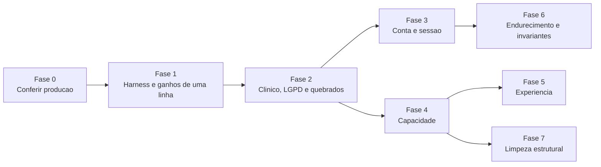

# Pitacos do Fable — Médico 360: relatório da varredura e plano de implementação

Data: 2026-09-18. Cópia em Markdown do documento
https://claude.ai/code/artifact/0ae33dee-6f53-4d0c-bf2b-93756240aa8d

A varredura encontrou 17 defeitos já ativos em produção que a suíte verde de 1263 testes não pega, um teto de cerca de 20 respostas simultâneas no backend e 23 testes que passam exercitando o caminho errado. Nada foi alterado no repositório. A recomendação é corrigir primeiro o que afeta segurança clínica, LGPD e funcionalidade quebrada, depois destravar a capacidade, e só então investir em experiência e limpeza.

## Como ler este relatório

A ordem dos achados segue o impacto no negócio, não a gravidade técnica isolada. A gravidade aparece em coluna própria, porque as duas coisas divergem: um bug de tela pode ser técnico simples e custar a confiança do médico.

**Ordem de impacto no negócio usada no ranking**

1. Risco clínico ou à vida: informação errada que pode orientar conduta ou socorro.
2. Risco legal e de LGPD: direito do titular que não funciona, vazamento entre médicos.
3. Funcionalidade quebrada em produção: o usuário tenta e não consegue.
4. Bloqueio de crescimento: o que impede sustentar mais médicos simultâneos.
5. Experiência percebida: o que o médico sente no uso diário.
6. Endurecimento de segurança sem caminho de exploração imediato.
7. Custo de manutenção: limpeza, duplicação, documentação.

| Gravidade | Critério |
| --- | --- |
| Crítica | Dano a paciente, vazamento de dado clínico entre contas, ou indisponibilidade geral |
| Alta | Direito legal inoperante, função principal quebrada, ou perda de dado do usuário |
| Média | Degradação perceptível, abuso possível com esforço, ou risco que depende de outra falha |
| Baixa | Higiene, custo de manutenção, melhoria incremental |

| Status | Significado |
| --- | --- |
| Executado | Reproduzido no banco de teste local, com saída guardada |
| Confirmado | Conferido no código, linha a linha |
| Relatado | Levantado por uma das varreduras com evidência de arquivo e linha, sem segunda conferência |
| Depende de produção | O código mostra o defeito, mas uma variável de ambiente pode mascará-lo |

Esforço: P é até meio dia, M é de um a três dias, G é uma semana ou mais. São estimativas de uma pessoa com o contexto do projeto.

## Ranking geral por impacto no negócio

São 58 achados em sete faixas. Os 17 primeiros são defeitos ativos hoje, com 18 usuários. Os da faixa 4 só aparecem com crescimento, mas derrubam o serviço inteiro quando aparecem.

### Faixa 1. Risco clínico ou à vida

| # | Achado | Eixo | Gravidade | Impacto no negócio | Esforço | Status |
| --- | --- | --- | --- | --- | --- | --- |
| 1 | PharmaDB fora do ar responde "não encontrado na base" em bula, receituário e genéricos | Backend | Crítica | No receituário, "não encontrado" pode ser lido como "não controlado". Mesma classe do falso verde já corrigido nas interações | P a M | Confirmado |
| 2 | Um único relato anônimo de "removido" esconde um DEA para sempre, mesmo ativo | DEA | Alta | Qualquer pessoa esvazia o mapa de uma cidade com um script. Ferramenta de parada cardíaca sem aparelhos | P a M | Confirmado |
| 3 | Timeout de GPS mostra São Paulo como se fosse a posição do socorrista, sem aviso | DEA | Alta | Socorrista vê aparelhos e distâncias de outro lugar, em ambiente interno onde o GPS demora | P | Confirmado |

### Faixa 2. Risco legal, LGPD e privacidade

| # | Achado | Eixo | Gravidade | Impacto no negócio | Esforço | Status |
| --- | --- | --- | --- | --- | --- | --- |
| 4 | Conta pode ser plantada para um colega: troca de e-mail sem verificação, identidade divergente da Waid aceita, token que se renova para sempre | Segurança | Crítica | As conversas clínicas do colega caem na conta do atacante, que lê tudo. Vazamento entre médicos | M | Confirmado, cadeia não executada |
| 5 | Exclusão de conta falha por chave estrangeira para todo usuário com onboarding | LGPD | Alta | Direito de eliminação inoperante. O usuário recebe erro 500 e nada é apagado | P a M | Executado |
| 6 | Não existe logout no servidor. O cookie sobrevive ao "Sair" por até uma hora | Segurança | Alta | Em estação compartilhada de hospital, o próximo usuário lê o histórico do anterior | P a M | Relatado |
| 7 | Dumps de produção sem criptografia dentro da pasta do projeto, na área de trabalho | Operação | Alta | Cinco cópias do banco real em um notebook. Exposição se a pasta sincroniza com nuvem pessoal ou o equipamento se perde | P | Relatado |
| 8 | Export LGPD omite pastas com evolução, consentimentos, calculadoras e notícias | LGPD | Média | Portabilidade entregue incompleta, justamente no texto livre mais sensível | P a M | Relatado |

### Faixa 3. Funcionalidade quebrada em produção

| # | Achado | Eixo | Gravidade | Impacto no negócio | Esforço | Status |
| --- | --- | --- | --- | --- | --- | --- |
| 9 | App de DEA leva 403 ao cadastrar ou verificar aparelho | DEA | Alta | O módulo público não recebe contribuições de pessoas reais. Scripts sem o cabeçalho passam | P | Executado, depende de produção |
| 10 | App de notícias leva 403 ao gravar temas e palavras-chave | Notícias | Alta | Personalização do feed não salva | P | Executado, depende de produção |
| 11 | Pergunta enviada enquanto as referências são verificadas apaga a resposta anterior da tela | Frontend | Alta | O médico perde a resposta que estava lendo. Volta só ao reabrir a conversa | P | Confirmado |
| 12 | Enter durante o processamento do anexo envia sem o exame. Um arquivo com erro descarta o lote | Frontend | Alta | Resposta clínica gerada sem o exame, sem o médico saber | P | Confirmado |
| 13 | Limite semanal atingido aparece como "Erro ao conectar com o servidor" | Frontend | Média | Usuário beta acha que o produto caiu, em vez de entender a cota | P | Relatado |
| 14 | Conversas além das 50 mais recentes ficam inalcançáveis e somem das pastas | Frontend | Média | Médico assíduo perde acesso ao próprio histórico | M | Relatado |
| 15 | Leads das páginas de captação fora do iframe chegam sem e-mail nem nome | Captação | Média | Lead impossível de contatar, e sem deduplicação | P a M | Relatado |
| 16 | Rodada do resumo de notícias reenvia e-mails e aborta em caso de corrida entre réplicas | Notícias | Média | E-mail duplicado ao médico. Só aparece com mais de uma réplica | P | Relatado |
| 17 | A rota sem streaming descarta citações e registra o modelo errado em falha | Backend | Baixa | Telemetria de custo e fontes incorretas nos modos de farmácia | P | Relatado |

### Faixa 4. Bloqueio de crescimento: capacidade e confiança na entrega

| # | Achado | Eixo | Gravidade | Impacto no negócio | Esforço | Status |
| --- | --- | --- | --- | --- | --- | --- |
| 18 | Cada resposta em streaming segura duas conexões de banco do início ao fim | Capacidade | Crítica | Cerca de 20 respostas simultâneas esgotam o banco. A partir daí toda requisição autenticada espera 30 s e falha | P e M | Confirmado |
| 19 | Contador semanal de custo pode travar o stream na virada da semana e perde atualização sob concorrência | Capacidade | Alta | Resposta trava antes do fim e prende duas conexões. Custo subcontado fura o teto beta | P | Confirmado por leitura |
| 20 | Telemetria Phoenix exporta cada span de forma síncrona no único event loop | Capacidade | Alta | Toda resposta congela as demais por um round trip. Phoenix lento congela a API inteira | P | Confirmado, depende de produção |
| 21 | Rate limit por IP, em memória, com cabeçalho de IP falsificável | Capacidade e segurança | Alta | Um hospital inteiro divide 30 perguntas por minuto. Um atacante zera todos os limites, inclusive o de código por e-mail | P | Confirmado |
| 22 | 23 testes tentam sair para a rede e passam, porque o app engole o erro da guarda | Testes | Alta | A suíte do orquestrador valida o caminho de contingência, não o principal. Confiança falsa em toda entrega | P | Executado |
| 23 | Rota principal de streaming via HTTP, verificação de código por e-mail e exclusão de conta têm cobertura zero | Testes | Alta | Os fluxos que mais importam não têm rede de proteção | M | Executado |
| 24 | O repositório não tem fonte de verdade para a tabela de modelos e preços | Operação | Alta | Banco restaurado só do schema responde "modelo não disponível" em todos os modos. Agrava o risco do backup manual | M | Confirmado |
| 25 | Um único pool de 100 conexões HTTP para tudo, e cada stream prende uma | Capacidade | Média | Próximo teto depois do item 18. Triagem e login começam a falhar perto de 80 streams | P | Relatado |
| 26 | Upload lê o corpo inteiro antes de checar o tamanho. Imagens em base64 ficam em memória durante o stream | Capacidade | Média | Dez revisões de exame simultâneas custam perto de 1 GB. Corpo gigante derruba o container | P a M | Confirmado |
| 27 | Servidor em configuração padrão: deploy corta respostas em andamento e não há heartbeat no stream | Capacidade | Média | Resposta perdida com custo já gasto a cada deploy. Proxies de hospital podem cortar streams longos | P | Relatado |
| 28 | Modos de farmácia pagam triagem e mascaramento duas vezes | Capacidade | Média | Latência e custo dobrados no segundo modo mais usado | P a M | Confirmado |
| 29 | Sem controle de vazão para o PubMed | Capacidade | Média | Com uma a duas perguntas por segundo, a validação de referências cai para todos | P | Relatado |
| 30 | Pool do Redis com 20 conexões, sem timeout, falhando aberto | Capacidade | Média | Sob carga, vira chamada extra de triagem paga. Redis travado trava toda requisição | P | Relatado |
| 31 | Harness não consegue testar caminhos que fazem rollback, e vaza estado entre testes | Testes | Média | Disjuntor fica a uma falha de abrir para 170 testes. Caminhos de recuperação de erro são intestáveis | P | Executado |
| 32 | Cobertura medida errado para baixo, portão do CI em 50%, páginas de captação sem CI | Testes | Média | O CI permite perder quase 30 pontos de cobertura sem avisar | P | Executado |

### Faixa 5. Experiência percebida

| # | Achado | Eixo | Gravidade | Impacto no negócio | Esforço | Status |
| --- | --- | --- | --- | --- | --- | --- |
| 33 | A resposta inteira é reprocessada como Markdown a cada quadro | Frontend | Média | Texto engasga no terço final de respostas longas, em celular e no iframe | P, depois M | Relatado |
| 34 | Campo de digitação bloqueado de 13 a 57 s, sem botão Parar, e perde o foco | Frontend | Média | Médico não rascunha a próxima pergunta nem cancela uma errada | P | Relatado |
| 35 | A tela não acompanha o texto durante a resposta. Trocar de conversa mantém a rolagem antiga | Frontend | Média | Rolagem manual por até um minuto a cada pergunta | P a M | Relatado |
| 36 | Trocar de conversa não tem cache, feedback nem proteção contra corrida | Frontend | Média | Clique sem resposta visível. Clicar rápido em duas conversas pode mostrar a errada | M | Relatado |
| 37 | Nenhum dos seis apps define política de cache para os arquivos estáticos | Todos os apps | Média | Cada abertura revalida todos os arquivos antes de pintar a tela | P | Confirmado |
| 38 | Celular: altura fixa cobre o campo de digitação, zoom automático no iOS, alvos de toque pequenos, menu da conversa só no hover | Frontend | Média | Mover conversa para pasta é impossível no toque | P | Relatado |
| 39 | Todo erro de stream mostra a mesma mensagem, sem tentar de novo | Frontend | Média | Sessão expirada, cota e queda de rede parecem iguais. O médico redigita | P a M | Relatado |
| 40 | DEA não abre sem rede, faz uma busca desperdiçada e carrega o mapa na aba do metrônomo | DEA | Média | App de emergência lento justamente em rede ruim | M | Relatado |
| 41 | Metrônomo: uma ligação para o 192 silencia o áudio sem aviso, e o pulso visual adianta o som | DEA | Média | A tela mostra "Parar" sem som tocando, durante a massagem | M | Relatado |
| 42 | App de notícias pede código por e-mail a cada abertura nos apps da Waid | Notícias | Média | Atrito em todo acesso móvel | P | Relatado |
| 43 | Página de contabilidade com imagem de 1,2 MB. As três páginas carregam 300 KB de código e podem esconder o formulário por 30 s | Captação | Média | Perda de conversão em 4G | P | Confirmado na imagem |
| 44 | Painel lateral desmonta ao tirar o mouse. Medidor de uso pisca a cada resposta | Frontend | Baixa | Pastas recolhem sozinhas e a lista pula | P a M | Relatado |
| 45 | Pacote inicial carrega o chat inteiro em todas as rotas. Fontes bloqueiam a primeira pintura | Todos os apps | Baixa | 100 a 300 ms na primeira visita após cada deploy | P | Relatado |
| 46 | Sem anúncio para leitor de tela, diálogo sem captura de foco | Frontend | Baixa | Acessibilidade | P | Relatado |

### Faixa 6. Endurecimento de segurança

| # | Achado | Eixo | Gravidade | Impacto no negócio | Esforço | Status |
| --- | --- | --- | --- | --- | --- | --- |
| 47 | CORS com credenciais inclui origens que não autenticam. Sem cabeçalhos de segurança nem restrição de iframe | Segurança | Média | Um XSS em página pública ou no LMS parceiro lê o histórico clínico do médico logado | M | Relatado |
| 48 | Páginas de captação aceitam listas sem limite e revelam se um e-mail já se cadastrou | Segurança | Média | Uma requisição anônima insere centenas de milhares de linhas | P | Relatado |
| 49 | HTML de notícia sem escape no servidor. Sanitização no cliente com configuração padrão | Segurança | Média | Única barreira é o navegador. Links do artigo tiram o médico de dentro do iframe | P | Confirmado |
| 50 | App de calculadoras não limpa o token anterior no fluxo embed | Segurança | Média | Em estação compartilhada, o próximo médico herda a sessão do anterior | P | Confirmado |
| 51 | Código por e-mail guardado em texto puro, tentativas sem trava de linha, enumeração por tempo | Segurança | Baixa | Limitado pelo teto por e-mail no Redis, que falha aberto | P | Relatado |
| 52 | Erro bruto do provedor chega ao cliente no agregador. URL de citação aceita qualquer esquema. Validação Curseduca nasce desligada | Segurança | Baixa | Defesa em profundidade | P | Relatado |

### Faixa 7. Custo de manutenção

| # | Achado | Eixo | Gravidade | Impacto no negócio | Esforço | Status |
| --- | --- | --- | --- | --- | --- | --- |
| 53 | Duas implementações do orquestrador, com 14 blocos duplicados | Limpeza | Média | Já causou três bugs em um dia. Cerca de 450 linhas elimináveis | G | Relatado |
| 54 | Arquivo único de provedores com 1208 linhas e 11 chamadas a modelo fora da camada de provedores | Limpeza | Média | Cada provedor novo copia 300 caracteres de assinatura e um laço de leitura. Disjuntor não cobre todas as chamadas auxiliares | M | Relatado |
| 55 | Duas dependências sem uso, uma dúzia de nomes mortos, quatro configurações não lidas, scripts pontuais obsoletos | Limpeza | Baixa | Um dos scripts, se rodado de novo, grava o modelo errado | P | Confirmado nas dependências |
| 56 | Três páginas de captação são o mesmo app copiado. Login, autenticação e cliente de API duplicados entre apps | Limpeza | Baixa | Correção precisa ser feita três vezes. Lint e versões divergem | M | Relatado |
| 57 | Documentação contradiz o código: modelo antigo, SSO inexistente, plano marcado como não iniciado, README sem a rota principal | Limpeza | Baixa | Quem entra no projeto aprende o sistema errado | P a M | Relatado |
| 58 | Higiene: configuração local versionada, dois ambientes virtuais, 28 MB de protótipo na pasta, testes que leem código-fonte como texto | Limpeza | Baixa | Os testes por texto bloqueiam a refatoração dos itens 53 e 54 | P | Relatado |

## Detalhe dos achados críticos e altos

Cada item traz onde está, o que acontece, a correção e o teste que impede a volta. Os números são os do ranking.

### 1. PharmaDB fora do ar vira "não encontrado"

- **Onde:** `app/services/integracoes/pharmadb_service.py`, funções `buscar_pa`, `buscar_produto`, `buscar_bula`, `buscar_receita`, `buscar_genericos` e `get_historico_comercializacao`. Todas terminam em `except Exception` com `return None`.
- **O que acontece:** o orquestrador recebe vazio e chama `mensagem_nao_encontrado`, que responde "não encontrado na base PharmaDB. Verifique o nome do medicamento". O ramo de contingência com aviso de indisponibilidade nunca é alcançado em queda real.
- **Correção:** espelhar o `InteracoesIndisponiveisError` que já existe para interações. Erro de transporte e resposta 5xx sobem como exceção. Vazio só quando a base respondeu e não achou.
- **Teste:** dirigir as funções reais por um transporte HTTP falso que devolve 503 e timeout, e exigir o aviso de indisponibilidade na resposta. Hoje toda a camada HTTP do serviço tem cobertura zero, e os 29 testes usam dicionários inventados.

### 2. Um relato de "removido" esconde o DEA

- **Onde:** `app/dea/services/cadastro_service.py`, ramo final de `registrar_verificacao`. `STATUS_VISIVEIS` em `dea_router.py` exclui o status removido.
- **O que acontece:** uma requisição anônima muda o status de qualquer aparelho, inclusive ativo e de alta confiança. O aparelho sai da listagem, então ninguém consegue reverificar. Só volta por SQL. Não há deduplicação por origem, e o limite por IP é contornável pelo item 21.
- **Correção:** exigir relatos independentes para remover, como já é feito para "não encontrado". Nunca deixar um relato esconder aparelho ativo. Índice único por aparelho, origem e dia. Manter o aparelho visível com rótulo "remoção relatada".
- **Teste:** promover um aparelho a ativo, enviar um "removido" anônimo e exigir que continue listado. O teste atual `test_marcar_como_removido_tira_do_mapa` trava o comportamento de voto único e precisa ser invertido.

### 3. GPS com timeout mostra São Paulo

- **Onde:** `dea-app/src/hooks/useLocalizacao.ts` e `dea-app/src/pages/MapaPage.tsx` linha 107.
- **O que acontece:** timeout e posição indisponível viram o estado `indisponivel`, que não tem nenhuma interface. A tela só avisa quando a permissão é negada. O centro padrão é usado como se fosse a posição real, e a lista de aparelhos é buscada a partir dele.
- **Correção:** aviso com botão de tentar de novo para `indisponivel`. Primeira tentativa rápida de baixa precisão, refinando depois. Não buscar nem mostrar distâncias enquanto não houver posição real.
- **Teste:** simular falha de geolocalização por timeout e exigir a mensagem visível. O app não tem jsdom nem testing-library instalados, então o teste exige dependência nova.

### 4. Conta plantada para um colega

- **Onde:** `PATCH /auth/me` em `app/api/v1/endpoints/auth.py`, e `get_or_create_por_identidade_waid` em `app/services/auth_service.py`, linhas 179 a 204.
- **O que acontece:** três comportamentos se combinam. A troca de e-mail não exige prova de posse. Quando o e-mail bate com uma conta cujo identificador da Waid é outro, o código loga "Identidade nova recusada" e devolve a conta assim mesmo. E qualquer token válido gera outro token novo, sem limite de idade da sessão.
- **Cenário:** o médico A troca o próprio e-mail para o do colega V, que ainda não entrou no produto. V entra pelo embed e cai dentro da conta de A. As conversas clínicas de V se acumulam lá, e A lê tudo mantendo a sessão viva.
- **Correção:** só aplicar a troca de e-mail depois de confirmação no endereço novo, ou retirar o campo. Levantar exceção quando o identificador diverge. Parar de emitir token no `PATCH`, ou limitar a idade total da sessão por um campo de hora de autenticação.
- **Teste:** usuário com identificador A, troca de token devolvendo o mesmo e-mail com identificador B. Exigir ausência de sessão e registro de auditoria. `tests/test_waid_backfill_unico.py` linhas 47 a 49 hoje trava o comportamento permissivo.
- **Ressalva:** cada passo foi conferido no código. A cadeia completa não foi executada.

### 5. Exclusão de conta falha

- **Onde:** `apagar_dados_do_usuario` em `app/repositories/auth_repository.py`.
- **O que acontece:** quatro chaves estrangeiras sem regra de exclusão ficam fora da cascata manual: `consent_logs.user_id`, `audit_logs.interaction_id`, `calculator_executions.user_id` e `invite_tokens.created_by`. Todo usuário que passou pelo onboarding tem consentimento gravado. Todo usuário que já fez uma pergunta tem auditoria ligada à interação.
- **Evidência:** `ForeignKeyViolationError` em `consent_logs_user_id_fkey` e em `audit_logs_interaction_id_fkey`, reproduzido no banco de teste. O defeito existe igual na migration de baseline, portanto também em produção.
- **Correção:** incluir as quatro tabelas na cascata. Consentimento pode ser anonimizado como a auditoria, se precisar sobreviver como prova. Anular `interaction_id` da auditoria antes de apagar as interações.
- **Teste:** um construtor de "usuário completo" com todas as tabelas ligadas, e exclusão via HTTP exigindo 204 e zero linhas. O teste atual cria só preferência e auditoria.

### 6. Sem logout no servidor

- **Onde:** não existe rota de logout nem `delete_cookie` em `app/`. O `logout()` do frontend só limpa o armazenamento local.
- **O que acontece:** o cookie é HttpOnly, então o JavaScript não consegue apagá-lo. Depois de "Sair", uma chamada com credenciais ainda devolve o histórico por até uma hora. O token não tem identificador nem versão, então desativar o usuário é a única forma de revogar.
- **Correção:** `POST /auth/logout` apagando o cookie com as mesmas flags. Campo de versão de token no usuário, conferido em `get_current_user`.

### 7. Dumps de produção na pasta do projeto

- **Onde:** pasta `backups/`, cinco arquivos, 58 MB no total. Estão fora do git e fora da imagem Docker.
- **Correção:** mover para fora da árvore de trabalho, criptografar, e apagar os dois dumps de segurança pré-migration que já cumpriram a função. O conteúdo dos arquivos não foi lido.

### 9 e 10. Apps de DEA e de notícias levam 403 ao gravar

- **Onde:** `app/api/v1/router.py` aplica `exigir_origem_confiavel` ao router inteiro. `origens_confiaveis()` em `app/core/config.py` exclui `dea_url` de propósito e não inclui `noticias_url`.
- **O que acontece:** o navegador sempre manda o cabeçalho `Origin` em POST entre origens, e a guarda responde 403. Uma chamada sem o cabeçalho passa. A proteção barra pessoas e admite scripts.
- **Evidência:** POST em `/api/v1/dea/locais` com a origem do próprio app devolveu 403 "Origem não autorizada". O mesmo para `/news/me/keywords`.
- **Depende de produção:** se as URLs entrarem por `EMBED_ALLOWED_ORIGINS` ou `LANDING_PAGES_ORIGINS` no Railway, o defeito está mascarado. Vale conferir o painel antes de corrigir.
- **Correção:** incluir as duas URLs na lista confiável, ou isentar o router do DEA, que não usa cookie.
- **Teste:** para toda rota pública de escrita, um POST com a origem do app dono exigindo resposta diferente de 403. E um teste que enumera as URLs de frontend das configurações e exige cada uma classificada.

### 11. Resposta some da tela

- **Onde:** `frontend-app/src/App.tsx`, linhas 154 a 157 e 294.
- **O que acontece:** a referência da mensagem em streaming só é limpa no `finally`. O evento `text_done` libera o campo de digitação antes disso. Uma pergunta nesse intervalo trata a resposta concluída como parcial de um stream abortado e a remove da lista.
- **Correção:** limpar a referência no `text_done`.
- **Teste:** gerador controlável que segura o evento `done`, envia a segunda pergunta e exige as duas respostas presentes. O teste existente cobre apenas o caso em que o primeiro stream já terminou.

### 12. Anexo perdido

- **Onde:** `frontend-app/src/components/InputBar.tsx`, linha 175 e linhas 126 a 140.
- **O que acontece:** o envio não confere se há extração em andamento. O arquivo não enviado se anexa à próxima mensagem. No lote, os resultados só são gravados no fim do laço, então um erro no terceiro arquivo descarta os dois anteriores.
- **Correção:** bloquear envio durante a extração e gravar cada arquivo ao chegar. Reduzir imagens no cliente para cerca de 2000 px remove também o erro de 5 MB em fotos de celular.

### 18 e 19. Conexões presas no stream e o contador semanal

- **Onde:** `app/api/v1/endpoints/orquestrador.py` linhas 124 a 154, `app/services/orquestrador_stream_service.py` linhas 108, 295, 324 e 454, e `app/services/usage_service.py`.
- **O que acontece:** a sessão do request fica aberta, ociosa em transação, até o fim do stream, porque o FastAPI só encerra a dependência depois de enviar o corpo. O serviço abre uma segunda sessão que faz `flush` antes do modelo e só faz `commit` depois. O pool é de 30 mais 10.
- **Travamento:** `check_limit` deixa um `UPDATE` sem commit na primeira sessão quando a semana virou ou o usuário é novo. `record_cost` na segunda sessão espera esse bloqueio, que só se solta quando o stream termina. O stream mostra todo o texto e trava antes do `text_done`.
- **Correção:** `commit` da sessão do request antes de devolver o `StreamingResponse`. No serviço, comitar a interação antes de chamar o modelo e reabrir para gravar. `record_cost` como `UPDATE` atômico com soma no banco. `pool_timeout` de 5 s e `idle_in_transaction_session_timeout` no servidor.
- **Teste:** fixture com duas conexões reais, pool de 2, seis streams simultâneos com provedor falso lento, exigindo que todos terminem. E usuário beta com semana vencida via HTTP, com limite de 5 s.

### 20. Phoenix síncrono

- **Onde:** `app/core/telemetry.py` linha 43, `register(project_name=...)` sem `batch=True`.
- **O que acontece:** o padrão da biblioteca é o processador simples, que exporta dentro do `on_end` do span, com cliente HTTP bloqueante. São dois spans por resposta.
- **Correção:** `batch=True`. Uma linha.

### 21. Rate limit por IP

- **Onde:** `app/core/limiter.py` e o `Dockerfile` com `--forwarded-allow-ips "*"`.
- **Correção:** chave pelo usuário do token nas rotas autenticadas, com IP como reserva. Armazenamento no Redis. Restringir os IPs de proxy confiáveis à faixa do Railway, depois de verificar o que a borda faz com o cabeçalho enviado pelo cliente.

### 22. Testes que engolem a guarda de rede

- **Onde:** `tests/conftest.py` linha 376 levanta `AssertionError`, que é subclasse de `Exception`. Em `tests/test_orquestrador_stream.py` linhas 75 a 81, os fakes de cache e triagem são definidos e nunca aplicados.
- **O que acontece:** nove testes do stream fazem três tentativas cada de chamar a OpenAI. A guarda levanta, o `except Exception` do app trata como falha do provedor, e o teste passa pelo caminho de contingência.
- **Correção:** a guarda registra a violação e reprova o teste no encerramento, e levanta uma subclasse de `BaseException`. Aplicar os fakes esquecidos.

### 24. Tabela de modelos sem fonte de verdade

- **Onde:** nenhuma migration insere linhas em `model_pricing`. Quatro scripts `add_*` cobrem quatro modelos. `sonar-pro`, `gpt-5.4-nano`, `gpt-4o` e `gpt-5.4-mini` não têm script nenhum.
- **Correção:** um `scripts/seed_models.py` idempotente dirigido por tabela, e um teste exigindo que todo modelo citado no mapa de modos e nas listas de contingência esteja nela. Vale o mesmo para os seis seeds de calculadora, dos quais o CI roda dois.

## Capacidade: em que ordem o backend quebra

O primeiro teto é o banco, em cerca de 20 respostas simultâneas. Nada aqui foi medido sob carga. Os números saem da leitura da configuração e de aritmética, e a latência do modelo, que é o gargalo conhecido, não muda com nenhum destes itens.

| Ordem | Teto | Quando aparece | O que o usuário vê | Item |
| --- | --- | --- | --- | --- |
| 1 | Pool de banco, 40 conexões, duas por stream | Cerca de 20 streams simultâneos | Toda requisição autenticada espera 30 s e devolve erro 500 | 18 |
| 2 | Event loop único bloqueado pela telemetria | 3 a 5 respostas por segundo, ou Phoenix lento | Todos os streams param de emitir texto ao mesmo tempo | 20 |
| 3 | Rate limit por IP | 30 perguntas por minuto no mesmo endereço | Médicos do mesmo hospital recebem 429 | 21 |
| 4 | Pool HTTP de saída, 100 conexões | 70 a 90 streams | Triagem e login falham. Cada excedente gasta 30 s por modelo de contingência | 25 |
| 5 | Memória com imagens | Cerca de 10 revisões de exame com 5 imagens | Container reiniciado | 26 |
| 6 | Um processo, um núcleo | Centenas de streams | Latência geral sobe, sem erro rápido | 27 |

**Subir o número de processos ou réplicas exige três mudanças antes.** O rate limit precisa ir para o Redis, senão os limites se multiplicam pelo número de processos. O envio do resumo de notícias precisa de transação por usuário e ordenação estável, senão duplica e-mails. E o alarme de vigilância dispara uma vez por réplica.

**Conferido e adequado**

- O middleware de compressão não segura o stream. A versão instalada do Starlette exclui `text/event-stream`.
- O reconhecimento de nomes do mascaramento de dados roda sempre fora do event loop, em thread. O mesmo vale para PDF, DOCX, XLSX e envio de e-mail.
- Um único cliente HTTP compartilhado. Nenhum cliente criado por chamada.
- Autenticação custa uma consulta por chave primária por requisição, sem chamada externa.
- Listas paginadas, carregamento antecipado das respostas, imagens em base64 fora das consultas de lista, índices coerentes com os filtros.
- Coletor, redator e classificador de notícias são seguros com várias réplicas.
- Tarefas em segundo plano guardam referência forte. Desconexão do cliente cancela a chamada ao modelo, conforme a leitura do código.

## Experiência percebida

Como a latência do modelo é fixa, a velocidade percebida depende do que a tela faz durante a espera. Os itens 11, 12 e 13 do ranking são os que mais pesam. Depois deles, o maior ganho por esforço está em quatro ajustes pequenos.

**Os quatro ajustes pequenos de maior retorno no chat**

1. Atualizar o texto a cada 80 a 120 ms em vez de a cada quadro, e memorizar a barra de digitação e o topo. Resolve o engasgo do item 33 sem reestruturar nada.
2. Manter o campo habilitado durante a resposta, transformar "Enviar" em "Parar" e devolver o foco ao terminar, só no desktop.
3. Ao enviar, rolar a pergunta para o topo e dar ao espaço da resposta a altura da área visível. A resposta preenche a tela sem rolagem.
4. Um arquivo `serve.json` em cada app, com cache longo e imutável para os arquivos com hash e sem cache para o `index.html`. Restringir a reescrita para fora de `/assets`, para que um deploy não deixe abas abertas com tela branca.

**Tamanho do que é entregue hoje**

| App | JavaScript de entrada, comprimido | Outro arquivo pesado |
| --- | --- | --- |
| Chat principal | cerca de 155 KB antes da primeira pintura, em todas as rotas | Fonte externa bloqueante |
| Calculadoras | 63 KB mais 27 KB de bibliotecas | Tabela de referência em PNG de 618 KB, sob demanda |
| Notícias | 81 KB em arquivo único | Fonte "Just Sans" citada e nunca carregada |
| Contabilidade | 96 KB | Imagem de topo de 1208 KB, PNG com extensão jpg e proporção declarada errada |
| Finanças | 88 KB | Imagem de 100 KB |
| Parceiros | 95 KB | Imagem de 127 KB |

O código do agregador oculto não está no pacote entregue. Ele é código morto apenas no repositório.

**DEA, por ser usado em emergência**

- O agendamento do metrônomo está correto, no relógio do áudio e sem deriva acumulada.
- Faltam: tratamento de interrupção do áudio por ligação ou bloqueio de tela, pulso visual sincronizado com o som, e descarte de batidas atrasadas depois de a aba ser suspensa.
- O texto "ligue 192" não é um link de telefone.
- Os blocos do mapa vêm direto do OpenStreetMap, cuja política restringe uso pesado em produção. Vale um provedor com chave se o tráfego crescer.

**Conferido e adequado**

- Texto agrupado por quadro, mensagens anteriores memorizadas, painel lateral com propriedades estáveis.
- Pergunta mostrada de forma otimista no mesmo instante do envio, sem ida e volta para criar conversa.
- Requisições de abertura em paralelo, sem tela de carregamento bloqueante.
- Mutações de pasta e conversa otimistas com reversão.
- Nenhum `any` nem teste pulado no frontend principal.

## Segurança

Os itens 2, 4, 5, 6, 9 e 21 concentram o risco e estão detalhados acima. O restante é endurecimento. A varredura cobriu o que mudou desde a revisão de 8 de setembro e as classes que ela não havia olhado.

**Endurecimento, em ordem de retorno**

1. Restringir o CORS com credenciais aos apps que autenticam. Apps públicos recebem política sem credenciais. A origem do LMS parceiro sai da lista, salvo se a página dele chamar a API diretamente.
2. Um middleware pequeno de cabeçalhos na API, e `frame-ancestors` restrito aos parceiros no `serve.json` dos apps.
3. Limite de tamanho nas listas dos formulários de captação, validadas contra o conjunto conhecido de opções. Retirar a rota de checagem por e-mail, já que o envio responde o mesmo.
4. Escapar autores e título no HTML de citação gerado pelo redator de notícias, e permitir só uma lista curta de tags no servidor. No cliente, configurar o sanitizador com lista de tags, só `href`, só `https`, e abrir links em nova aba.
5. Limpar o token anterior na entrada do fluxo embed do app de calculadoras.
6. Ler o upload em blocos até o limite, reduzir o teto de descompressão e pôr tempo máximo no parser.
7. Guardar o código por e-mail com hash, travar a linha ao contar tentativas e enviar o e-mail em segundo plano.
8. Incluir aviso de privacidade e link da política ao lado dos formulários das três páginas de captação, que coletam faturamento sem texto de consentimento.

**Saiu limpo**

- Nenhuma rota com acesso indevido por identificador. Conversas, pastas, arquivos, contexto de pasta, calculadoras e notícias filtram pelo usuário autenticado.
- Administrador decidido pelo registro no banco, não pelo campo do token.
- Sem SSRF: o coletor consulta o PubMed por ISSN fixo, e a raspagem de HTML foi removida.
- Sem injeção de SQL: todo `text()` usa parâmetros ligados.
- Nenhum caminho novo escapa do mascaramento de dados. Todas as chamadas diretas a modelo recebem texto já sanitizado.
- Token com algoritmo fixado, expiração de uma hora, segredo sem valor padrão, e o boot falha em produção sem os segredos.
- Nenhum segredo, `.env` ou dump versionado, nem no histórico.
- `postMessage` com origem conferida na entrada e destino explícito na saída. Sem redirecionamento aberto.
- Nenhuma vulnerabilidade conhecida nas versões fixadas. Vale rodar `pip-audit` e `npm audit` para confirmação.

## Testes

A suíte é grande, estável e rápida, mas valida menos do que aparenta. Os defeitos das faixas 1 a 3 têm a mesma raiz já registrada no projeto: teste com dado fabricado, ou sem o cabeçalho e a linha que a produção tem.

| Medida | Valor |
| --- | --- |
| Backend | 1263 passam, 6 pulados por exigirem rede real, 0 falhas |
| Estabilidade | 5 rodadas completas, uma em ordem invertida, sem nenhuma falha intermitente |
| Tempo | cerca de 60 s |
| Cobertura do backend, medição padrão | 75,0% de linhas e ramos |
| Cobertura do backend, medição corrigida para greenlet | 77,5% de linhas e ramos, 80,5% só de linhas |
| Portão de cobertura no CI | 50% |
| Chat principal | 175 testes, 47,9% de instruções contando todos os arquivos |
| DEA | 18 testes, só o metrônomo |
| Notícias, calculadoras e código compartilhado | zero testes unitários em cerca de 8100 linhas |

**A medição de cobertura está errada para baixo.** Não existe `.coveragerc`. O SQLAlchemy assíncrono usa greenlets, e o rastreador padrão perde as linhas depois do primeiro acesso ao banco. `conversations.py` aparecia com 35% e tem 94%. Os números de `docs/PLANO_COBERTURA_TESTES.md` foram tirados com essa falha.

**Módulos com cobertura baixa que importam**

| Módulo | Cobertura | O que está descoberto |
| --- | --- | --- |
| `pharmadb_service.py` | 53% | Toda a camada HTTP e de formato de resposta. Risco clínico |
| `auth_service.py` e `endpoints/auth.py` | 69% e 70% | Verificação de código por e-mail, bloqueio em 5 tentativas, exclusão de conta, troca de e-mail |
| `endpoints/orquestrador.py` | 87% | A rota `/stream`, a principal do produto, nunca é chamada por HTTP |
| `orquestrador_shared.py` | 80% | `registrar_hit_de_cache`, que impede resposta em cache de devolver conversa de outro médico |
| `extraction_service.py` das calculadoras | 20% | Saída de modelo convertida em entrada clínica de calculadora |
| `pubmed_service.py` | 35% | O cálculo do índice de confiança mostrado ao médico |
| `endpoints/landing_pages.py` | 31% | Os quatro envios públicos |
| `news_agendado.py` e `main.py` | 26% e 63% | Nada garante quais agendadores sobem. Mesma classe do incidente de 39 dias sem expurgo |
| `src/api/orquestrador.ts` | 2,4% | O leitor de SSE do frontend, sempre substituído por mock |

**Problemas de qualidade**

- 23 testes batem na guarda de rede e passam pelo caminho de contingência. É o item 22.
- `test_otp_request_nao_revela_se_email_existe` usa dois e-mails inexistentes. Não consegue detectar enumeração, e é o teste mais lento, com 8 s.
- `test_cache_hit_historico.py` promete no cabeçalho testar identificadores entre usuários e testa só a montagem de metadados.
- Medição de custo do orquestrador é provada por presença da string `await record_cost(` no código-fonte, não por comportamento.
- Testes do PharmaDB e do DEA substituem a própria função sob teste.
- O esquema de teste vem de `create_all`, não das migrations. Nada confere equivalência nem executa downgrade.
- As calculadoras usam valores de referência publicados, o que é bom. No PREVENT, os braços de diabetes, estatina e filtração abaixo de 60 não têm âncora externa.

**Invariantes que valem manter:** a tabela `ROUTE_POLICY`, a enumeração de rotas de escrita, a busca por provedor instanciado fora do registro, e os testes de deriva de constantes entre backend e frontend.

**O débito 7 precisa ser corrigido no texto.** O relógio do Windows tem resolução de cerca de 15 ms. Em meio segundo, mais de um milhão de chamadas a `datetime.now` produziram 239 valores distintos. Empate de horário é rotineiro, a hipótese original estava certa, e o desempate já aplicado resolve.

**Cinco ajustes do harness, todos pequenos, que destravam o resto**

1. Guarda de rede que reprova no encerramento e não pode ser engolida.
2. Reset automático dos disjuntores e do rate limiter entre testes.
3. Sessão de teste com `join_transaction_mode="create_savepoint"` e uma fixture única de fábrica de sessão, no lugar das 18 cópias.
4. Fixture opcional com duas conexões reais e limpeza por truncamento, para testes de bloqueio e concorrência.
5. `REDIS_URL` de teste apontando para porta fechada, para que um Redis local não mude o comportamento.

**Duas invariantes estruturais que fecham a classe inteira**

- Toda tabela ligada a usuário, direta ou transitivamente, precisa ter destino declarado: apaga, anonimiza, cascata, exporta ou não exporta com motivo. Tabela nova sem declaração quebra o CI. Mesmo mecanismo do `ROUTE_POLICY`.
- Toda rota pública de escrita é testada com o cabeçalho `Origin` do app dono, e toda URL de frontend nas configurações precisa estar classificada.

## Limpeza

O repositório está limpo onde mais importa: nenhum segredo ou dump versionado, lint zerado, nenhum TODO esquecido, 21 supressões de lint todas justificadas. O custo de manutenção está concentrado em duplicação.

**Ganhos rápidos e seguros**

- Remover `tenacity` e `orjson` de `requirements.txt`. Nenhum import em `app`, `tests` ou `scripts`.
- Apagar nomes sem nenhuma referência: `FeatureEnum`, `InputTypeEnum`, `PESO_CORE`, `StreamChunk`, `StreamComplete`, `get_conversation_context`, `dados_do_titular_existem`, `FOLDER_KINDS`, `termos_mais_cadastrados`, `Coordenada`, e o `_post` do PharmaDB. `encontrar_duplicata` e `prazo_de_expiracao` do DEA parecem recurso planejado, vale conferir antes.
- Apagar quatro configurações que ninguém lê: `app_name`, `max_models_per_query`, `max_prompt_chars`, `default_timeout_seconds`.
- Apagar `scripts/update_claude_sonnet_model_id.py`, que gravaria o modelo errado se rodado hoje. Arquivar os três scripts pontuais já aplicados. Corrigir o cabeçalho de `expurgar_dados_vencidos.py`, que ainda manda configurar o cron que causou o incidente.
- `_make_title` do agregador é idêntico ao compartilhado. A rota sem streaming consulta preços direto no banco três vezes, com a função em cache disponível.
- Trocar `logger.error(f"ERRO NO STREAM...")` por `logger.exception`. Hoje um timeout gera log vazio e sem pilha.
- Tirar `.claude/settings.local.json` do versionamento. Apagar um dos dois ambientes virtuais, de cerca de 430 MB cada. Mover `medico-360/` para fora da pasta.
- Juntar no `conftest.py` os auxiliares de teste repetidos três vezes: `ClienteFalso`, `_gravar_troca` e a fixture `servico`.

**Estrutural, em ordem de retorno**

1. **Modos de farmácia dentro do stream.** Hoje o stream recusa e o frontend refaz em `/query`. Atender no próprio stream elimina a triagem e o mascaramento em dobro, e deixa `/query` sem nenhum chamador. Depois, ou aposentar `/query`, ou reduzi-la a um coletor dos eventos do stream.
2. **Fonte única de modelos e de calculadoras.** Item 24.
3. **Dividir `ai_providers.py`.** Primeiro a divisão mecânica por arquivo, sem mudança de comportamento, mantendo o módulo atual como reexportação. Depois uma base comum para OpenAI, Perplexity e Maritaca, que falam o mesmo dialeto, e um leitor único de SSE no lugar dos seis laços iguais.
4. **Um auxiliar para chamadas auxiliares a modelo.** Onze pontos chamam o modelo por HTTP direto. A remoção de cercas de código do JSON está copiada seis vezes, o nome do modelo é literal em seis arquivos, e só três desses pontos passam pelo disjuntor.
5. **Um app de captação parametrizado.** Dez arquivos são idênticos byte a byte entre as três páginas. Continua publicando como três serviços, com argumento de build.
6. **Código compartilhado entre apps.** Guarda de token, cliente HTTP com tratamento de erro, URL base da API falhando o build se ausente em produção, e tokens de cor. Adotar o `LoginOtp` compartilhado no app de calculadoras.
7. **Agregador.** A decisão de manter o backend está tomada. A parte barata é remover `/agregador/query`, `/agregador/history` e o método `query` de 232 linhas, que não têm chamador. O módulo inteiro pesa 1078 linhas mais cerca de 200 de busca na web dentro dos provedores.

**Documentação a corrigir**

- `docs/plano-correcoes.md` diz "nada implementado ainda", e o próprio `debitos.md` registra itens dele como feitos. Dois testes leem esse arquivo por caminho, então não dá para só arquivar.
- `ARQUITETURA_TECNICA.md` e `regras-de-negocio.md` ainda citam `claude-sonnet-4-6`. O código usa `claude-sonnet-5`. Três trechos ainda prometem cookie SSO.
- O README não menciona `/orquestrador/stream`, descreve o cache semântico sem dizer que está desligado, e não cita exames, notícias, DEA, calculadoras nem o harness de teste.

**Maiores funções**

| Linhas | Função |
| --- | --- |
| 507 | `stream` em `orquestrador_stream_service.py` |
| 339 | `query` em `orquestrador_service.py` |
| 232 | `query` em `agregador_service.py`, sem chamador |
| 166 | `agregador_stream`, lógica de negócio dentro do endpoint |
| 117 | `OpenAIProvider.stream`, com 11 níveis de aninhamento |

Cinco das dez maiores pertencem ao par do orquestrador ou ao agregador. Os itens estruturais 1, 3 e 7 resolvem.

## Plano de implementação

São oito fases, de 45 a 62 dias de trabalho de uma pessoa com o contexto do projeto. As fases 0 a 2 fecham todo o risco clínico, legal e de funcionalidade quebrada em cerca de duas semanas e meia. As estimativas são por leitura do código, e não incluem revisão nem homologação na tela.

As fases 3 e 4 são independentes entre si e podem correr em paralelo. A fase 7 depende da 4 porque os dois mexem no mesmo serviço de streaming.

| Fase | Objetivo | Itens do ranking | Esforço | Migration |
| --- | --- | --- | --- | --- |
| 0 | Conferir em produção o que o código não mostra | 7, 9, 10, 20, 21 | meio dia, sem código | não |
| 1 | Harness confiável e ganhos de uma linha | 20, 22, 31, 32, 37 | 3 a 4 dias | não |
| 2 | Risco clínico, LGPD e funcionalidade quebrada | 1, 2, 3, 5, 8, 9, 10, 11, 12, 13 | 7 a 9 dias | sim, índice único do DEA |
| 3 | Conta e sessão | 4, 6, 21, 50 | 4 a 5 dias | sim, versão de token |
| 4 | Capacidade e continuidade | 18, 19, 24, 25, 26, 27, 28, 29, 30 | 7 a 9 dias | não |
| 5 | Experiência percebida | 14, 33 a 36, 38 a 46 | 8 a 12 dias | não |
| 6 | Endurecimento e invariantes estruturais | 15, 16, 17, 23, 47 a 49, 51, 52 | 5 a 7 dias | não |
| 7 | Limpeza estrutural | 53 a 58 | 10 a 15 dias | opcional, tabela sem uso |

### Fase 0. Conferir produção

- [ ] No painel do Railway, ler `EMBED_ALLOWED_ORIGINS` e `LANDING_PAGES_ORIGINS`. Se as URLs do DEA e de notícias não estiverem lá, os itens 9 e 10 estão ativos agora.
- [ ] Tentar cadastrar um DEA e salvar um tema de notícia pelo navegador, com o console aberto.
- [ ] Conferir se `PHOENIX_API_KEY` está definida. Se estiver, o item 20 está ativo.
- [ ] Enviar uma requisição com `X-Forwarded-For` falso e ver qual IP o backend registra. Decide a correção do item 21.
- [ ] Anotar o `max_connections` do Postgres, o limite de memória do container e o tempo de inatividade do proxy.
- [ ] Mover os dumps para fora da pasta do projeto e criptografar.
- [ ] Olhar os logs de acesso de `/orquestrador/query`. Se só o frontend chama, a rota pode ser aposentada na fase 7.

**Aceite:** cada item acima com resposta escrita no documento.

### Fase 1. Harness confiável e ganhos de uma linha

Vem antes das correções porque os testes que vão travá-las dependem destes ajustes.

1. Os cinco ajustes do harness da seção de testes. O primeiro vai reprovar 23 testes de propósito.
2. Aplicar os fakes esquecidos e consertar esses 23 testes, para que exercitem o caminho principal.
3. `.coveragerc` com `concurrency = greenlet,thread` e `branch = True`. Subir o portão do CI de 50 para 75.
4. `batch=True` no registro do Phoenix, com teste que espiona a chamada.
5. `max_age=86400` no CORS.
6. `serve.json` nos seis apps, já com `frame-ancestors`. O DEA precisa de uma pasta `public/`.
7. Job de CI para as três páginas de captação: instalação, lint e checagem de tipos.

**Aceite:** zero teste tocando a guarda de rede. Cobertura medida em torno de 78% com portão em 75. `curl -I` em um arquivo com hash mostra cache imutável.

### Fase 2. Risco clínico, LGPD e funcionalidade quebrada

Ordem interna por impacto. Cada correção entra com o teste descrito na seção de detalhe.

1. **Item 1, PharmaDB.** Exceção de indisponibilidade nas seis funções. Gravar três respostas reais sanitizadas como fixture e dirigir o serviço por transporte falso.
2. **Itens 9 e 10, origem.** Incluir as URLs na lista confiável. Teste estrutural de rota pública com `Origin`.
3. **Item 5, exclusão de conta.** Completar a cascata. Construtor de usuário completo. Invariante de destino declarado por tabela.
4. **Item 8, export.** Usar o mesmo construtor para exigir toda tabela marcada como exportável no JSON.
5. **Item 2, remoção de DEA.** Corroboração, índice único por aparelho, origem e dia, e rótulo visível. É a única migration da fase.
6. **Item 3, GPS.** Aviso, nova tentativa e bloqueio da busca sem posição real. Instalar jsdom e testing-library no app.
7. **Itens 11, 12 e 13, chat.** Limpar a referência no `text_done`, bloquear envio durante extração, gravar arquivo a arquivo, e mapear 401 e 429 para mensagens próprias.

**Aceite:** As duas provas executadas nesta varredura, exclusão de conta e POST com a origem do DEA, viram testes do repositório e passam. Exclusão de uma conta usada devolve 204 e deixa zero linhas. Cadastro de DEA pelo navegador funciona em produção. Homologação na tela dos três itens do chat.

### Fase 3. Conta e sessão

1. **Item 4.** Levantar exceção na identidade divergente e inverter o teste que trava o comportamento atual. Depois, a troca de e-mail, que depende da decisão de produto na última seção.
2. **Item 6.** Rota de logout e versão de token no usuário. Limite de idade total da sessão.
3. **Item 50.** Limpar token na entrada do embed de calculadoras.
4. **Item 21.** Chave por usuário, armazenamento no Redis e proxies confiáveis restritos, conforme o resultado da fase 0.

**Aceite:** depois de "Sair", uma chamada com credenciais devolve 401. Identidade divergente não gera sessão e gera auditoria. Cabeçalho de IP falso não muda a chave do limite.

### Fase 4. Capacidade e continuidade

1. **Itens 18 e 19.** `commit` antes do `StreamingResponse`, nenhuma conexão presa durante o modelo, `record_cost` atômico, `pool_timeout` curto. Teste de concorrência com pool de 2 e seis streams.
2. **Item 28.** Modos de farmácia atendidos dentro do stream, emitindo o texto como um único evento. O frontend perde o ramo `unsupported_mode`.
3. **Item 24.** `seed_models.py` e seed único de calculadoras, ambos no CI.
4. **Item 27.** `--timeout-keep-alive 75`, encerramento gracioso de 90 s, limite de concorrência, e comentário de ping a cada 15 s no stream.
5. **Itens 25, 26, 29 e 30.** Cliente HTTP separado para streams, leitura de upload em blocos com redução de imagem, limitador para o PubMed, pool bloqueante com timeout no Redis.

**Aceite:** o teste de concorrência passa. Durante um stream, o banco não mostra nenhuma sessão ociosa em transação. Um banco vazio mais os seeds responde em todos os modos. Vale um ensaio de carga simples, fora de escopo até aqui, com provedor falso lento.

### Fase 5. Experiência percebida

1. Os três primeiros ajustes pequenos da seção de experiência: itens 33, 34 e 35.
2. Item 36: cache de conversa, esqueleto de carregamento e descarte de resposta atrasada.
3. Item 38: altura dinâmica, fonte de 16 px no celular, alvos de toque e menu acessível sem hover.
4. Item 39: linha de erro com "Tentar novamente".
5. Item 14: paginação da lista de conversas.
6. Itens 40 e 41: DEA como PWA com metrônomo offline, mapa sob demanda, e retomada de áudio.
7. Itens 42 e 43: manter token fora do iframe no app de notícias, recodificar a imagem de topo, mostrar o formulário de captação de imediato.
8. Itens 44, 45 e 46.

**Aceite:** homologação na tela, em celular real e dentro do iframe da Waid. O projeto já foi surpreendido por recurso com testes verdes que não funcionava no caminho principal.

### Fase 6. Endurecimento e invariantes

1. Lista de endurecimento da seção de segurança, itens 47 a 49, 51 e 52.
2. Itens 15, 16 e 17.
3. Item 23: testes de código por e-mail, stream via HTTP, ciclo de vida dos agendadores, e contrato de eventos SSE entre backend e frontend, alimentando o leitor real com o corpo cortado em pontos arbitrários.
4. `alembic check` e um ciclo de downgrade e upgrade no CI.
5. Opcional: testes por propriedade para o mascaramento de dados e para as calculadoras, e duas âncoras externas a mais para o PREVENT.

**Aceite:** tabela nova ligada a usuário sem destino declarado quebra o CI. Evento SSE novo sem tratamento no frontend quebra o CI.

### Fase 7. Limpeza estrutural

1. Ganhos rápidos da seção de limpeza. Um dia, podem entrar em qualquer momento.
2. Aposentar `/query` ou reduzi-la a coletor. Reescrever os 40 testes de paridade que leem código-fonte como texto, a maioria deixa de ser necessária.
3. Dividir `ai_providers.py` e criar o auxiliar de chamadas auxiliares.
4. App único de captação e código compartilhado entre apps.
5. Documentação e README.

**Aceite:** nenhum teste lê arquivo de código por nome, exceto as invariantes deliberadas. Um único caminho de execução do orquestrador.

**Fluxo de trabalho.** Nada foi commitado, e os commits continuam com o Ruben. As migrations novas entram na cadeia que parte de `000_baseline`.

## Não verificado e decisões pendentes

**O que não foi possível verificar**

- As variáveis de ambiente de produção. Delas depende se os itens 9, 10 e 20 estão ativos hoje.
- O que a borda do Railway faz com um `X-Forwarded-For` enviado pelo cliente, o limite de memória do container e o tempo de inatividade do proxy.
- Nenhum número de capacidade foi medido sob carga. São derivados da configuração.
- A cadeia completa do item 4 e a corrida do item 16 foram lidas, não executadas.
- A deriva entre modelos e migrations contra um banco real. O Alembic lê `DATABASE_URL`, e o `.env` aponta para produção, então não foi rodado.
- Se os 23 testes do item 22 continuam passando depois que os fakes forem aplicados. Devem exigir retrabalho.
- O vínculo do token do embed com o nosso app do lado da Waid. Vale perguntar a eles se outro iframe no mesmo LMS consegue pedir um token e reusá-lo em cinco minutos.
- Os itens marcados como "Relatado" no ranking não tiveram segunda conferência.

**Decisões que são do Ruben ou do produto**

1. **Troca de e-mail.** Confirmar por link no endereço novo, ou retirar o campo do perfil. Define metade do item 4.
2. **Consentimento na exclusão de conta.** Apagar, ou anonimizar como a auditoria para manter a prova. É questão jurídica.
3. **Remoção de DEA.** Quantos relatos independentes removem um aparelho, e se o aparelho com remoção relatada continua visível com rótulo.
4. **Rota `/query`.** Aposentar ou manter como coletor. Depende dos logs de acesso da fase 0.
5. **Agregador.** A decisão de manter o backend está tomada. Falta decidir se as duas rotas sem chamador saem.
6. **Telas para os direitos do titular.** Exportação, histórico de consentimento e revogação existem na API e não têm nenhuma tela.
7. **Ensaio de carga.** Estava fora de escopo por decisão. Os itens 18 a 20 são motivo para rever antes de qualquer campanha de crescimento.

**Onde está a evidência.** As saídas das rodadas de teste, a lista dos 23 testes que tocam a rede, o estado vazado dos disjuntores e os dois testes de prova ficaram na pasta temporária da sessão, fora do repositório. Ela é apagada com a sessão, então os dois testes de prova devem ser recriados dentro de `tests/` na fase 2.

## Nota de maturidade: 7 de 10

Esta seção não está no documento publicado. É a resposta dada na conversa, em 2026-09-18.

| Área | Nota | Motivo |
| --- | --- | --- |
| Segurança de aplicação | 8 | Sem acesso indevido por id, SSRF ou injeção. Mascaramento de dados coberto por invariante. Perde pontos pela sessão sem logout e pela conta plantável |
| Arquitetura e disciplina de engenharia | 8 | Lint zerado, nenhum TODO esquecido, dívidas registradas com motivo, decisões documentadas |
| Testes | 6 | Suíte grande, estável e rápida, com boas invariantes estruturais. Mas 23 testes validam o caminho errado, e os fluxos principais têm cobertura zero |
| Prontidão para escala | 4 | Cerca de 20 respostas simultâneas esgotam o banco. Nunca houve ensaio de carga |
| LGPD na prática | 5 | A política existe e é boa. A exclusão de conta não funciona, e o export é incompleto |
| Frontend | 7 | O chat principal é cuidadoso. Os apps secundários quase não têm teste, e há muita cópia entre eles |
| Operação | 6 | Health check, Sentry e runbook são bons. Backup manual, modelos sem fonte de verdade e dumps soltos no notebook pesam |

**O que sustenta a nota.** O projeto tem hábitos de código maduro: mede antes de decidir, corrige o próprio registro quando erra e trava invariantes por teste.

**O que segura a nota.** Um padrão que se repete: o teste confirma o fluxo imaginado, não o real. Foi assim no contexto de pasta em agosto, e é assim agora na exclusão de conta, no 403 do DEA e nos 23 testes que engolem a guarda de rede.

**Como ler o número.** Para 18 usuários, o sistema se comporta como um 8. Para algumas centenas de médicos simultâneos, hoje é um 5, porque cai. As fases 0 a 4 do plano levam a um 8,5 sólido. O 9 exige também tempo rodando em produção sob uso real. O 9 registrado em agosto estava otimista. A nota de escala é derivada de configuração, não de medição.

---

Documento online, com comentários e edição: https://claude.ai/code/artifact/0ae33dee-6f53-4d0c-bf2b-93756240aa8d
